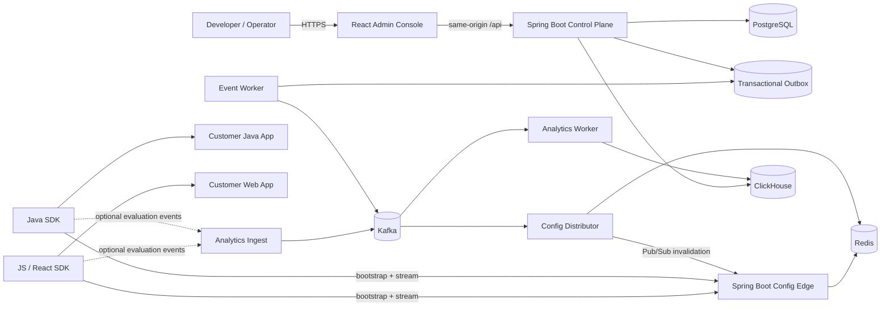
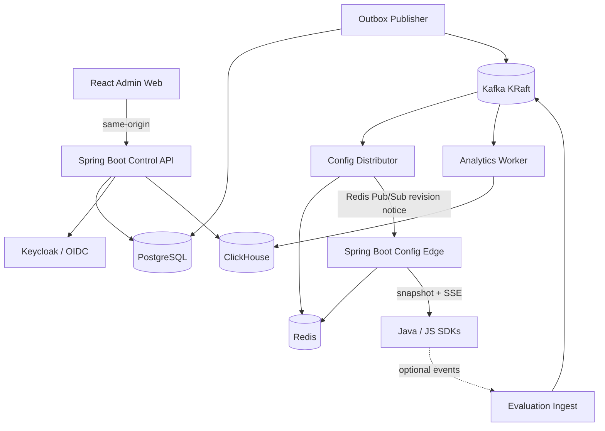
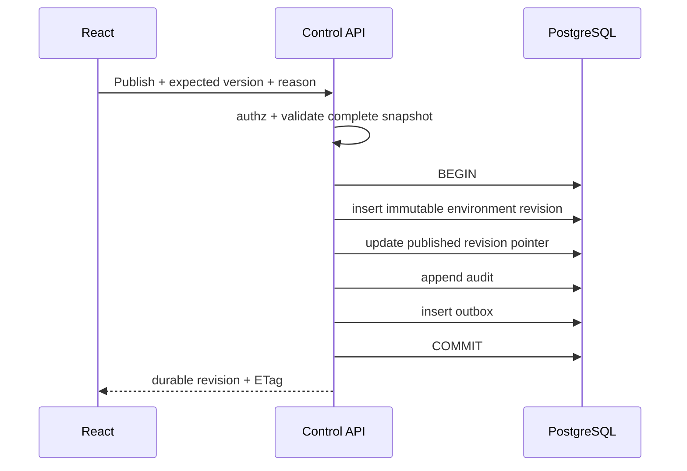
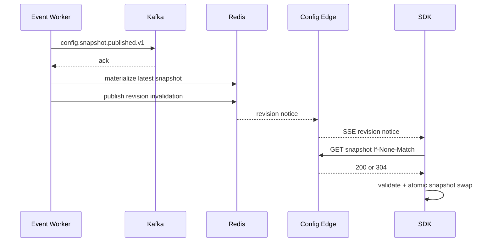

# LaunchForge - Complete Codex Implementation Specification

> GENERATED FILE. Source files are the authority. Run `python eng/sync_master_spec.py` after editing documentation.

---

<!-- SOURCE: README.md -->

# LaunchForge — Feature Flag & Remote Configuration Platform

> **Working project name.** Perform trademark/domain clearance before using `LaunchForge` commercially.

## What this package is

This repository contains the implementation and source-of-truth specification for a production-style **feature flag, remote configuration, gradual rollout, kill-switch, and SDK delivery platform** built primarily with **Java / Spring Boot** and **React / TypeScript**.

The project is designed for two goals:

1. **Employment/portfolio:** prove modern Java, Spring Boot, React, distributed systems, caching, Kafka, low-latency SDK design, security, testing, observability, Docker, and Kubernetes/Helm.
2. **Commercial validation:** become a real developer tool that can be self-hosted first and later offered as a hosted service if outside teams validate the need.

The central engineering problem is not CRUD. It is **safe, deterministic, low-latency delivery of changing configuration to many applications without making customer request paths synchronously depend on LaunchForge**.

## Core product

A software team can:

- create organizations, projects, and Development/Staging/Production environments;
- create typed flags and remote configuration values;
- define ordered targeting rules;
- roll a feature out deterministically to a percentage of subjects;
- disable a feature globally with a kill switch;
- publish immutable configuration revisions;
- roll back by publishing a new revision containing prior known-good content;
- integrate through Java, JavaScript, and React SDKs;
- evaluate flags locally from SDK-cached configuration;
- receive near-real-time configuration revision updates;
- rotate SDK keys;
- audit who changed what and why;
- optionally collect privacy-minimized evaluation analytics.

## Final target architecture



### Key design principle

The **control plane** is where humans manage configuration. The **data plane** is where SDKs retrieve published snapshots and stay updated. Runtime flag evaluation happens **inside the SDK**, not by calling LaunchForge on every application request.

## Implementation strategy

Do not begin with every distributed component.

1. Build a correct modular control plane and deterministic evaluator.
2. Prove Java SDK local evaluation and outage behavior.
3. Add a dedicated Config Edge and real-time streaming.
4. Build the JavaScript/React SDKs against the same golden vectors.
5. Add the polished React admin console.
6. Introduce Kafka and Redis only when multi-node runtime distribution requires them.
7. Add analytics only after configuration delivery is correct.
8. Add observability, performance evidence, Docker, Helm, and CI/CD.
9. Finish with recruiter demo and pilot package.

## Technology baseline — dated 2026-08-10

Prompt 0 verification is recorded in `docs/19_TECHNOLOGY_BASELINE.md`. Deferred service versions are re-verified again when their owning milestone begins.

- Java 25 LTS; no preview/incubator APIs in production code
- Spring Boot 4.1.x
- Maven multi-module
- React 19.2.x + TypeScript + Vite + pnpm
- PostgreSQL 18.x + Flyway
- Apache Kafka 4.3.x in KRaft mode
- Redis 8.2.x
- ClickHouse, deferred until analytics milestone
- Keycloak 26.7.0 as the digest-pinned local/reference OIDC provider
- Docker Compose
- Kubernetes + Helm
- OpenTelemetry + Prometheus + Grafana
- JUnit 5, ArchUnit, Testcontainers, Playwright, JMH, k6

## Repository shape

```text
LaunchForge/
  pom.xml
  package.json
  pnpm-workspace.yaml
  AGENTS.md
  README.md
  CODEX_START_HERE.md
  CODEX_PROMPT_SEQUENCE.md
  CODEX_MASTER_IMPLEMENTATION_SPEC.md
  PROJECT_STATUS.md
  backend/
    launchforge-domain/
    launchforge-application/
    launchforge-infrastructure/
    launchforge-contracts/
    launchforge-control-api/
    launchforge-config-edge/
    launchforge-event-worker/
  frontend/
    admin-web/
  sdks/
    java/
      launchforge-java-sdk/
    javascript/
      packages/
        core/
        browser/
        react/
  demos/
    spring-demo/
    react-demo/
  tests/
    architecture-tests/
    integration-tests/
    e2e/
    performance/
  contracts/
    openapi/
    events/
    snapshots/
    golden-vectors/
  deploy/
    docker/
    helm/
  docs/
  templates/
  eng/
```

## How to use this package

1. Extract the folder into a new Git repository.
2. Read `CODEX_START_HERE.md`.
3. Give Codex **Prompt 0 only**.
4. Review the assessment and exact technology pins.
5. Continue one numbered prompt at a time.
6. Never ask Codex to build all milestones in one task.
7. `CODEX_MASTER_IMPLEMENTATION_SPEC.md` is generated from the modular docs; edit source files, not the generated master.

## Development foundation

M0 requires Eclipse Temurin Java `25.0.4+7`, the committed Maven `3.9.16` wrapper, Node.js `24.19.0`, pnpm `11.21.0`, and Docker/Compose. Exact dependency and deferred-service pins are recorded in `docs/19_TECHNOLOGY_BASELINE.md`.

### Toolchain check

```powershell
java -version
.\mvnw.cmd -version
node --version
corepack --version
pnpm --version
docker version
docker compose version
```

Activate the pinned JavaScript package manager once per Node installation:

```powershell
corepack enable
corepack prepare pnpm@11.21.0 --activate
```

### Java quality and tests

```powershell
.\mvnw.cmd spotless:apply
.\mvnw.cmd verify
.\mvnw.cmd -pl tests/integration-tests -am verify -Pintegration
```

`verify` runs formatter checks, focused Checkstyle, compiler `-Xlint:all` with warnings treated as failures, unit tests, and ArchUnit rules. The integration profile requires a running Docker engine and starts PostgreSQL `18.4` through Testcontainers.

### Frontend quality and development

```powershell
pnpm install --frozen-lockfile
pnpm format:check
pnpm lint
pnpm typecheck
pnpm test
pnpm build
pnpm --filter @launchforge/admin-web dev
```

### Local PostgreSQL

```powershell
Copy-Item .env.example .env
docker compose config --quiet
docker compose up -d --wait postgres
docker compose ps
docker compose exec postgres pg_isready -U launchforge -d launchforge
docker compose down
```

The local template binds PostgreSQL to `127.0.0.1:55432` to avoid colliding with an existing system PostgreSQL. Change `LAUNCHFORGE_POSTGRES_PORT` and the matching JDBC URL together if another host port is preferred.

To run the minimal Control API shell, export `LAUNCHFORGE_DB_URL`, `LAUNCHFORGE_DB_USER`, and `LAUNCHFORGE_DB_PASSWORD` using the same local-only values as `.env`, then run:

```powershell
.\mvnw.cmd -pl backend/launchforge-control-api -am package
java -jar backend/launchforge-control-api/target/launchforge-control-api-0.1.0-SNAPSHOT-exec.jar
```

### Local identity and authenticated shell

M1 adds an optional Keycloak profile, four fictional operator identities, a fictional organization/project seed, and the authenticated React shell. Set every password placeholder in `.env`, then start PostgreSQL and the imported realm and assign the local-only demo password:

```powershell
docker compose --profile identity --profile identity-seed up -d --wait postgres keycloak
docker compose --profile identity --profile identity-seed run --rm keycloak-seed
```

Export the database and OIDC variables shown in `.env.example` into the shell that starts Java. Enable the fictional SQL seed only in the `local` profile:

```powershell
.\mvnw.cmd -pl backend/launchforge-control-api -am package
java -jar backend/launchforge-control-api/target/launchforge-control-api-0.1.0-SNAPSHOT-exec.jar --spring.profiles.active=local
```

Start the UI at `http://localhost:5173` and sign in as `owner`, `admin`, `developer`, or `viewer` with `LAUNCHFORGE_DEMO_USER_PASSWORD`:

```powershell
pnpm --filter @launchforge/admin-web dev
```

The browser receives only an HttpOnly same-origin application-session cookie; OIDC tokens remain server-side. The local profile uses the non-secure `launchforge_session` cookie for HTTP development, while the default non-local configuration uses the secure `__Host-launchforge_session` cookie.

With PostgreSQL, Keycloak, and the seeded Control API running, execute the real login/access/logout smoke test with:

```powershell
$env:LAUNCHFORGE_E2E_PASSWORD = $env:LAUNCHFORGE_DEMO_USER_PASSWORD
pnpm test:e2e
```

The Playwright configuration starts and stops Vite automatically. Stop the local services without deleting PostgreSQL data with:

```powershell
docker compose --profile identity --profile identity-seed down
```

The reset command below permanently deletes only the local Compose PostgreSQL volume:

```powershell
docker compose down -v
```

### Flag control plane

M2 implements the authenticated management API for projects, environments, typed flags/variations, environment drafts, ordered targeting rules, 100,000-bucket percentage allocations, publication history/diff, and rollback. Mutable routes use ETag/`If-Match`; browser mutations retain the M1 CSRF requirement. Rollout salt is server-owned and can change only through the explicit reason-required reseed route.

Flyway applies `V2__flag_control_plane.sql` when the Control API starts. Publication validates the full draft and commits the RFC 8785 canonical revision, current pointer, audit event, and pending outbox intent atomically. PostgreSQL rejects update/delete of revision rows. Kafka publishing, Config Edge, SDK evaluation, and the React flag editor remain intentionally deferred to their owning prompts.

On Unix-like systems, use `./mvnw` in place of `.\mvnw.cmd`. After initializing Git on Windows, record the executable bit with `git update-index --chmod=+x mvnw`.

## Commercial approach

Treat the product name, pricing, and market positioning as hypotheses.

1. Build a reproducible self-hosted demo.
2. Interview 10–15 small SaaS/agency engineering teams.
3. Offer 2–3 controlled pilots.
4. Measure integration time, recurring usage, reliability, and willingness to pay.
5. Prefer paid onboarding/managed hosting before building a complicated subscription system.

Never claim customers, revenue, availability, or benchmark numbers until they are real and measured.

---

<!-- SOURCE: AGENTS.md -->

# AGENTS.md — Repository Instructions for Codex

## Mission

Build and maintain LaunchForge according to the specifications in this repository. LaunchForge is a multi-tenant feature flag and remote configuration platform with local SDK evaluation, deterministic targeting, real-time configuration delivery, auditable change management, and optional evaluation analytics.

## Required reading order

Before changing code, read:

1. `README.md`
2. `docs/01_PRODUCT_REQUIREMENTS.md`
3. `docs/02_SYSTEM_ARCHITECTURE.md`
4. `docs/05_FLAG_EVALUATION_ENGINE.md`
5. the document(s) linked to the assigned issue
6. `docs/15_BACKLOG_AND_ACCEPTANCE.md`
7. `templates/definition-of-done.md`

`CODEX_MASTER_IMPLEMENTATION_SPEC.md` is generated. Never edit it directly.

If requirements conflict, stop and report the conflict. Do not silently invent a new product direction.

## Architecture rules

- The control plane begins as a **modular monolith**.
- Final deployment may use separate Control API, Config Edge, and Event Worker processes, but business modules are not split into arbitrary microservices.
- Primary backend language: Java.
- Framework: Spring Boot.
- Frontend: React + TypeScript.
- System of record: PostgreSQL.
- Runtime published configuration is immutable and versioned.
- SDK runtime evaluation is local whenever possible.
- Kafka is introduced only when durable multi-node configuration distribution requires it.
- Redis is a rebuildable data-plane materialization/cache and fan-out helper, never the source of truth.
- ClickHouse is analytics-only and deferred until the analytics milestone.
- Browser authentication uses OIDC through a same-origin BFF/session design; never store long-lived access tokens in localStorage.
- Human credentials, Server SDK keys, Browser SDK keys, and future management API credentials are separate credential classes.
- Docker Compose must work before Helm/Kubernetes work begins.

## Java coding rules

- Use the verified Java LTS baseline from `docs/19_TECHNOLOGY_BASELINE.md`.
- No preview, incubator, or experimental Java APIs in production code.
- Domain must not depend on Spring, JPA, HTTP, Kafka, Redis, ClickHouse, or UI packages.
- Prefer explicit, readable domain types over framework-driven behavior.
- Keep controllers thin; business behavior belongs in application/domain services.
- Validate all external input.
- Use optimistic concurrency on management resources.
- Use explicit network/database timeouts where applicable.
- Never swallow exceptions or retry permanent failures blindly.
- Never log secrets, SDK keys, raw cookies, authorization headers, or arbitrary evaluation context.
- No hard-coded credentials, organization IDs, project IDs, URLs, pricing, or demo accounts in production code.
- Do not add a dependency solely because it is popular; document why it is required.

## Evaluation engine rules

- Evaluation must be deterministic for the same snapshot/context.
- Rule semantics are versioned.
- No implicit type coercion.
- Missing attributes have explicit behavior.
- Percentage rollout follows `docs/05_FLAG_EVALUATION_ENGINE.md`.
- Java and TypeScript implementations must pass the same golden test vectors.
- Evaluation returns a safe reason code for diagnostics.
- SDKs use last-known-good or caller defaults if remote configuration is unavailable.
- Local evaluation performs no network, database, or disk I/O.

## Distribution rules

- A management edit does not affect runtime until a validated immutable environment revision is published.
- PostgreSQL commit and Kafka publication use the documented transactional outbox boundary.
- Kafka messages and snapshots are versioned contracts.
- Consumers are idempotent and tolerate duplicate delivery.
- Revision numbers are the ordering authority.
- Redis loss cannot erase authoritative configuration.
- Stream disconnects fall back to bounded polling with exponential backoff and jitter.
- Customer applications continue evaluating with last-known-good/defaults when LaunchForge is unavailable.

## Testing rules

For every behavior change:

1. add/update unit tests;
2. add integration tests for persistence/auth/Kafka/Redis/ClickHouse/HTTP boundaries;
3. update cross-SDK golden vectors if evaluation semantics change;
4. run applicable format/static/build/tests;
5. report exact commands and outcomes.

Critical flows require end-to-end evidence:

- admin creates flag -> publishes -> Java SDK refreshes -> local evaluation returns expected value;
- stable 10% rollout remains stable for same subject and approximately distributes over a deterministic sample;
- kill switch publishes -> connected SDK observes new revision without app redeploy;
- rollback creates a newer revision that restores prior behavior;
- cross-organization direct-ID access is denied;
- duplicate/stale configuration events are harmless;
- edge/Redis restart does not change already published behavior;
- stream disconnect falls back safely;
- revoked SDK key is denied;
- analytics disabled means no evaluation event leaves the SDK.

## Security rules

- HTTPS outside local development.
- Secure, HttpOnly, SameSite session cookies in non-local environments.
- CSRF protection on browser mutations.
- Validate OIDC issuer/signature/state/nonce and audience where required.
- Server SDK keys use strong entropy and hash-only storage where verification semantics permit.
- Browser SDK keys are treated as public and can only retrieve client-visible read-only snapshots.
- Every management operation is organization-scoped and role-authorized.
- Rate-limit login/management/bootstrap/stream/analytics independently.
- Feature flags are not a secrets manager.
- Analytics excludes arbitrary targeting context by default.
- Logs/metrics must not leak secrets or unbounded labels.

## Task execution protocol

For every assigned issue:

1. Restate issue IDs and affected components.
2. Read linked requirements and ADRs.
3. State assumptions/conflicts.
4. Give a small implementation plan.
5. Implement only assigned issue(s).
6. Add tests.
7. Run validation.
8. Update source docs, `PROJECT_STATUS.md`, and `CHANGELOG.md` if behavior changes.
9. Run `python eng/sync_master_spec.py` when source documentation changes.
10. Report files changed, commands/results, remaining risks, and next recommended issue without implementing it.

## Definition of done

An issue is complete only when it satisfies both `docs/15_BACKLOG_AND_ACCEPTANCE.md` and `templates/definition-of-done.md`.

---

<!-- SOURCE: CODEX_START_HERE.md -->

# Codex Start Here

You are implementing LaunchForge. Treat repository documentation as the source of truth.

## First assignment — do not code yet

### Step 1 — Read

Read completely:

- `AGENTS.md`
- `README.md`
- `docs/00_DOCUMENT_MAP.md`
- `docs/01_PRODUCT_REQUIREMENTS.md`
- `docs/02_SYSTEM_ARCHITECTURE.md`
- `docs/05_FLAG_EVALUATION_ENGINE.md`
- `docs/14_TIMELINE_MILESTONES.md`
- `docs/15_BACKLOG_AND_ACCEPTANCE.md`
- `docs/19_TECHNOLOGY_BASELINE.md`

Skim all ADRs and report any contradiction.

### Step 2 — Assess

Return:

1. Product understanding in at most 15 bullets.
2. Proposed repository/module structure.
3. Exact technology versions to pin, verified against official compatibility/release documentation.
4. Maven, Node and pnpm commands you expect to use.
5. Architecture dependency graph.
6. Data-model concerns or missing constraints.
7. Security/privacy concerns.
8. Requirement contradictions or ambiguous decisions.
9. Milestone dependency graph.
10. Exact scope of Prompt 1 / Milestone 0.
11. Validation commands for Java formatting/build/test, integration tests, frontend lint/typecheck/test/build, and local infrastructure.

### Step 3 — Wait

Do **not** write application code, initialize frameworks, or create product migrations during this assessment. Wait for approval to begin Prompt 1.

## Standard issue prompt

> Implement issue(s) `[IDs]` from `docs/15_BACKLOG_AND_ACCEPTANCE.md`. Read linked requirements and ADRs first. Provide a short plan, implement only those issues, add tests, run required validation, update source documentation/status if needed, regenerate `CODEX_MASTER_IMPLEMENTATION_SPEC.md`, and report files changed plus remaining risks. Do not start the next issue.

## Quality requirement

Every change must be understandable and reviewable by a human developer. Fast generation is not more important than correctness, security, deterministic behavior, interoperability, tests, and documentation.

---

<!-- SOURCE: PROJECT_STATUS.md -->

# Project Status

**Status:** Prompt 3 flag control-plane implementation complete.

**Current milestone:** M2 flag domain and control plane (LF-0201–LF-0207) complete; stop point before Prompt 4 / M3 evaluator and Java SDK.

**Specification baseline:** Canonical module paths, snapshot/checksum representation, algorithm-version-1 types and reason codes, milestone dependencies, and exact Prompt 0 toolchain pins were normalized on 2026-08-10.

| Milestone | Issues | Status |
|---|---|---|
| M0 Foundation | LF-0001–LF-0005 | Complete (2026-08-10) |
| M1 Tenancy & identity | LF-0101–LF-0105 | Complete (2026-08-10) |
| M2 Flag domain & control plane | LF-0201–LF-0207 | Complete (2026-08-10) |
| M3 Evaluation engine & Java SDK | LF-0301–LF-0307 | Not started |
| M4 Data plane & streaming | LF-0401–LF-0406 | Not started |
| M5 JavaScript/React SDKs | LF-0501–LF-0505 | Not started |
| M6 Admin console | LF-0601–LF-0606 | Not started |
| M7 Kafka/Redis scale-out | LF-0701–LF-0706 | Not started |
| M8 Analytics | LF-0801–LF-0805 | Not started |
| M9 Security hardening | LF-0901–LF-0906 | Not started |
| M10 Reliability/performance | LF-1001–LF-1006 | Not started |
| M11 Containers/Helm | LF-1101–LF-1104 | Not started |
| M12 CI/CD supply chain | LF-1201–LF-1205 | Not started |
| M13 Demo/pilot | LF-1301–LF-1305 | Not started |

Update after each completed Codex prompt. Do not mark issues complete until validation passes.

---

<!-- SOURCE: IMPLEMENTATION_CHECKLIST.md -->

# LaunchForge Implementation Checklist

Use `PROJECT_STATUS.md` as the status source of truth. This checklist is a quick navigation aid.

## Before coding

- [x] Run Codex Prompt 00
- [x] Review proposed exact versions
- [x] Resolve documentation contradictions found by Prompt 00
- [x] Approve M0 only

## M0 Foundation

- [x] LF-0001
- [x] LF-0002
- [x] LF-0003
- [x] LF-0004
- [x] LF-0005

## M1 Tenancy and identity

- [x] LF-0101
- [x] LF-0102
- [x] LF-0103
- [x] LF-0104
- [x] LF-0105

## M2 Control plane

- [x] LF-0201
- [x] LF-0202
- [x] LF-0203
- [x] LF-0204
- [x] LF-0205
- [x] LF-0206
- [x] LF-0207

## M3 Java evaluator/SDK

- [ ] LF-0301
- [ ] LF-0302
- [ ] LF-0303
- [ ] LF-0304
- [ ] LF-0305
- [ ] LF-0306
- [ ] LF-0307

**Resume checkpoint A**

## M4 Config Edge/SSE

- [ ] LF-0401
- [ ] LF-0402
- [ ] LF-0403
- [ ] LF-0404
- [ ] LF-0405
- [ ] LF-0406

## M5 JavaScript/React SDKs

- [ ] LF-0501
- [ ] LF-0502
- [ ] LF-0503
- [ ] LF-0504
- [ ] LF-0505

## M6 Admin console

- [ ] LF-0601
- [ ] LF-0602
- [ ] LF-0603
- [ ] LF-0604
- [ ] LF-0605
- [ ] LF-0606

## M7 Kafka/Redis

- [ ] LF-0701
- [ ] LF-0702
- [ ] LF-0703
- [ ] LF-0704
- [ ] LF-0705
- [ ] LF-0706

**Resume/interview checkpoint B**

## M8 Optional analytics

- [ ] LF-0801
- [ ] LF-0802
- [ ] LF-0803
- [ ] LF-0804
- [ ] LF-0805

## M9 Security

- [ ] LF-0901
- [ ] LF-0902
- [ ] LF-0903
- [ ] LF-0904
- [ ] LF-0905
- [ ] LF-0906

## M10 Reliability/performance

- [ ] LF-1001
- [ ] LF-1002
- [ ] LF-1003
- [ ] LF-1004
- [ ] LF-1005
- [ ] LF-1006

**Flagship portfolio checkpoint C**

## M11 Containers/Helm

- [ ] LF-1101
- [ ] LF-1102
- [ ] LF-1103
- [ ] LF-1104

## M12 CI/CD

- [ ] LF-1201
- [ ] LF-1202
- [ ] LF-1203
- [ ] LF-1204
- [ ] LF-1205

## M13 Demo/pilot

- [ ] LF-1301
- [ ] LF-1302
- [ ] LF-1303
- [ ] LF-1304
- [ ] LF-1305

## Final review

- [ ] Run Prompt 15
- [ ] Create issues for findings
- [ ] Correct findings one issue at a time
- [ ] Clean-clone demo validation
- [ ] Verify every resume claim

---

<!-- SOURCE: docs/00_DOCUMENT_MAP.md -->

# 00 — Document Map

| Document | Purpose |
|---|---|
| `01_PRODUCT_REQUIREMENTS.md` | users, jobs-to-be-done, scope, product rules, success criteria |
| `02_SYSTEM_ARCHITECTURE.md` | control plane/data plane, modules, deployables, dependency rules |
| `03_DOMAIN_AND_DATABASE.md` | entities, invariants, relational model, revisions, tenancy, and normative snapshot representation/checksum |
| `04_API_AND_CONTRACTS.md` | management, SDK, stream, analytics APIs and errors |
| `05_FLAG_EVALUATION_ENGINE.md` | normative evaluator semantics, reason codes, types, targeting and percentage rollout algorithm |
| `06_SDK_ARCHITECTURE.md` | Java/JS/React SDK behavior, cache, outage safety, streaming |
| `07_REALTIME_AND_EVENTING.md` | publication, outbox, Kafka, Redis, SSE and ordering |
| `08_FRONTEND_UX.md` | admin console workflows, accessibility and demo behavior |
| `09_SECURITY_PRIVACY.md` | auth, authorization, keys, privacy and threats |
| `10_TESTING_QUALITY.md` | test pyramid, conformance, integration, E2E, performance |
| `11_OBSERVABILITY_OPERATIONS.md` | logs, metrics, traces and operational signals |
| `12_DEVOPS_CICD.md` | Docker, Helm, migrations, release and rollback |
| `13_PERFORMANCE_CAPACITY.md` | benchmark methodology and targets |
| `14_TIMELINE_MILESTONES.md` | milestone order and dependencies |
| `15_BACKLOG_AND_ACCEPTANCE.md` | issue IDs and exact acceptance criteria |
| `16_DEMO_PORTFOLIO.md` | recruiter demo and honest resume evidence |
| `17_COMMERCIALIZATION.md` | pilots, pricing hypotheses and validation |
| `18_FAILURE_MODES_RUNBOOKS.md` | failure behavior and recovery |
| `19_TECHNOLOGY_BASELINE.md` | dated versions and pinning policy |
| `20_INTERVIEW_TALK_TRACK.md` | system-design explanations and interview questions |
| `21_NON_GOALS_AND_FUTURE.md` | deliberate exclusions and future options |

ADRs under `docs/decisions/` explain choices that must not be casually reversed.

---

<!-- SOURCE: docs/01_PRODUCT_REQUIREMENTS.md -->

# 01 — Product Requirements

## 1. Product summary

LaunchForge is a multi-tenant developer platform for feature flags and remote configuration. Teams change application behavior without redeploying by publishing versioned configuration delivered to SDKs and evaluated locally.

## 2. Primary users

### Developer
Integrates an SDK, evaluates flags safely, debugs evaluation reasons, and tests Development/Staging before Production.

### Engineering lead / release manager
Needs gradual rollout, kill switches, auditability, rollback, and confidence that application request paths do not depend on LaunchForge uptime.

### Organization owner/admin
Needs memberships, environments, roles, SDK-key rotation, audit history and operational visibility.

### Viewer/support engineer
Needs read-only access to current configuration, revision history and evaluation diagnostics.

## 3. Core jobs to be done

1. Create organization, project and environments.
2. Create a typed flag with safe defaults.
3. Configure environments differently.
4. Target a cohort with deterministic rules.
5. Gradually roll out to a stable percentage.
6. Publish/distribute a revision.
7. Observe SDK behavior change without app redeploy.
8. Disable a feature quickly.
9. Roll back to prior known-good behavior while preserving history.
10. Explain why a subject received a variation.
11. Rotate/revoke SDK credentials.
12. Optionally observe privacy-minimized evaluation counts.

## 4. Flag types

MVP:

- boolean
- string
- number
- JSON value with size/depth limits

A flag type is immutable after creation.

## 5. Variations

A flag has 2–10 named variations:

- stable variation ID
- human label
- typed value
- optional description

Each environment configuration defines:

- enabled state
- off variation
- default/on variation
- ordered targeting rules
- optional percentage rollout
- rollout salt
- concurrency version

## 6. Environments

Projects start with Development, Staging and Production. Names may change; keys are immutable.

Production publish/rollback requires a human change reason. The UI must make the active environment unmistakable.

## 7. Targeting

Rules are ordered. Each rule contains ANDed conditions. First matching rule wins.

Supported attribute categories:

- string
- number
- boolean
- semantic version

Algorithm version 1 accepts scalar context attributes only. `IN` and `NOT_IN` compare one string context value with a configured list of strings. List-valued context attributes are deferred until a later algorithm version defines their exact semantics.

No arbitrary JavaScript, SpEL, SQL, user-provided regex, or dynamically executed code.

## 8. Percentage rollout

Rollouts are:

- deterministic
- stable across restarts
- identical across Java and TypeScript SDKs
- independent of request order
- re-randomized only through explicit salt regeneration

Weights total 100,000 buckets for 0.001% resolution.

## 9. Publishing and revisions

Management edits are not runtime-visible until publish.

Publish must atomically:

1. validate the complete environment configuration;
2. create an immutable environment snapshot;
3. assign a strictly increasing environment revision;
4. persist audit metadata;
5. insert an outbox event in the same transaction;
6. return the durable revision.

Distribution to every SDK is eventually consistent and occurs after commit.

Rollback never rewinds revision history. It publishes prior content as a **new higher revision**.

## 10. SDK requirements

SDKs:

- bootstrap a versioned snapshot;
- cache last-known-good;
- evaluate locally;
- expose caller defaults;
- optionally subscribe to revision stream;
- fall back to polling with jitter;
- never block startup forever;
- never call LaunchForge for each flag evaluation;
- expose evaluation detail/reason;
- allow complete analytics disablement.

## 11. Audit

Append-only audit records include:

- actor ID/type
- organization/project/environment
- action type
- resource identity
- old/new revision references where relevant
- human Production reason
- UTC timestamp
- correlation ID

Do not record secrets or arbitrary targeting context.

## 12. Commercially testable MVP

Requires:

- self-hosted Docker Compose
- Java and React integration guides
- organization/project/environment management
- typed flags/rules/rollout
- Java SDK
- JavaScript/React SDK
- live update demo
- audit/revision history
- SDK key lifecycle
- polished admin UI
- one-command fictional demo

Analytics, experiments, SAML/SCIM and multi-region are not required for the first pilot.

## 13. Success evidence

### Engineering

- cross-SDK conformance suite passes;
- cross-organization access tests pass;
- duplicate/stale config event has no harmful effect;
- SDK continues last-known-good during LaunchForge outage;
- kill switch reaches connected demo without redeploy;
- rollback produces a newer revision restoring old behavior;
- benchmark methodology/results are reproducible.

### Portfolio

A recruiter can understand the problem, architecture and Java/Spring focus within one minute from README media.

### Commercial

Do not call the product validated until external teams actually integrate and repeatedly use it. Stars/page views are not product validation.

## 14. Non-functional priority order

1. deterministic correctness
2. safe customer behavior during outage
3. tenant isolation and credential safety
4. local evaluation performance
5. reliable propagation
6. operability/debuggability
7. scale
8. breadth

---

<!-- SOURCE: docs/02_SYSTEM_ARCHITECTURE.md -->

# 02 — System Architecture

## 1. Strategy

LaunchForge uses a **control-plane / data-plane architecture**, while the control-plane business model starts as a modular monolith.

Do not begin with many microservices. Separate runtime delivery only when its traffic/availability requirements justify a distinct deployable.

## 2. Final logical architecture



## 3. Deployable units

### Control API — Spring MVC

Responsibilities:

- OIDC BFF/session
- organization membership/authorization
- projects/environments
- flag/variation/rule management
- publish and rollback
- SDK key lifecycle
- audit queries
- analytics query API
- health/readiness
- transactional outbox writes

It must not own long-lived SDK streaming connections.

### Config Edge — Spring WebFlux

Responsibilities:

- SDK-key authentication
- snapshot serving
- ETag/304
- local hot cache
- Redis materialization lookup/fallback
- long-lived revision stream
- SDK data-plane rate limits
- data-plane health/metrics

It exposes no management mutation capability.

### Event Worker

Responsibilities after later milestones:

- lease/publish outbox events
- Kafka publication
- config event consumption/materialization
- Redis Pub/Sub invalidation
- analytics consumption/ClickHouse inserts
- bounded retries
- lag/failure metrics

Separate logical workers may share one deployable initially.

### React Admin Web

Responsibilities:

- authenticated navigation
- project/environment context
- flag/rule/rollout editor
- publish/revision/rollback
- SDK keys
- audit
- analytics/operations
- accessible errors/loading/concurrency

### Java SDK

Pure Java, no Spring dependency:

- bootstrap snapshot
- immutable in-memory config
- deterministic local evaluation
- streaming/poll refresh
- last-known-good hooks
- caller defaults
- evaluation details
- optional bounded analytics

### JS and React SDKs

A TypeScript core SDK and thin React binding. React never reimplements evaluator semantics.

## 4. Module structure

```text
backend/
  launchforge-domain/
  launchforge-application/
  launchforge-infrastructure/
  launchforge-contracts/
  launchforge-control-api/
  launchforge-config-edge/
  launchforge-event-worker/
sdks/
  java/
    launchforge-java-sdk/
  javascript/
    packages/
      core/
      browser/
      react/
frontend/
  admin-web/
demos/
  spring-demo/
  react-demo/
```

## 5. Dependency rules

- Domain references no Spring/JPA/transport/infrastructure.
- Application references Domain.
- Contracts references neither Domain nor Infrastructure.
- Infrastructure references Domain/Application.
- Control API references Application/Infrastructure/Contracts.
- Config Edge references only runtime contracts/data-plane infrastructure, not management controllers.
- Event Worker references narrow Application/Infrastructure/Contracts as needed.
- Java SDK is independent of backend modules.
- JS SDK shares JSON schemas/golden vectors only, not Java code.
- JavaScript Browser SDK depends on JavaScript Core.
- React SDK depends on JavaScript Browser/Core and never reimplements evaluation.

ArchUnit enforces backend constraints.

## 6. Publish path



No Kafka network call occurs inside the database transaction.

## 7. Final runtime distribution path



## 8. Availability philosophy

Customer applications must not fail just because LaunchForge is temporarily unavailable.

SDK evaluation priority:

1. current in-memory snapshot
2. persisted last-known-good if configured
3. caller-provided default

Remote failure impacts freshness, not every application request.

## 9. Multi-tenancy

Organization is the management security boundary.

Organization scope is derived server-side through authenticated membership and resource parentage. Never trust a client-supplied organization ID as the authority.

Integration tests must attempt direct-ID cross-organization access for every resource family.

## 10. Data ownership

- PostgreSQL: authoritative management state, revisions, keys metadata, audit, outbox
- Kafka: durable propagation transport; not source of truth
- Redis: rebuildable current data-plane materialization/cache
- ClickHouse: analytics only
- SDK local cache: runtime last-known-good copy

## 11. Consistency

A successful publish means the revision is durable in PostgreSQL. It does not mean every SDK has already observed it.

Runtime distribution is eventually consistent with **monotonic environment revision numbers**. Edge and SDK ignore stale revisions. Rollback publishes a newer revision.

## 12. Scaling

Scale independently:

- Control API by management load
- Config Edge by SDK bootstrap/stream load
- Event Worker by outbox/Kafka lag
- PostgreSQL by management/revision workload
- Redis by active snapshot footprint
- ClickHouse by analytics volume

Do not introduce sharding or multi-region active-active until measured requirements exist.

---

<!-- SOURCE: docs/03_DOMAIN_AND_DATABASE.md -->

# 03 — Domain and Database

## Core entities

### Organization
`id`, name, slug, status, optimistic version, timestamps.

Statuses: Trial, Active, Suspended, Closed.

### OrganizationMembership
OIDC identity (`issuer` + `subject`) -> organization role. A membership is unique by `(organization_id, oidc_issuer, oidc_subject)`; `subject` alone is never treated as globally unique.

Roles: Owner, Admin, Developer, Viewer.

### Project
Organization-owned. Has immutable key, name, description, status, version.

### Environment
Project-owned. Has immutable key, display name, kind (Development/Staging/Production/Custom), current published revision number, version.

### Flag
Project-level identity:

- stable ID
- immutable key
- name
- type
- description
- client-visible policy
- archived state

Archived flag keys are not reused within a project.

### Variation
Stable ID, label and typed value.

### FlagEnvironmentConfig
Mutable draft/current management configuration:

- enabled
- off/default variation
- ordered rules
- rollout
- rollout salt
- optimistic version

### EnvironmentRevision
Immutable publication artifact:

- environment ID
- strictly increasing revision
- schema version
- canonical snapshot JSON
- SHA-256 checksum
- actor
- change reason
- source revision for rollback
- UTC timestamp

### SDKKey
Kinds:

- BrowserClient
- ServerSDK
- future Management credential

Store prefix/lookup metadata, the versioned HMAC verifier defined in `docs/09_SECURITY_PRIVACY.md` for secret credentials, created/revoked/last-used metadata, and environment scope.

### AuditEvent
Append-only product record.

### OutboxEvent
Transactional delivery intent: event ID/type/schema/aggregate/payload/status/lease/attempt/failure fields.

## Canonical snapshot

Contains everything an SDK needs to evaluate its authorized flags without a management API call. This section is the normative snapshot shape; other documents reference it instead of defining alternatives.

```json
{
  "schemaVersion": 1,
  "algorithmVersion": 1,
  "projectKey": "northstar-storefront",
  "environmentKey": "production",
  "revision": 42,
  "generatedAt": "2026-08-10T17:00:00Z",
  "flags": {
    "new-checkout": {
      "type": "boolean",
      "enabled": true,
      "clientVisible": true,
      "variations": [
        {"id": "off", "value": false},
        {"id": "on", "value": true}
      ],
      "offVariation": "off",
      "defaultVariation": "off",
      "rules": [],
      "rollout": {
        "attribute": "key",
        "salt": "checkout-r1",
        "weights": [
          {"variation": "on", "weight": 10000},
          {"variation": "off", "weight": 90000}
        ]
      }
    }
  },
  "checksum": "<64 lowercase hexadecimal SHA-256 characters>"
}
```

Contract rules:

- `schemaVersion` versions document shape and validation; `algorithmVersion` versions evaluator semantics.
- `flags` is an object keyed by immutable flag key. The nested flag does not repeat that key.
- flag type values are lowercase: `boolean`, `string`, `number`, or `json`.
- variation references use the `id` field and the names `offVariation` and `defaultVariation`.
- `rules` is always an array; the optional `rollout` member is omitted when no rollout is configured rather than emitted as JSON null.
- A rule has `id`, ordered `conditions`, and a `variation` machine key. A condition has `attribute`, lowercase `attributeType`, an algorithm-version-1 `operator`, and `values`; numeric operands are JSON numbers and other configured operands are strings. Conditions within a rule are ANDed and rule array order is evaluation order.
- Rollouts use `attribute`, server-owned `salt`, and ordered `weights`; each weight names a variation machine key and uses an integer bucket count.
- arrays preserve semantic declaration order. In particular, rule and rollout-weight order is significant.
- server and browser projections are separate complete snapshot representations. Filtering occurs before checksum generation, so their checksums and ETags may differ for the same environment revision.
- management-only data, internal database IDs, identities, audit data, and secret material are excluded.

### Canonical JSON and checksum

Snapshot JSON uses the JSON Canonicalization Scheme in RFC 8785. Input must satisfy the I-JSON constraints required by that scheme and the numeric restrictions in `docs/05_FLAG_EVALUATION_ENGINE.md`.

To create or verify `checksum`:

1. remove the top-level `checksum` member;
2. serialize the remaining complete projection with RFC 8785 canonical JSON;
3. encode those canonical bytes as UTF-8 with no BOM or trailing newline;
4. compute SHA-256;
5. encode the digest as exactly 64 lowercase hexadecimal characters.

All present fields, including additive fields understood by a later compatible reader, participate in the checksum. Snapshot schemas and frozen checksum fixtures must test property ordering, Unicode, numeric rendering, and both server/browser projections.

## Identifier canonicalization

- Organization slugs match `^[a-z0-9](?:[a-z0-9-]{0,61}[a-z0-9])?$`.
- Project, environment, flag, and variation machine keys match `^[a-z][a-z0-9._-]{0,63}$`.
- Machine keys are accepted only in canonical lowercase ASCII form. APIs reject rather than silently trim or lowercase input.
- Display names remain separate human-readable fields.
- Rollout salts are server-generated URL-safe ASCII without CR/LF and are immutable unless an explicit audited cohort re-randomization is requested.
- Archived flag keys remain reserved permanently within their project.

## Suggested PostgreSQL tables

```text
organizations
organization_memberships
projects
environments
flags
flag_variations
flag_environment_configs
environment_revisions
sdk_keys
audit_events
outbox_events
```

### M1 implemented baseline

Flyway migration `V1__tenancy_identity.sql` creates `organizations`, `organization_memberships`, `audit_events`, and the PostgreSQL-backed `launchforge_session` tables. It also creates the minimum organization-scoped `projects` table needed for the opt-in read-only M1 shell seed; project domain behavior and CRUD remain assigned to M2.

The M1 JDBC adapter derives tenant access from the exact authenticated OIDC `(issuer, subject)` membership, repeats actor membership scope in tenant queries/mutations, and locks the organization row while changing the roster. Membership and tenant foreign keys use `RESTRICT`, and denied/successful membership administration writes bounded audit fields without tokens, cookies, or arbitrary claims.

### M2 implemented baseline

Flyway migration `V2__flag_control_plane.sql` adds environments, typed flags/variations, one mutable `flag_environment_configs` row per flag/environment, immutable environment revisions, and durable outbox intent. Tenant ownership is repeated on child rows and enforced through compound foreign keys as well as actor-scoped JDBC queries.

The management domain validates two to ten typed variations, algorithm-version-1 operator/type/arity rules, ordered rule/condition limits, explicit off/default references, server-owned rollout salts, and positive integer weights totalling exactly `100000`. JSON inputs use strict duplicate detection, I-JSON numeric/Unicode limits, and RFC 8785 canonicalization.

Publication locks the project/environment rows, validates the complete active draft, creates the normative keyed-flag snapshot, calculates and injects its checksum, inserts a revision, advances the environment, appends audit, and inserts a versioned pending outbox event in one PostgreSQL transaction. A database trigger rejects revision update/delete. Rollback rebases historical content with a new timestamp/checksum and strictly higher revision while preserving history and recording `source_revision`.

Rule trees may initially be validated `jsonb` inside `flag_environment_configs` if domain validation remains explicit. Normalize only if query requirements justify it. Published snapshots remain immutable `jsonb`.

## Constraints

- organization slug globally unique
- organization membership unique per organization/OIDC issuer/OIDC subject
- project key unique per organization
- environment key unique per project
- flag key unique per project, including archived
- one config per flag/environment
- environment revision unique per environment/revision
- outbox event ID unique
- SDK key lookup identity unique
- audit ID unique/immutable

Tenant-owned child rows must be protected from cross-organization parent mismatches by enforced ownership chains and compound foreign keys where a direct organization key is duplicated for scoping. Repository filters alone are not sufficient. Removing or demoting the final Owner must be rejected inside the same transaction and covered by a concurrency integration test.

## Optimistic concurrency

Mutable management resources expose opaque version/ETag. Updates require `If-Match` or explicit expected version.

On conflict, never silently overwrite. Return consistent conflict status and safe current revision metadata.

## Publish transaction

Atomically:

1. validate expected management versions
2. validate complete environment configuration
3. generate canonical snapshot
4. lock the environment row with PostgreSQL `SELECT ... FOR UPDATE`, verify its current published revision, and allocate `next_revision = current_published_revision + 1`
5. insert immutable environment revision
6. update environment published pointer
7. append audit
8. insert outbox

Failure rolls back all steps.

The environment-row lock is the version-1 publish revision allocator. Publish and rollback use the same path. Do not replace it with `MAX(revision)+1`, an in-memory counter, or a process-local lock. Concurrent integration tests must prove uniqueness and monotonicity.

## Rollback

Input references prior revision R. Application verifies schema compatibility and publishes R's content as a new revision N where `N > current`, recording `source_revision=R`.

Never move the published pointer backward without a new revision.

## Archive/deletion

- flags archive, not hard-delete in MVP
- environments archive only after relevant key controls
- projects/organizations use lifecycle state and explicit retention
- analytics retention is separate from management/audit retention
- tenant/domain foreign keys use `RESTRICT` rather than cascading hard deletion in the MVP
- closing an organization or archiving a parent does not erase revisions, audit records, or key lifecycle metadata
- any future destructive retention job requires a separate issue, preview/dry-run, tenant-safe batching, and an audit record

## IDs/time

Use UTC `Instant`. Use one consistent UUID strategy. Do not add UUIDv7 dependency unless justified.

## Migrations

Flyway, forward-only production practice. Migration job executes before new workload. No automatic destructive rollback.

---

<!-- SOURCE: docs/04_API_AND_CONTRACTS.md -->

# 04 — API and Contracts

## API families

1. **Management/BFF** — humans and later management tokens.
2. **SDK data plane** — environment-scoped read-only bootstrap/stream.
3. **Analytics ingestion** — optional batched evaluation events.

Credential classes are never interchangeable.

## Common conventions

- HTTPS outside local dev
- JSON UTF-8
- `/api/v1` management
- `/sdk/v1` data plane
- `/events/v1` analytics
- UTC ISO-8601
- Problem Details-style errors with stable `code`
- correlation ID
- ETag/If-Match on mutable management resources
- ETag/If-None-Match on snapshots

The normative runtime snapshot shape, projection checksum, and identifier rules are in `docs/03_DOMAIN_AND_DATABASE.md`. The normative evaluator/reason-code contract is in `docs/05_FLAG_EVALUATION_ENGINE.md`; API examples must not define alternate names or semantics.

## Version 1 safety limits

These are validation limits for the first contract, measured on decoded/uncompressed content unless stated otherwise. Deployments may configure lower values, not silently higher ones:

| Item | Maximum |
|---|---:|
| Management JSON request body | 1 MiB |
| Canonical snapshot projection | 5 MiB UTF-8 |
| Flags in one environment snapshot | 2,000 |
| Variations per flag | 50 |
| Rules per flag | 100 |
| Conditions per rule | 10 |
| Rollout weight entries per flag | 50 |
| Evaluation-context attributes | 64 |
| Encoded evaluation context | 16 KiB UTF-8 |
| Context attribute name | 128 Unicode scalar values |
| String context value | 1,024 Unicode scalar values |
| One JSON variation value | 64 KiB canonical UTF-8 |

Exceeding a management/context limit returns a stable validation Problem Details code. A snapshot that exceeds runtime limits is rejected before publish; an SDK that receives one rejects it and retains last-known-good. Raising a version-1 hard limit requires a documented issue and Java/JavaScript boundary tests.

## Browser/session

M1 routes:

```text
GET  /api/v1/auth/me
GET  /api/v1/auth/csrf
GET  /oauth2/authorization/keycloak
POST /api/v1/auth/logout
```

The OAuth route uses Authorization Code with a public client and PKCE S256. `GET /api/v1/auth/me` returns only server-derived organization memberships for the exact authenticated issuer/subject. `GET /api/v1/auth/csrf` returns the session-bound mutation token, and logout invalidates the local PostgreSQL-backed session. Unauthenticated `/api/**` calls return `401` instead of an HTML login redirect.

## Organizations/memberships

```text
GET    /api/v1/organizations
GET    /api/v1/organizations/{orgId}
GET    /api/v1/organizations/{orgId}/members
POST   /api/v1/organizations/{orgId}/members
PATCH  /api/v1/organizations/{orgId}/members/{membershipId}
DELETE /api/v1/organizations/{orgId}/members/{membershipId}
```

These are the M1 implemented routes. Organization creation/renaming endpoints and project behavior are not exposed by Prompt 2. Membership mutations accept the target identity/role only; an organization ID supplied in the JSON body is rejected, and the path organization is authorized from the server-derived operator membership. Owner/Admin policy is enforced in the application service, UI visibility is not an authorization control, and the final Owner can never be removed or demoted.

## Projects/environments

```text
POST  /api/v1/organizations/{orgId}/projects
GET   /api/v1/organizations/{orgId}/projects
PATCH /api/v1/projects/{projectId}
POST  /api/v1/projects/{projectId}/environments
GET   /api/v1/projects/{projectId}/environments
PATCH /api/v1/environments/{environmentId}
```

## Flags

```text
POST  /api/v1/projects/{projectId}/flags
GET   /api/v1/projects/{projectId}/flags
GET   /api/v1/flags/{flagId}
PATCH /api/v1/flags/{flagId}
POST  /api/v1/flags/{flagId}/archive
GET   /api/v1/flags/{flagId}/environments/{environmentId}
PUT   /api/v1/flags/{flagId}/environments/{environmentId}
POST  /api/v1/flags/{flagId}/environments/{environmentId}/rollout/reseed
```

## Publish/revision

```text
POST /api/v1/environments/{environmentId}/publish
GET  /api/v1/environments/{environmentId}/revisions
GET  /api/v1/environments/{environmentId}/revisions/{revision}
GET  /api/v1/environments/{environmentId}/revisions/diff?from={revision}&to={revision}
POST /api/v1/environments/{environmentId}/rollback
```

Production change reason is required.

These project/environment/flag/draft/publication routes are implemented by M2. Mutable updates, draft replacement, publication, reseeding, and rollback require `If-Match`; missing preconditions return `428` and stale versions return `409`. Request bodies never accept tenant ownership or rollout salt. Cohort reseeding is a separate reason-required audited operation. History summaries omit snapshot content, a single-revision read returns the immutable canonical snapshot, and structured diff reports added, removed, and changed flag keys without exposing actor or audit internals.

Flag creation accepts `BOOLEAN`, `STRING`, `NUMBER`, or `JSON`, a `clientVisible` decision, and two to ten variations. JSON token types must exactly match the declared flag type; there is no implicit coercion.

## Evaluation simulator

```text
POST /api/v1/environments/{environmentId}/evaluate
```

Returns flag key, variation ID, typed value, reason, matched rule, bucket if relevant, and revision. Test context is not persisted by default.

## SDK bootstrap

```text
GET /sdk/v1/snapshot
Authorization: LF-SDK <key>
If-None-Match: "revision:42:checksum"
```

Outcomes:

- 200 snapshot
- 304 unchanged
- 401 invalid/revoked key
- 403 inactive/forbidden projection
- 429 rate limited
- 503 unable to safely serve materialized snapshot

Browser client keys only receive client-visible projection.

Projection happens before checksum and ETag calculation. A server projection and browser projection for the same environment revision may therefore have different checksums/ETags, and a client must validate the exact representation it received.

## Revision stream

```text
GET /sdk/v1/stream
Authorization: LF-SDK <key>
Accept: text/event-stream
Last-Event-ID: 42
```

Example:

```text
event: revision
id: 43
data: {"revision":43,"etag":"...","checksum":"..."}
```

Stream carries revision hints; SDK retrieves authoritative snapshot with conditional GET.

## Analytics ingestion

```text
POST /events/v1/evaluations/batch
Authorization: LF-SDK <key>
```

Bounded count/body, no arbitrary context map, optional pseudonymous subject hash, bounded clock skew.

Analytics is off by default.

## SDK key lifecycle

```text
POST /api/v1/environments/{environmentId}/sdk-keys
GET  /api/v1/environments/{environmentId}/sdk-keys
POST /api/v1/sdk-keys/{keyId}/rotate
POST /api/v1/sdk-keys/{keyId}/revoke
```

Secret material is returned once where applicable.

## Error model

Use RFC 9457-compatible Problem Details with stable `code` and correlation ID. Never echo secrets or rejected raw targeting contexts.

## Versioning

- URL major for management
- `schemaVersion` in snapshot
- event type/schema version in Kafka
- SDK rejects unsupported future major schema and continues last-known-good
- prefer additive changes within major

---

<!-- SOURCE: docs/05_FLAG_EVALUATION_ENGINE.md -->

# 05 — Flag Evaluation Engine

This is a correctness boundary. Java and TypeScript evaluators must independently implement these semantics and pass the same golden vectors.

## Inputs

- immutable published snapshot
- flag key
- typed evaluation context
- caller-provided default

Context has a non-empty canonical string `key` when percentage rollout uses the default subject attribute.

Algorithm version 1 context attributes are scalar string, number, or boolean values. Semantic versions are strings interpreted only by semantic-version operators. Explicit JSON `null` is treated as missing. List-valued context attributes are deferred; `IN`/`NOT_IN` compare one string attribute with a configured string list.

## Result

Return:

- typed value
- variation ID if known
- reason code
- matched rule ID where relevant
- published revision
- safe optional error metadata

The canonical bounded reason-code enum is:

```text
FLAG_NOT_FOUND
FLAG_DISABLED
DEFAULT_VARIATION
RULE_MATCH
ROLLOUT_MATCH
MISSING_ROLLOUT_KEY
TYPE_MISMATCH
INVALID_CONFIG
SNAPSHOT_UNAVAILABLE
ERROR_DEFAULT
```

Meanings:

- `DEFAULT_VARIATION` is the normal fallthrough when no rule matches and no rollout selects a value.
- `MISSING_ROLLOUT_KEY` returns the configured default variation because the selected rollout attribute was absent, null, empty, or not a string.
- `INVALID_CONFIG` returns the caller default when a flag in an otherwise activated snapshot cannot be evaluated safely.
- `SNAPSHOT_UNAVAILABLE` is produced by the SDK facade, not the pure evaluator, when no validated snapshot is active.
- `ERROR_DEFAULT` is the final bounded fallback for an unexpected internal evaluation failure; the public result never exposes a stack trace.

`TARGET_MATCH`, `ROLLOUT`, `FALLTHROUGH`, `CONTEXT_ERROR`, and `MALFORMED_FLAG` are not algorithm-version-1 reason codes. Equivalent cases map respectively to `RULE_MATCH`, `ROLLOUT_MATCH`, `DEFAULT_VARIATION`, a non-match or `MISSING_ROLLOUT_KEY`, and `INVALID_CONFIG`.

## Evaluation order

1. flag lookup; missing -> caller default / `FLAG_NOT_FOUND`
2. requested type check; mismatch -> caller default / `TYPE_MISMATCH`
3. disabled -> off variation / `FLAG_DISABLED`
4. ordered rules; first match wins
5. percentage rollout
6. configured default variation / `DEFAULT_VARIATION`
7. invalid runtime config -> caller default / safe error

Published invalid config should be prevented server-side, but SDK still fails safe.

## Rules

Conditions inside one rule are ANDed. OR is represented as multiple ordered rules for MVP.

Except for `EXISTS` and `NOT_EXISTS`, a missing or explicit-null attribute never matches, including negative operators such as `NOT_EQUALS` and `NOT_IN`. Operators are valid only for their declared attribute type; a different runtime type is a non-match, never a coercion.

### String
`EQUALS`, `NOT_EQUALS`, `IN`, `NOT_IN`, `STARTS_WITH`, `ENDS_WITH`, `CONTAINS`, `EXISTS`, `NOT_EXISTS`

String comparisons are case-sensitive ordinal comparisons of the exact well-formed Unicode scalar sequence. They do not trim, normalize Unicode, or apply locale-specific case rules. `IN` means the scalar context string equals one member of the configured string list; `NOT_IN` is its inverse only when the attribute exists and is a string.

### Number
`EQ`, `NE`, `GT`, `GTE`, `LT`, `LTE`, `BETWEEN_INCLUSIVE`, `EXISTS`, `NOT_EXISTS`

### Boolean
`IS_TRUE`, `IS_FALSE`, `EXISTS`, `NOT_EXISTS`

### Semantic version
`SEMVER_EQ`, `SEMVER_GT`, `SEMVER_GTE`, `SEMVER_LT`, `SEMVER_LTE`

Invalid semantic version strings do not match and are never compared lexically.

Semantic-version operators implement SemVer 2.0.0 precedence. Build metadata does not affect precedence. Inputs with leading/trailing whitespace or syntax outside SemVer 2.0.0 are invalid and do not match.

## Type policy

No implicit coercion.

- `"10"` string != `10` number
- `"true"` string != `true` boolean
- missing attribute does not match `NOT_EQUALS`; use `NOT_EXISTS` when absence itself is intended

Algorithm-version-1 numbers use finite IEEE-754 binary64 semantics in both Java and TypeScript:

- reject NaN, positive/negative infinity, and numeric literals that overflow binary64;
- normalize negative zero to positive zero before storage/comparison;
- integer values outside JavaScript's safe integer range `[-9007199254740991, 9007199254740991]` are rejected;
- parse and compare as Java `double` / JavaScript `number`, never by the original decimal spelling;
- equality compares the normalized binary64 value; ordering uses ordinary finite numeric ordering;
- snapshot numeric serialization follows RFC 8785, so exponent and decimal spelling cannot vary by language.

JSON flag variation values must satisfy the same I-JSON/canonical-number restrictions recursively. SDK APIs return immutable JSON values or defensive copies so callers cannot mutate the active snapshot.

## Rule output

A matching MVP rule returns one variation. Percentage split inside a rule is deferred unless a later ADR changes it.

## Percentage rollout algorithm

Buckets: `0..99,999`.

Canonical UTF-8 material:

```text
<flagKey>\n<rolloutSalt>\n<subjectAttributeValue>
```

Hash with SHA-256.

Take the first 8 digest bytes as **unsigned big-endian 64-bit** and calculate:

```text
bucket = unsigned64(first8bytes(SHA256(material))) mod 100000
```

Variation weights are cumulative in declaration order.

Example:

```text
A weight 10000 -> buckets 0..9999
B weight 90000 -> buckets 10000..99999
```

Implement independently in Java and TypeScript. Do not use Java `hashCode`, JS string hash, random number generators, or language-specific unstable hashing.

Hash-input rules for algorithm version 1:

- the rollout attribute value must be a non-empty string; numbers and booleans are not stringified;
- use the string exactly as supplied, with no trimming, case folding, or Unicode normalization;
- all strings must be well-formed Unicode; reject unpaired UTF-16 surrogates at SDK/context boundaries;
- flag keys and rollout salts are canonical newline-free values under `docs/03_DOMAIN_AND_DATABASE.md`;
- Java interprets the first eight digest bytes with unsigned arithmetic (for example `Long.remainderUnsigned`); JavaScript uses `BigInt`, never `Number`, for the 64-bit intermediate.

## Missing rollout attribute

If the specified rollout attribute is missing, null, empty, non-string, or otherwise invalid:

- do not randomly assign
- skip rollout
- return configured default variation
- detail reason is `MISSING_ROLLOUT_KEY`

## Salt

Salt remains stable across ordinary allocation edits. A subject's bucket never changes while flag key, salt, and exact subject value remain unchanged. Its selected variation can still change when cumulative allocation boundaries move; cohort expansion is guaranteed only for an edit that monotonically extends that same variation's bucket range without moving its existing boundary.

Explicit “re-randomize cohort” creates a new salt and requires clear warning/audit/change reason.

## Publish validation

Before publish:

- unique variation IDs
- values match flag type
- off/default variations exist
- unique rule IDs
- valid operator/type combinations
- rule target variations exist
- rollout weights total exactly 100000
- rollout variation IDs exist
- bounded attributes/rules/JSON values
- bounded total snapshot
- supported schema only

## Java thread safety

Evaluator reads immutable snapshot from an `AtomicReference` or equivalent safe publication mechanism. Refresh validates a new snapshot off hot path and atomically swaps after success. Evaluation never locks on network refresh.

## TypeScript behavior

Treat snapshots as immutable. Refresh validates then replaces the current reference. React subscriptions notify after successful swap.

## Cross-SDK golden vectors

Cover:

- every operator
- missing attributes
- type mismatch
- semantic versions
- Unicode subject/flag material
- rollout boundary buckets
- salt changes
- disabled flags
- JSON values
- malformed snapshot rejection
- deterministic large sample

Any semantic change requires spec update, vectors update, and both SDK suites green.

## Performance rule

Local evaluation performs no network, DB, disk, or per-evaluation server logging. JMH measurements are recorded later; do not claim unmeasured latency.

---

<!-- SOURCE: docs/06_SDK_ARCHITECTURE.md -->

# 06 - SDK Architecture

## 1. Purpose

LaunchForge succeeds only if feature evaluation remains safe when the LaunchForge control plane is slow, unreachable, restarting, or being upgraded. The SDKs are therefore first-class product components, not thin HTTP wrappers.

The Java SDK is the reference implementation. The JavaScript SDK must implement the same evaluation semantics and pass the same language-neutral golden vectors.

## 2. SDK responsibilities

Each server-side SDK must:

- authenticate with a scoped SDK key;
- bootstrap an environment snapshot;
- validate snapshot schema and checksum before activation;
- hold an immutable in-memory snapshot;
- evaluate flags locally with no per-evaluation network request;
- maintain a last-known-good snapshot;
- subscribe to revision notifications when streaming is enabled;
- fall back to jittered polling when the stream is unavailable;
- expose safe caller-provided fallback values;
- provide deterministic reason metadata for debugging;
- never log SDK keys or raw context attributes by default;
- expose lifecycle methods so applications can close network resources cleanly.

## 3. Non-responsibilities

SDKs must not:

- store arbitrary application secrets;
- execute customer-provided code;
- call the management API;
- mutate flag configuration;
- implement business-specific user segmentation outside documented operators;
- make blocking network calls from the hot evaluation path;
- hide invalid variation/type mismatches.

## 4. Repository layout

```text
sdks/
  java/
    launchforge-java-sdk/
      src/main/java/...
      src/test/java/...
      README.md
  javascript/
    packages/
      core/
      browser/
      react/
    examples/
    README.md
contracts/
  config-snapshot.schema.json
  evaluation-context.schema.json
  analytics-event.schema.json
  golden-vectors/
```

The Java SDK must not depend on Spring. A separate optional Spring integration module may be added only after the pure Java SDK is stable.

## 5. Snapshot model

The runtime snapshot is the versioned immutable document defined normatively in `docs/03_DOMAIN_AND_DATABASE.md`. SDKs must not accept an alternate array-shaped flag model or alternate field names. An abbreviated valid shape is:

```json
{
  "schemaVersion": 1,
  "algorithmVersion": 1,
  "projectKey": "checkout-service",
  "environmentKey": "production",
  "revision": 42,
  "generatedAt": "2026-08-10T12:00:00Z",
  "flags": {
    "new-checkout": {
      "type": "boolean",
      "enabled": true,
      "clientVisible": true,
      "variations": [
        {"id": "off", "value": false},
        {"id": "on", "value": true}
      ],
      "offVariation": "off",
      "defaultVariation": "off",
      "rules": []
    }
  },
  "checksum": "<64 lowercase hexadecimal SHA-256 characters>"
}
```

Management-only details, user identities, audit records, internal database IDs, and secret material are excluded.

Checksum calculation, canonical JSON, numeric representation, server/browser projection behavior, and identifier rules are defined only in `docs/03_DOMAIN_AND_DATABASE.md` and `docs/05_FLAG_EVALUATION_ENGINE.md`.

## 6. Atomic snapshot swap

Parsing and validation occur off the hot path. After a new snapshot is valid, the SDK replaces one atomic reference:

```text
network bytes
   -> parse candidate
   -> validate schema/version/checksum
   -> compile evaluation form
   -> atomic reference swap
```

Readers never observe a partially updated configuration.

In Java, prefer an immutable compiled snapshot held by `AtomicReference<CompiledSnapshot>` or an equivalent safe-publication mechanism. Do not put a global write lock around every evaluation.

## 7. Java SDK public API

The exact package naming can be finalized during implementation, but the conceptual API is:

```java
LaunchForgeClient client = LaunchForgeClient.builder()
    .sdkKey(System.getenv("LAUNCHFORGE_SDK_KEY"))
    .baseUri(URI.create("https://config.launchforge.example"))
    .build();

EvaluationContext context = EvaluationContext.builder("user-123")
    .attribute("country", "CA")
    .attribute("plan", "pro")
    .build();

boolean enabled = client.boolVariation(
    "new-checkout",
    context,
    false
);

EvaluationDetail<Boolean> detail = client.boolVariationDetail(
    "new-checkout",
    context,
    false
);
```

`EvaluationDetail` should include at least:

- returned value;
- selected variation key when known;
- reason code;
- matched rule identifier when appropriate;
- snapshot revision;
- error kind when fallback was used.

Do not expose internal stack traces through the public evaluation result.

## 8. Evaluation reason codes

Use exactly the bounded algorithm-version-1 enum in `docs/05_FLAG_EVALUATION_ENGINE.md`: `FLAG_NOT_FOUND`, `FLAG_DISABLED`, `DEFAULT_VARIATION`, `RULE_MATCH`, `ROLLOUT_MATCH`, `MISSING_ROLLOUT_KEY`, `TYPE_MISMATCH`, `INVALID_CONFIG`, `SNAPSHOT_UNAVAILABLE`, and `ERROR_DEFAULT`.

Reason codes are useful in tests, debug tooling, and bounded metrics.

## 9. Initialization modes

Support explicit initialization behavior:

### Blocking bootstrap

The constructor/factory waits up to a bounded timeout for the first valid snapshot. If it cannot obtain one, creation fails with a documented exception.

Useful for services that must not start without feature configuration.

### Non-blocking bootstrap

Client starts immediately and returns caller defaults until a valid snapshot arrives.

Useful for applications that prioritize startup availability.

Non-blocking bootstrap is the default. Blocking bootstrap requires an explicit builder/factory option and a bounded caller-supplied or documented default timeout. In both modes, evaluation returns caller defaults with `SNAPSHOT_UNAVAILABLE` until a validated snapshot is active.

## 10. Streaming

Streaming is a notification mechanism, not the source of truth.

The stream event should be compact:

```text
event: revision
id: 43
data: {"revision":43}
```

On receipt:

1. compare with current revision;
2. ignore stale/duplicate notifications;
3. fetch the authoritative snapshot with a conditional request;
4. validate;
5. atomically activate;
6. persist durable last-known-good state when the optional Milestone 10 feature is configured.

The SDK must reconnect with exponential backoff plus jitter. It must not reconnect in a tight loop.

## 11. Polling fallback

When streaming is disabled or unhealthy, use bounded jittered polling.

Recommended behavior:

- conditional GET using ETag;
- configured minimum/maximum interval;
- random jitter to avoid synchronized fleets;
- no snapshot replacement on `304 Not Modified`;
- retain last-known-good on any transient failure.

## 12. Last-known-good behavior

In-memory last-known-good behavior is required in Milestone 3: a transient refresh failure or invalid newer snapshot never replaces the active valid snapshot.

Durable local-file persistence is deferred to LF-1005 in Milestone 10. When implemented, it optionally persists the most recently validated snapshot using an atomic write/rename pattern.

Startup order:

1. load and validate local LKG if configured;
2. make it active;
3. attempt remote bootstrap;
4. replace only with a newer valid remote revision.

Document the security implications of local snapshot persistence. Runtime configuration may itself be sensitive even though LaunchForge is not a secrets manager.

## 13. JavaScript and React SDKs

### JavaScript core

The JS core package owns:

- snapshot parsing;
- deterministic evaluator;
- rollout hashing;
- in-memory snapshot;
- polling/stream client appropriate to its runtime.

### Browser package

Browser environments require a public/mobile-style client key with limited scope. It must never use a server SDK key.

The browser package must assume the end user can inspect:

- the client key;
- delivered flag definitions;
- variation values.

Therefore do not deliver server-only sensitive rules or values to browser clients. A future relay/proxy pattern may provide stricter segmentation when needed.

### React wrapper

The React package should be thin:

- `LaunchForgeProvider`;
- `useFlag`;
- `useFlagDetail`;
- stable context update APIs.

It must not contain an independent evaluator.

## 14. Cross-language compatibility

Golden vectors are mandatory.

They must cover:

- every supported flag type;
- missing context;
- type mismatch;
- operator behavior;
- rule order;
- deterministic rollout boundaries;
- Unicode;
- empty strings;
- signed-looking and large numeric values;
- percentage allocation boundaries;
- malformed snapshots rejected consistently.

Both Java and JS implementations run against the same fixtures in CI.

## 15. Thread safety

The Java SDK is intended to be shared as a singleton application dependency.

Requirements:

- concurrent evaluations are safe;
- snapshot activation cannot expose partial state;
- listener callbacks cannot block the evaluator;
- shutdown is idempotent;
- client state has no unbounded queues;
- mutable evaluation context is not shared between calls.

## 16. Performance goals

Goals are not resume claims until measured.

The evaluator should be designed for:

- no network I/O on the hot path;
- no database access on the hot path;
- no JSON parsing on the hot path;
- minimal allocations after snapshot compilation;
- bounded rule traversal;
- deterministic behavior.

JMH benchmarks in Milestone 10 establish actual performance.

## 17. Compatibility policy

Before public release:

- define semantic versioning;
- document supported snapshot schema versions;
- retain backward compatibility for at least one previous snapshot version or explicitly document the upgrade contract;
- never silently reinterpret a previously valid rule/operator.

Breaking evaluator semantics require a schema or algorithm version change and updated golden vectors.

---

<!-- SOURCE: docs/07_REALTIME_AND_EVENTING.md -->

# 07 - Real-Time Distribution and Eventing

## 1. Objective

A published flag change should become visible to SDKs quickly without making every flag evaluation depend on LaunchForge availability.

This document separates:

1. management writes;
2. durable change propagation;
3. edge projection;
4. client notification;
5. authoritative snapshot fetch.

## 2. Publish transaction

A management publish is complete only when PostgreSQL commits:

- the new immutable environment revision;
- its canonical snapshot payload or rebuildable normalized representation;
- audit metadata;
- an outbox event.

All are committed atomically.

Kafka is never written inside the database transaction.

## 3. Outbox pattern

The outbox protects against this failure:

```text
DB commit succeeds
    |
Kafka publish fails
    |
without outbox -> change may be lost
```

Instead:

```text
PostgreSQL transaction
  - revision 43
  - audit event
  - outbox row
       |
       v
Outbox publisher
       |
       v
Kafka
```

The publisher retries until acknowledgement. It records publication state only after the broker acknowledges.

Consumers must remain idempotent because the contract is at-least-once.

### M2 implemented boundary

M2 writes one `PENDING` outbox row in the same PostgreSQL transaction as the immutable revision, current-revision pointer, and audit event. The JSON payload uses the `config.revision-published.v1` envelope with event/schema identifiers, UTC occurrence time, organization/project/environment IDs, revision, trace ID, and snapshot checksum. No Kafka client, publisher loop, lease processing, or delivery-state transition is implemented before M7; committed pending rows are durable intent only.

## 4. Kafka role

Kafka is used for durable internal propagation after the core system is working without it.

Initial topic family:

```text
launchforge.config.revision-published.v1
launchforge.project.lifecycle.v1
launchforge.key.lifecycle.v1
```

Do not create a topic per tenant or project.

### Event envelope

Every event should include:

```json
{
  "eventId": "uuid",
  "eventType": "config.revision-published.v1",
  "occurredAt": "...",
  "organizationId": "...",
  "projectId": "...",
  "environmentId": "...",
  "revision": 43,
  "traceId": "..."
}
```

Do not place SDK keys, OIDC tokens, arbitrary user attributes, or full audit payloads in Kafka.

## 5. Partitioning and ordering

For configuration revision events, partition by stable environment identifier.

This provides ordered delivery for revisions belonging to one environment while allowing different environments to progress independently.

Consumers still compare revision numbers because:

- retries happen;
- replays happen;
- duplicated events happen;
- a stale consumer may catch up after restart.

## 6. Redis role

Redis is a **rebuildable acceleration layer**.

It may contain:

- current compiled snapshot by environment;
- current revision metadata;
- ETag/checksum metadata;
- bounded rate-limit state;
- Pub/Sub invalidation hints.

Redis is not:

- the authoritative revision history;
- the only copy of published configuration;
- a replacement for the outbox;
- a secrets vault.

A total Redis flush must be recoverable from PostgreSQL/Kafka.

## 7. Projection consumer

The configuration projection consumer:

1. receives a revision event;
2. compares it with the locally/Redis-known revision;
3. loads authoritative revision content if necessary;
4. validates it;
5. materializes the current snapshot in Redis;
6. emits a best-effort Redis invalidation notification;
7. records metrics;
8. commits Kafka progress only after safe processing.

A duplicate or older event is a no-op.

## 8. Config Edge service

`launchforge-config-edge` is a separate Spring Boot/WebFlux deployable because its workload differs from the management API:

- high read volume;
- many long-lived SSE connections;
- no management writes;
- SDK-key authentication;
- strict runtime response contracts.

It serves:

```text
GET /sdk/v1/snapshot
GET /sdk/v1/stream
POST /sdk/v1/events   # optional analytics, later
```

The edge must be horizontally scalable and stateless except for ephemeral connection state.

## 9. Snapshot resolution

Fast path:

```text
SDK request
   -> authenticate key
   -> resolve environment
   -> Redis current snapshot
   -> response
```

Fallback path:

```text
Redis miss/unavailable
   -> PostgreSQL published revision
   -> validate/materialize
   -> response
```

Redis failure should increase latency before it causes unavailability.

## 10. ETag contract

Snapshot responses should include:

```text
ETag: "env_<opaque>_rev_43_<checksum>"
X-LaunchForge-Revision: 43
Cache-Control: no-store
```

SDKs may send `If-None-Match`.

A matching current snapshot returns `304`.

Do not rely on browser/shared-proxy caching for server SDK configuration.

## 11. SSE stream semantics

SSE is intentionally thin.

Events contain revision metadata, not the full configuration.

Example:

```text
id: 43
event: revision
data: {"revision":43}
```

Heartbeat comments keep compatible intermediaries from declaring idle connections dead.

### Stream rules

- authenticate before opening;
- bind one connection to one environment/key scope;
- cap connections per key/IP as appropriate;
- disconnect revoked keys quickly;
- send no raw secrets or context;
- tolerate duplicate events;
- support `Last-Event-ID` only as a hint;
- never assume SSE itself provides durable delivery.

If a client misses events, its next snapshot fetch converges it to current state.

## 12. Why not WebSockets

Feature flag distribution is primarily server-to-client notification. SSE provides:

- simpler HTTP semantics;
- easier reverse proxy support;
- automatic browser reconnection semantics;
- no need for client-to-server message frames.

WebSockets can be revisited if future product requirements require bidirectional low-latency control.

## 13. Redis Pub/Sub

Each edge instance may subscribe to bounded invalidation channels such as one global namespaced channel whose payload includes environment ID/revision.

Do not create an unbounded subscription channel per environment.

Pub/Sub is best-effort. Losing a Pub/Sub notification must not lose configuration because:

- Kafka/projector owns durable propagation;
- Redis/PostgreSQL own current state;
- SDK polling provides eventual convergence.

## 14. Failure scenarios

### Kafka unavailable during publish

Management DB publish succeeds because outbox row commits. Outbox remains pending and retries. Dashboard must distinguish "published in control plane" from delayed distribution if delay exceeds alert threshold.

### Projector down

Kafka retains events. Current snapshots remain at prior revision. When projector resumes it processes revisions in order and catches up.

### Redis unavailable

Edge falls back to authoritative database access with rate/circuit protection. SDKs keep LKG. Alert on sustained fallback.

### One edge instance misses Redis Pub/Sub

SDKs connected to it still poll and eventually fetch current revision. Edge may also periodically verify revision watermarks.

### SSE network interruption

SDK reconnects with jitter and immediately checks the current snapshot.

### Duplicate Kafka event

Revision check makes projection idempotent.

### Revision 44 arrives after 45 due to replay

Projection ignores 44 because current revision is already 45.

## 15. Backpressure

Protect the platform from connection and event storms:

- bounded thread/event-loop resources;
- connection quotas;
- broker consumer lag alerts;
- bounded retries;
- no unbounded in-memory event buffers;
- load shedding for optional analytics before config distribution;
- staggered polling;
- jittered reconnects.

## 16. Delivery SLO candidates

These become contractual only after measurement and operational maturity.

Track:

- publish-to-projection latency;
- projection-to-edge visibility;
- publish-to-SDK convergence;
- connected stream count;
- stream reconnect rate;
- snapshot p50/p95/p99 latency;
- Kafka consumer lag;
- Redis fallback rate.

A demo may target visible convergence within seconds, but do not place an unmeasured number on a resume.

## 17. Schema evolution

Kafka event types are versioned in their names/envelopes.

Rules:

- consumers ignore unknown additive fields;
- incompatible changes create a new event version;
- producer/consumer contract tests run in CI;
- replay of retained old events remains safe.

## 18. Local development

The first milestones do not require Kafka or Redis.

Later Docker Compose should provide:

- PostgreSQL;
- Kafka in KRaft mode;
- Redis;
- optional Kafka UI;
- management API;
- config edge;
- React app;
- demo apps.

This sequencing prevents infrastructure from hiding correctness problems in the domain/evaluator.

---

<!-- SOURCE: docs/08_FRONTEND_UX.md -->

# 08 - Frontend and UX Specification

## 1. Product goal

The React console should let a developer understand and safely change a production flag without reading documentation first.

The UI is an operations console, not a marketing site.

## 2. Technology

Baseline:

- React 19.2.x;
- TypeScript strict mode;
- Vite;
- React Router;
- TanStack Query for server state;
- a focused form/schema validation library selected when the first M6 form requires it;
- Playwright for browser acceptance tests.

Avoid a large state-management framework unless a concrete need appears. Most persistent state is server state.

## 3. Information architecture

```text
Organization
  ├── Overview
  ├── Members
  └── Projects
       └── Project
            ├── Flags
            ├── Environments
            ├── SDK Keys
            ├── Revisions
            ├── Audit
            └── Analytics (later)
```

Top-level environment context must always be visible on destructive or publish actions.

## 4. Core screens

### Login

- OIDC redirect via same-origin BFF/session;
- clear expired-session state;
- no access tokens displayed to JavaScript.

### Project dashboard

Show:

- environments;
- current published revisions;
- flag counts;
- recent publishes;
- edge/distribution status at a high level.

### Flag list

Columns/fields:

- key;
- display name;
- type;
- state in selected environment;
- rollout summary;
- last changed;
- tags.

Support search/filter without hiding environment context.

### Flag detail/editor

Sections:

1. identity and description;
2. variations;
3. environment state;
4. ordered targeting rules;
5. fallthrough;
6. percentage rollout;
7. change summary;
8. publish action.

Editing creates a draft. Runtime SDKs see only published revisions.

### Rule builder

The rule builder must:

- use explicit dropdown operators;
- make AND semantics obvious;
- prevent impossible type/operator combinations;
- allow rule reordering;
- support test/simulation before publish;
- never accept arbitrary executable expressions.

The console simulator calls `POST /api/v1/environments/{environmentId}/evaluate`. That endpoint invokes the same pure Java evaluator used by the Java SDK and the shared golden vectors. The console must not implement a third evaluator or infer a result from form state.

### Rollout editor

Represent percentages visually and numerically.

Requirements:

- total allocation must be exactly 100% / 100000 units;
- each variation has a stable key;
- salt changes require explicit warning because they reshuffle subjects;
- changing percentage must preview approximate impact;
- deterministic simulation accepts a sample context/subject.

### Revision history

Display:

- revision number;
- author;
- timestamp;
- change summary;
- reason/ticket reference when supplied;
- compare to previous;
- rollback action.

Rollback creates a new revision and UI must say so.

### Audit page

Filter by:

- actor;
- project/environment;
- action family;
- time range.

Do not expose secret values in audit output.

### SDK keys

Show:

- key name;
- type/scope;
- environment;
- prefix/fingerprint;
- created/last-used/revoked timestamps when available.

The secret is displayed only once on creation/rotation.

## 5. Publish workflow

Publishing production configuration is high impact.

Flow:

```text
Edit Draft
   -> Review Changes
   -> Simulation/Validation
   -> Enter reason
   -> Publish
   -> Success with revision N
```

For production environments, require explicit confirmation including project/environment and count of changed flags.

Do not use confirmation phrases intended to frustrate the user; make the impact clear.

## 6. Conflict handling

Use optimistic concurrency.

If another operator changes the draft/config while the user is editing:

- reject stale mutation with `409`;
- show the latest server version;
- preserve local edits when safe;
- require user reconciliation rather than silently overwriting.

## 7. Live status

The admin UI may receive SSE updates for operational status, but control writes remain normal authenticated HTTP mutations.

Useful live indicators:

- latest published revision;
- distribution/projection caught up;
- demo SDK connected;
- optional event ingestion status.

Never imply global propagation is complete based only on the browser receiving an SSE event.

## 8. Error states

Every screen must define:

- initial loading;
- empty state;
- authorization denial;
- validation errors;
- conflict;
- network error;
- server error;
- retry.

Never leave a production publish button active after an ambiguous failed request without reconciling server state.

## 9. Accessibility

Minimum:

- semantic landmarks;
- keyboard navigation;
- visible focus;
- labels for controls;
- 44px target sizing where practical;
- sufficient contrast;
- reduced-motion support;
- no color-only state communication;
- screen-reader announcement for publish result and important async errors.

Run automated accessibility checks plus targeted manual keyboard tests.

## 10. Responsive behavior

Primary target is developer laptops/desktops, but the console should remain usable on tablets and narrow windows.

Do not force dense flag-rule tables into unreadable horizontal layouts. Collapse into cards or stacked fields as needed.

## 11. Visual design

A clean technical operations style is preferred:

- restrained surfaces;
- strong environment badges;
- clear production warning treatment;
- monospace for flag keys/revision IDs;
- charts only when they aid a decision;
- no decorative animation that competes with operational state.

## 12. Frontend security

- same-origin API calls;
- HttpOnly secure session cookie;
- CSRF protection for mutations;
- no long-lived bearer token in localStorage;
- no server SDK key delivered to browser;
- output escaping by default;
- restrictive CSP established in hardening milestone.

## 13. Browser tests

Critical Playwright flows:

1. login;
2. create project/environment;
3. create flag and variations;
4. create targeting rule;
5. configure rollout;
6. simulate context;
7. publish;
8. see revision;
9. watch demo app update;
10. rollback and see new revision;
11. role-based denial;
12. stale edit conflict;
13. key create/rotate/revoke.

## 14. Demo experience

The recruiter demo should be reproducible with fictional data.

Suggested split-screen sequence:

1. DemoShop app on right uses LaunchForge React SDK.
2. Console on left shows `new-checkout`.
3. Change 0% -> 10%; show deterministic users differ.
4. Change country rule; show matching Canadian test user.
5. Set 100%; demo updates after stream notification/snapshot refresh.
6. Trigger kill switch; feature returns to old experience.
7. Show audit/revision history.
8. briefly show architecture/metrics.

The demo must not depend on a paid external service.

---

<!-- SOURCE: docs/09_SECURITY_PRIVACY.md -->

# 09 - Security and Privacy

## 1. Security posture

LaunchForge changes production application behavior. Treat configuration writes and SDK credential handling as security-sensitive even though the product is not a secrets manager.

Primary threats:

- cross-tenant data access;
- unauthorized production flag changes;
- leaked SDK keys;
- replay/stale writes;
- rule/snapshot tampering;
- secret leakage in logs;
- browser token theft;
- denial of service against config distribution;
- malicious attribute values;
- supply-chain compromise.

## 2. Trust boundaries

```text
Operator Browser
   | OIDC/session
   v
Management API
   | trusted DB credentials
   v
PostgreSQL

Customer Server
   | server SDK key
   v
Config Edge

Customer Browser
   | public client key
   v
Config Edge

Internal
Management/Outbox -> Kafka -> Projector -> Redis -> Edge
```

Never treat organization/project/environment IDs supplied by a client as sufficient authorization.

## 3. Identity and operator authentication

Use OIDC Authorization Code flow through a same-origin backend-for-frontend/session design.

Local reference provider: Keycloak.

Requirements:

- PKCE where applicable;
- state/nonce validation;
- secure HttpOnly SameSite cookies;
- session rotation;
- bounded idle/absolute lifetime;
- logout invalidation;
- CSRF protection;
- no long-lived access/refresh tokens in browser localStorage.

M1 session baseline:

- identify an operator by the exact OIDC `(issuer, subject)` pair;
- keep OIDC tokens and session state server-side in PostgreSQL-backed Spring Session so logout/revocation and later multi-node control APIs have one authoritative session store;
- production cookie is `__Host-launchforge_session` with `Secure`, `HttpOnly`, `Path=/`, no `Domain`, and `SameSite=Lax`;
- rotate the session identifier after login and any privilege change;
- default idle lifetime is 30 minutes and absolute lifetime is 12 hours, both configurable only through bounded server configuration;
- local HTTP development uses a separate non-`__Host-` cookie name and never weakens non-local profiles.

`GET /api/v1/auth/csrf` returns a CSRF token bound to the authenticated session. Browser mutations send it in `X-CSRF-TOKEN`; it is kept in memory, not localStorage, and rotates with the session. Management endpoints are same-origin and do not enable cross-origin credentialed CORS.

M1 re-verified and pinned Keycloak `26.7.0` as the local reference provider. Compose uses `quay.io/keycloak/keycloak:26.7.0@sha256:0f198be292568439d700cdbfb893e69a6009bb43a94a06a945b1d3d506c76b13` only through the optional `identity`/`identity-seed` profiles. The imported client is public, permits only the local callback origin, and requires PKCE S256; fictional user passwords are supplied at runtime and are absent from the realm file.

## 4. Authorization

Roles:

- Organization Owner;
- Admin;
- Developer;
- Viewer.

Suggested abilities:

| Ability | Owner | Admin | Developer | Viewer |
|---|---:|---:|---:|---:|
| View projects/flags | yes | yes | yes | yes |
| Edit draft flags | yes | yes | yes | no |
| Publish non-prod | yes | yes | yes | no |
| Publish production | yes | yes | no | no |
| Manage members | yes | yes | no | no |
| Manage SDK keys | yes | yes | constrained | no |
| Delete organization | yes | no | no | no |

Every application service and persistence path enforces tenant scope.

Developer production publishing is not configurable in the MVP. Adding delegated production-publish policy requires an explicit later issue with a persisted policy model, authorization tests, audit events, and safe defaults.

## 5. Multi-tenancy

All tenant-owned tables include `organization_id` directly or through an enforced parent ownership chain.

Defense in depth:

- server-derived organization context;
- scoped repository/query methods;
- compound foreign keys where useful;
- integration tests for cross-tenant read/write denial;
- avoid accepting `organizationId` as an authoritative mutation field;
- audit authorization denials without sensitive payloads.

Optional PostgreSQL row-level security may be evaluated later, but application tests remain required either way.

## 6. SDK keys

Types:

### Server SDK key

- full environment snapshot access for one environment;
- used only in trusted server environments;
- never bundled into browser/mobile code.

### Client/mobile key

- intentionally public identifier with reduced snapshot visibility;
- can fetch only browser-safe configuration;
- subject to stricter rate limits;
- cannot mutate anything.

### Management/service key

A future service-account credential for automation. Not required for MVP.

Storage:

- generate server-key lookup IDs with at least 96 bits and secret segments with 256 bits of cryptographically secure randomness, encoded base64url without padding;
- use the format `lf_srv_<lookup_id>_<secret>` for server keys and store only the lookup ID plus `HMAC-SHA-256(server_pepper, UTF8(secret))` verifier;
- store the pepper outside PostgreSQL in the deployment secret manager, record a non-secret pepper version with each verifier, and allow bounded overlap during pepper rotation;
- keep a non-secret prefix/fingerprint for lookup/display;
- display secret once;
- replacement server keys become active immediately; the old key has a configurable overlap capped at 24 hours and may be revoked immediately;
- snapshot requests check lifecycle state on every authentication; active streams revalidate no less frequently than every 60 seconds and disconnect revoked/expired keys;
- coalesce/batch last-used updates so one key writes at most once per hour by default.

High-entropy SDK keys are not passwords; do not add a deliberately slow password hash solely for their verifier. HMAC verification uses constant-time comparison. A browser/client key is a public opaque identifier, not a secret authenticator, and receives only the reduced browser projection.

## 7. Key lookup

Do not scan all key hashes.

Use a structured key format such as:

```text
lf_srv_<public_lookup_id>_<secret>
```

Store:

- public lookup ID;
- verifier of secret;
- environment/scope;
- lifecycle state.

Authenticate with constant-time secret verification.

Changing this version-1 format requires a credential-format version and migration/overlap plan. Key material must not embed tenant-sensitive metadata.

## 8. Configuration integrity

Each immutable revision has:

- monotonic environment revision number;
- canonical serialized content;
- checksum;
- author/reason;
- created timestamp.

Edge materialization verifies expected revision/checksum before serving.

SDKs validate schema/checksum before activation.

## 9. Input validation

Validate:

- flag key format and length;
- variation type/value;
- rule attributes/operators/value counts;
- context size;
- attribute key length;
- snapshot size;
- request body size;
- key header length;
- pagination bounds.

No arbitrary regex in MVP. No expression evaluation. No scripts.

## 10. Context privacy

Evaluation context can contain application-level attributes such as country or plan. The SDK evaluator needs those locally.

By default:

- server-side local evaluation does not send context to LaunchForge;
- snapshot fetch has no end-user context;
- analytics is opt-in;
- analytics payload uses only bounded fields required for aggregate measurement;
- support private attributes or exclusion lists before analytics is enabled.

Never log full evaluation context.

## 11. Browser-safe configuration

Browser SDK clients can inspect anything delivered to them.

Therefore:

- mark environments/flags or rules that are server-only;
- do not include sensitive variation values in browser snapshots;
- do not rely on hidden client-side flags for authorization;
- server application authorization must not depend solely on a client-side flag.

Feature flags alter behavior; they are not an access-control boundary.

## 12. CSRF, CORS, and headers

Management UI:

- same-origin recommended;
- CSRF token for state-changing requests;
- restrictive CORS;
- HSTS outside local;
- CSP;
- `X-Content-Type-Options: nosniff`;
- appropriate `Referrer-Policy`;
- frame restrictions.

Config Edge:

- server SDK endpoints generally do not need permissive browser CORS;
- browser SDK endpoint CORS is explicitly configured and key type restricted;
- credentials are not accepted from arbitrary origins.

Browser SDK origins are an explicit exact-origin allowlist per key/environment, use no credentialed CORS, and never use `*` for a production browser projection. Origin checks and CORS are abuse controls, not authentication or confidentiality; the public key and every delivered browser-visible value remain inspectable by end users.

## 13. Rate limiting

Independent policies:

- login/session endpoints;
- management mutations;
- SDK snapshot reads;
- SSE connections;
- analytics ingestion;
- key creation/rotation.

Partition on trusted authenticated identity where available, otherwise cautiously use IP plus key lookup identifiers.

Rate limiting does not replace authentication or request-size limits.

## 14. Audit

Immutable append-oriented audit events for:

- organization/member lifecycle;
- project/environment lifecycle;
- flag creation/update;
- publish;
- rollback;
- SDK key creation/rotation/revocation;
- production policy changes.

Audit contains:

- actor;
- action;
- target type/id;
- organization;
- timestamp;
- correlation/trace identifier;
- safe structured before/after summary;
- reason/reference where relevant.

Never audit plaintext SDK keys, tokens, or complete OIDC claims.

## 15. Logging

Structured logs must not contain:

- credentials;
- bearer/cookie values;
- SDK secret;
- complete config snapshot unless explicitly safe/test-only;
- arbitrary context attributes;
- email addresses unless strictly needed and redacted;
- raw request bodies.

Add automated log-redaction tests for key flows.

## 16. Dependency and supply-chain security

CI should include:

- Maven dependency review/vulnerability scan;
- npm lockfile audit policy;
- secret scan;
- container scan;
- pinned GitHub Actions SHAs;
- SBOM generation;
- provenance/attestation for release images;
- immutable image digest promotion.

Do not auto-upgrade major dependencies without tests.

## 17. Threat-model cases

At minimum test/document:

1. attacker changes organization ID in path/body;
2. stolen/revoked SDK key;
3. client key used against server endpoint;
4. replayed stale publish request;
5. malicious huge context;
6. invalid Unicode/serialization;
7. forged stream request;
8. SSE connection exhaustion;
9. Redis poisoning/stale projection;
10. Kafka duplicate/replay;
11. operator stale-write conflict;
12. compromised browser cannot retrieve server SDK key.

## 18. Secret management

Local:

- `.env` not committed;
- safe examples in `templates/`.

Staging/production:

- cloud secret manager or Kubernetes external secret integration;
- least-privilege workload identity;
- no secrets in container image, Helm values committed to Git, or GitHub workflow source.

## 19. Retention

Define separate policies for:

- operator audit;
- optional analytics events;
- session records;
- key metadata.

Configuration revision history should be long-lived because it supports rollback/audit. Retention jobs require dry-run/preview and explicit documentation before destructive behavior.

## 20. Security definition of done

A release is not production-ready until:

- cross-tenant tests pass;
- auth and role tests pass;
- key revocation is demonstrated;
- secret scanning passes;
- no critical/high unaccepted image findings;
- log privacy tests pass;
- production headers configured;
- rollback path tested;
- documented threat model reviewed.

---

<!-- SOURCE: docs/10_TESTING_QUALITY.md -->

# 10 - Testing and Quality Strategy

## 1. Philosophy

The value of this project is not the number of components. It is the evidence that the components behave correctly under concurrency, partial failure, version skew, and tenant boundaries.

Tests are part of the architecture.

## 2. Test pyramid

### Domain unit tests

Fast tests for:

- flag type invariants;
- variation uniqueness;
- rule validation;
- rollout allocation;
- publish state;
- rollback semantics;
- role/policy decisions.

### Evaluator unit tests

Exhaustive deterministic behavior:

- matching/non-matching conditions;
- rule order;
- operators;
- missing attributes;
- type mismatch;
- fallthrough;
- disabled flag;
- rollout buckets.

### Golden compatibility tests

Same JSON fixtures consumed by:

- Java evaluator;
- JavaScript evaluator.

These are required CI gates.

### Application tests

Use mocked ports for:

- create/update/publish workflows;
- authorization;
- conflict handling;
- key lifecycle;
- outbox creation.

### PostgreSQL integration tests

Use Testcontainers.

Cover:

- migrations;
- constraints;
- tenant isolation;
- monotonic revision allocation under concurrency;
- optimistic concurrency;
- publish + audit + outbox transaction atomicity;
- duplicate key constraints.

Do not substitute H2 for PostgreSQL behavior.

The M1 integration suite runs the real V1 Flyway migration against PostgreSQL 18 and proves server-derived organization scope, cross-tenant read/write denial, CSRF/unknown-field rejection, safe denial audits, concurrent final-Owner protection, OAuth state/nonce/PKCE parameters, and absolute session expiry.

### Kafka/Redis integration tests

Later milestones use Testcontainers or a Compose integration environment.

Cover:

- outbox publication;
- duplicate event handling;
- ordering by environment;
- projector restart;
- Redis rebuild;
- stale revision ignored.

### API contract tests

Validate:

- OpenAPI;
- JSON schema;
- status/error envelope;
- SDK snapshot schema;
- SSE format;
- analytics contract.

### Browser E2E

Playwright for critical operator workflows.

The M1 Chromium smoke uses the real local Keycloak reference and seeded Control API. It proves login, permitted organization/role display, HttpOnly SameSite session cookies, empty browser token storage, cross-tenant URL denial, logout invalidation, and post-logout `401`.

### SDK integration

Run Java/JS SDKs against a real local Config Edge.

### Performance

- JMH evaluator microbenchmarks;
- k6/Gatling HTTP load;
- SSE connection/reconnect profile;
- publish-to-visible convergence measurements.

## 3. Required test invariants

### Tenant isolation

For every new tenant-owned resource class, include a cross-tenant read/write denial test.

### Revision monotonicity

Concurrent publishes for the same environment cannot create duplicate or decreasing revision numbers.

### Immutability

Published revision content cannot be updated in place.

### Rollback

Rollback publishes a new revision whose content matches the selected historical source except for revision metadata.

### Evaluator determinism

Same inputs + same algorithm version + same snapshot -> same result across runs and languages.

### Availability

After bootstrap, local evaluation continues during Config Edge/Redis/Kafka outage.

### No partial snapshot

Concurrent evaluations during activation see either old complete snapshot or new complete snapshot.

## 4. Golden vector format

Example shape:

```json
{
  "algorithmVersion": 1,
  "cases": [
    {
      "name": "rollout-basic",
      "flag": {},
      "context": {},
      "expected": {
        "variation": "on",
        "reason": "ROLLOUT_MATCH"
      }
    }
  ]
}
```

Vectors must be computed by verified reference code and then frozen.

Do not manually invent expected cryptographic hash results.

## 5. Mutation/property testing

Strong candidates:

- percentage allocations always map to exactly one variation when total is 100000;
- arbitrary valid rule order is deterministic;
- snapshot serialization round-trips;
- invalid type/operator combinations never evaluate as a match;
- random tenant IDs never bypass scoping.

A property-testing library may be added only when the benefit justifies dependency cost.

## 6. Architecture tests

Use ArchUnit to enforce:

- domain has no Spring/JPA dependency;
- application does not depend on adapters;
- management/web layers cannot bypass application boundaries;
- SDK modules do not depend on management server code;
- evaluator core has no network dependencies.

## 7. Static quality

Backend:

- Java compiler warnings policy;
- Spotless formatter;
- focused Checkstyle rules plus compiler `-Xlint:all`; add PMD, Error Prone, or SpotBugs later only for a demonstrated non-overlapping need;
- Maven Enforcer;
- dependency convergence checks.

Frontend:

- TypeScript strict;
- ESLint;
- formatting;
- no implicit `any`;
- test/lint/build CI.

Do not stack redundant analyzers that create noise.

## 8. Test data

Use fictional organizations/users.

Do not commit:

- production credentials;
- personal phone/email data;
- real customer configuration.

Stable seeds should support deterministic screenshots and demo videos.

## 9. Failure injection tests

At minimum:

- Postgres unavailable during publish;
- Kafka unavailable after DB commit;
- projector killed mid-message;
- Redis flushed;
- edge restarted with active SDK clients;
- SSE disconnected repeatedly;
- corrupt snapshot returned/injected;
- revoked key while stream is active;
- old revision replayed.

For each, document expected availability and recovery.

## 10. Concurrency tests

Key cases:

- two publishers editing same draft;
- publish vs rollback;
- multiple outbox publishers;
- multiple projectors;
- snapshot read during Redis rebuild;
- SDK evaluation during snapshot swap;
- concurrent Java client shutdown/update.

Avoid timing-only sleeps where synchronization primitives/await conditions can make tests deterministic.

## 11. Performance regression policy

Benchmarks are not necessarily blocking on every PR initially.

Before portfolio release:

- establish a saved baseline;
- document hardware/environment;
- compare evaluator throughput/latency;
- compare snapshot endpoint p95/p99;
- record SSE connection test.

Only make resume claims from reproducible tagged benchmark artifacts.

## 12. CI tiers

### PR fast gate

- formatting;
- static analysis;
- unit;
- golden vectors;
- architecture tests;
- frontend tests;
- build;
- Compose/config validation where cheap.

### PR integration gate

- PostgreSQL Testcontainers;
- selected Kafka/Redis integration;
- API contract;
- browser smoke.

### Release gate

- complete integration/E2E;
- container scan;
- SBOM/provenance;
- staging smoke;
- optional performance threshold.

## 13. Coverage

Do not optimize for one global percentage.

Require high confidence in critical code:

- evaluator;
- tenant authorization;
- publish transaction;
- key authentication;
- revision distribution.

Coverage reports are diagnostic, not a substitute for meaningful assertions.

## 14. Flaky tests

No "retry until green" policy.

When a test flakes:

1. preserve evidence;
2. identify timing/resource/root cause;
3. fix synchronization/isolation;
4. quarantine only with an issue and owner;
5. restore gate quickly.

## 15. Definition of done linkage

Every backlog issue lists its acceptance criteria. Completion requires `templates/definition-of-done.md`, including:

- tests;
- validation commands;
- documentation;
- security/privacy consideration;
- no unrelated next-milestone work.

---

<!-- SOURCE: docs/11_OBSERVABILITY_OPERATIONS.md -->

# 11 - Observability and Operations

## 1. Objectives

Operators need to answer:

- Did the publish commit?
- Was the revision propagated?
- What revision is each edge serving?
- Are SDK streams healthy?
- Is Kafka lagging?
- Is Redis being bypassed?
- Are authentication failures spiking?
- Did analytics degrade without affecting config?
- What changed before an incident?

## 2. OpenTelemetry

Instrument:

- management HTTP;
- config edge HTTP;
- publish transaction;
- outbox dispatch;
- Kafka producer/consumer;
- projection;
- Redis access;
- snapshot fallback to PostgreSQL;
- analytics ingestion.

Use W3C trace context where transport supports it.

Do not propagate arbitrary untrusted trace baggage into logs/metrics.

## 3. Correlation

Generate/accept a bounded correlation ID at ingress.

Include:

- trace ID;
- correlation ID;
- safe organization/environment opaque identifier when needed;
- operation;
- outcome.

Do not include flag values/context attributes as high-cardinality metric labels.

## 4. Metrics

### Management

- request count/latency/status;
- publish count/outcome;
- publish transaction latency;
- conflict count;
- auth denial count;
- key rotation/revocation count.

### Outbox/Kafka

- pending outbox rows;
- oldest pending age;
- publish retries;
- Kafka producer errors;
- consumer lag;
- projection errors;
- stale/duplicate events.

### Edge

- snapshot request count;
- p50/p95/p99 latency;
- 304 rate;
- Redis hit/miss/fallback rate;
- active SSE connections;
- reconnects;
- stream authentication denials;
- served revision watermark.

### SDK (local or opt-in telemetry)

The SDK should expose local diagnostics but not phone home by default.

Possible local counters:

- evaluation count by reason;
- snapshot update success/failure;
- stream state;
- current revision;
- LKG age.

### Analytics

- accepted/rejected batches;
- queue depth;
- ClickHouse insert latency/failure;
- dropped optional events.

## 5. Logs

Use structured JSON in deployed environments.

Examples of safe event names:

```text
ConfigRevisionPublished
OutboxDispatchSucceeded
ProjectionAdvanced
SnapshotServed
SdkKeyRejected
StreamConnected
StreamDisconnected
AnalyticsBatchDropped
```

Log IDs/fingerprints, not credentials.

## 6. Traces

Important trace:

```text
POST /publish
  -> PostgreSQL transaction
  -> outbox persisted

async trace/link:
outbox poll
  -> Kafka publish
  -> projection consumer
  -> Redis write
```

SDK delivery is decoupled. Publish-to-convergence is measured using revision timestamps/metrics, not one giant synchronous trace.

## 7. Health endpoints

Management API:

- `/actuator/health/liveness`;
- `/actuator/health/readiness`.

Readiness may depend on PostgreSQL, but should not require optional analytics.

Config Edge readiness:

- process healthy;
- key/auth config loaded;
- can resolve current snapshots using at least one approved source.

Be cautious about making readiness depend directly on Kafka: edge should continue serving last materialized/current configuration during broker outage.

## 8. Alerts

Candidate alerts:

- oldest outbox event over threshold;
- Kafka consumer lag sustained;
- projection revision behind DB current by threshold;
- Redis fallback rate high;
- edge 5xx elevated;
- SDK key auth failures anomalous;
- snapshot latency elevated;
- no published revision visible after bounded time;
- analytics failures sustained;
- PostgreSQL saturation.

Thresholds are tuned from measurements, not invented.

## 9. Dashboards

Create Grafana dashboards for:

1. control plane;
2. distribution plane;
3. config edge;
4. optional analytics;
5. release/deployment.

A recruiter screenshot should emphasize meaningful system state, not dozens of decorative panels.

## 10. Operational invariants

- management publish can succeed while Kafka is temporarily unavailable;
- outbox age exposes delayed distribution;
- edge can serve during Kafka outage;
- Redis is rebuildable;
- optional analytics cannot make evaluation/config unavailable;
- rollback creates a traceable new revision;
- all production config changes have audit identity.

## 11. Runbooks

Detailed failure steps live in `docs/18_FAILURE_MODES_RUNBOOKS.md`.

Required runbooks:

- Kafka unavailable;
- outbox backlog;
- projector lag;
- Redis outage/flush;
- edge elevated errors;
- PostgreSQL incident;
- key compromise;
- bad production flag/revision;
- analytics outage;
- release rollback.

## 12. Revision diagnostics endpoint

An authenticated internal/admin diagnostic can expose:

```json
{
  "environment": "production",
  "databaseRevision": 45,
  "redisRevision": 45,
  "edgeRevision": 45,
  "outboxOldestAgeMs": 0
}
```

Do not expose organization internals anonymously.

## 13. Audit vs logs

Audit answers "who changed what."

Logs answer "what did the system do."

Do not substitute one for the other.

Audit is durable product data. Logs have operational retention and redaction policy.

## 14. On-call simulation

For portfolio hardening, run documented drills:

- stop Kafka;
- publish revision;
- verify outbox backlog;
- restart Kafka;
- verify convergence;
- flush Redis;
- verify rebuild;
- kill edge pod;
- verify SDK reconnect/LKG;
- publish bad-but-valid demo flag then rollback.

Capture timestamps and results in a fictional reliability report.

## 15. Cost awareness

Observability can become expensive.

Control:

- metric cardinality;
- log volume;
- trace sampling;
- analytics retention;
- debug logging duration.

Never label metrics with raw user IDs, flag keys at very high cardinality, emails, or SDK secrets.

---

<!-- SOURCE: docs/12_DEVOPS_CICD.md -->

# 12 - DevOps, Containers, Kubernetes, and CI/CD

## 1. Sequence

Deployment sophistication must follow product correctness:

1. local processes;
2. PostgreSQL Testcontainers;
3. Docker Compose;
4. Kafka/Redis Compose;
5. production-shaped images;
6. local Kubernetes/Helm;
7. staging;
8. protected production.

Do not let Kubernetes block the evaluator or SDK milestones.

## 2. Container images

Deployable images:

```text
launchforge-management
launchforge-config-edge
launchforge-web
launchforge-projector        # if separate from worker
launchforge-analytics        # later
```

Requirements:

- multi-stage;
- minimal runtime;
- non-root;
- fixed UID/GID where practical;
- read-only filesystem where compatible;
- health checks/probes;
- OCI labels;
- no build credentials/secrets;
- pinned base image digest for releases.

SDKs are packages, not containers.

## 3. Docker Compose

Final local stack may include:

- PostgreSQL;
- Kafka KRaft;
- Redis;
- optional ClickHouse;
- optional Keycloak;
- management API;
- config edge;
- worker/projector;
- React frontend;
- demo Spring app;
- demo React app;
- OpenTelemetry Collector;
- Prometheus/Grafana.

Profiles should allow developers to avoid starting ClickHouse/observability when not needed.

## 4. Database migrations

Use Flyway.

Rules:

- migration is an explicit release step;
- forward-compatible expand/contract strategy;
- workload does not race multiple migration attempts;
- rollback does not automatically reverse database migrations;
- destructive migrations require separate staged release.

## 5. Helm

Provide one chart or clear chart set under:

```text
deploy/helm/launchforge/
```

Values:

- image repositories/digests;
- replicas;
- resources;
- ingress;
- service accounts;
- secrets references;
- autoscaling;
- PDB;
- network policy toggles;
- OTel endpoint;
- external PostgreSQL/Kafka/Redis endpoints.

Production databases/brokers are external managed dependencies by default.

## 6. Kubernetes requirements

- readiness/liveness/startup probes;
- resource requests/limits;
- dedicated service accounts;
- least privilege;
- NetworkPolicy examples;
- PodDisruptionBudget for edge/management where replicas >1;
- horizontal scaling for Config Edge;
- graceful shutdown long enough to close SSE;
- termination handling tested;
- no plaintext secrets in values.

## 7. Release artifact immutability

Build once.

Promote the same image digests:

```text
build -> staging -> production
```

Do not rebuild production from the same Git tag.

## 8. GitHub Actions

### Pull request

- backend format/static/unit;
- architecture;
- PostgreSQL integration;
- JS/React lint/test/build;
- golden vectors;
- API/schema;
- secret scan;
- Compose/Helm validation;
- selected E2E.

### Release

- build images;
- image scan;
- generate SBOM;
- provenance attestation;
- publish immutable digests;
- deploy staging;
- migrations;
- smoke;
- gated production promotion.

Pin third-party Actions by full commit SHA.

The current M0/M1 workflow in `.github/workflows/ci.yml` implements the applicable subset: the Maven reactor and architecture gates, the real PostgreSQL Testcontainers tenancy/session tests, the complete frontend format/lint/typecheck/test/build suite, Compose rendering, documentation and JSON-template validation, and a real Keycloak/seeded-Control-API Playwright identity smoke. Later-milestone gates above are added only when their corresponding artifacts exist. Every third-party Action is SHA-pinned, and service images use readable tags plus immutable manifests.

## 9. Staging

Staging should prove:

- HTTPS;
- OIDC;
- management mutation;
- publish;
- outbox/Kafka;
- Redis projection;
- edge snapshot;
- SSE;
- Java demo;
- React demo;
- rollback.

Use fictional data.

## 10. Production gate

Require:

- protected GitHub environment;
- explicit approval;
- migration compatibility;
- staging smoke success;
- immutable artifact reference;
- documented rollback target;
- no outstanding critical/high unaccepted security findings.

## 11. Rollback

Application rollback:

- revert workload to previous compatible digest;
- do not reverse DB migrations automatically;
- verify edge snapshot compatibility.

Configuration rollback:

- performed through LaunchForge product workflow;
- creates new config revision.

These are separate operations.

## 12. Zero/low-downtime considerations

Management API:

- ordinary rolling deploy;
- compatible schema.

Config Edge:

- multiple replicas;
- connection draining;
- clients reconnect with jitter;
- SDK LKG prevents evaluation outage.

Kafka/projector:

- consumer group;
- idempotent revision application;
- rolling restart.

## 13. Infrastructure as code

For this project, Helm plus documented managed-service assumptions is sufficient initially.

Terraform may be added later if it demonstrates meaningful cloud architecture rather than duplicating PaymentOps portfolio work. It is intentionally not required for MVP.

## 14. Developer commands

The exact commands are established by Milestone 0. Desired developer experience:

```text
./mvnw verify
docker compose up -d postgres
npm ci
npm test
npm run build
```

Later:

```text
docker compose --profile distributed up
helm template ...
```

Document Windows PowerShell equivalents where commands differ.

## 15. Repository secrets

GitHub Environments/Actions secrets only.

OIDC to cloud is preferred over long-lived cloud access keys.

Never commit `.env`, Keycloak admin passwords, DB passwords, signing keys, or SDK secrets.

## 16. Supply chain

Release gate:

- dependency lock/resolution reproducible enough for chosen ecosystem;
- Maven wrapper checksum policy;
- npm lockfile committed;
- container base pin;
- image scan;
- SBOM;
- provenance;
- signed/tagged release.

## 17. Disaster recovery assumptions

Document separately:

- PostgreSQL backups/PITR;
- Kafka retention/replay;
- Redis rebuild;
- ClickHouse retention/backup if analytics matters commercially.

LaunchForge code does not claim production DR until restore has been tested.

---

<!-- SOURCE: docs/13_PERFORMANCE_CAPACITY.md -->

# 13 - Performance and Capacity Plan

## 1. Principle

Performance is valuable only when measured reproducibly.

This document defines hypotheses and experiments. It does not authorize invented benchmark claims.

## 2. Critical paths

### Hot path A: SDK evaluation

No network/database.

Inputs:

- immutable compiled snapshot;
- evaluation context;
- flag key.

Work:

- lookup;
- ordered conditions;
- deterministic hash if rollout;
- return typed variation/detail.

### Hot path B: snapshot fetch

```text
SDK -> Edge -> Redis -> response
```

Fallback:

```text
SDK -> Edge -> PostgreSQL -> materialize -> response
```

### Path C: publish convergence

```text
Management -> PostgreSQL/outbox -> Kafka -> projector -> Redis -> edge notification -> SDK fetch
```

### Path D: SSE fan-out

Long-lived connections plus small revision notifications.

### Path E: analytics

Explicitly lower priority than configuration distribution.

## 3. JMH plan

Benchmarks:

- boolean flag no rules;
- first-rule match;
- last-rule match;
- rollout;
- string/number/JSON variations;
- context with typical attributes;
- large but permitted rule set;
- snapshot swap under concurrent readers.

Record:

- JDK build;
- OS/CPU/RAM;
- warmup/forks;
- throughput;
- p50/p95 where meaningful;
- allocation rate.

Never compare Java/JS with incompatible benchmark setups.

## 4. HTTP load plan

Use k6 or Gatling.

Scenarios:

### Snapshot cached

- valid server SDK keys;
- mostly `304`;
- Redis warm.

### Snapshot cold

- Redis miss;
- DB fallback.

### Key authentication

- mixed valid/invalid keys;
- rate limits.

### Management

- lower volume;
- publish correctness under concurrency more important than raw RPS.

## 5. SSE load plan

Measure:

- 100/1k/5k+ concurrent connections as local resources allow;
- memory per connection;
- CPU idle/heartbeat;
- notification fan-out;
- reconnect storm;
- rolling edge restart;
- publish-to-client receive distribution.

Do not claim internet-scale capacity from a laptop.

## 6. Publish convergence experiment

For each test publish, record timestamps:

```text
t0 DB revision committed
t1 outbox Kafka acknowledged
t2 projector Redis updated
t3 edge observed revision
t4 Java SDK activated snapshot
t5 JS SDK activated snapshot
```

Compute distributions across repeated runs.

## 7. Capacity controls

- snapshot max size;
- max flags/environment;
- max rules/flag;
- max conditions/rule;
- context max attributes/bytes;
- SSE connections/key/IP;
- management mutation rate;
- analytics batch max;
- Kafka consumer batch;
- Redis value max.

Initial limits should be conservative and configurable, with validation tests.

The evaluator/snapshot version-1 hard limits are normative in `docs/04_API_AND_CONTRACTS.md`. Rate, connection, Kafka batch, and Redis operational defaults are introduced and measured in their owning milestones; they must not weaken the contract hard limits.

## 8. Caching

### SDK

Primary cache: immutable in-memory snapshot.

### Edge

Redis current snapshot.

Optional tiny local edge cache may be evaluated, but it complicates invalidation. Add only if measured Redis latency/availability justifies it.

### Management

No need for aggressive caching initially.

## 9. Database indexes

Validate with actual queries.

Expected indexes:

- project/environment natural keys;
- flag key within project;
- revision by environment/revision number;
- current published pointer;
- outbox pending/order;
- SDK lookup ID;
- audit by organization/time.

Use `EXPLAIN (ANALYZE, BUFFERS)` in performance work, not index guessing alone.

## 10. Payload efficiency

Runtime snapshots should omit management data.

Potential optimizations only after baseline:

- gzip/brotli HTTP compression;
- compact JSON;
- precompiled representation;
- delta updates.

MVP deliberately uses full authoritative snapshots after revision notification because it is easier to reason about.

## 11. Failure/capacity interaction

A Redis outage can shift load to PostgreSQL. Prevent cascading failure with:

- bounded fallback concurrency;
- circuit breaker;
- LKG on clients;
- reasonable edge response behavior;
- alerting.

A reconnect storm can overload edge. Use exponential backoff/jitter and connection rate limiting.

## 12. Portfolio benchmark report

`demos/benchmark-report/` should eventually contain:

- tagged commit;
- environment;
- commands;
- raw result artifact;
- summarized table;
- charts generated from raw data;
- limitations.

Resume bullet must link to or be reproducible from this evidence.

## 13. Example acceptable claim format

Only after measuring:

> Benchmarked local Java SDK evaluation at X operations/sec under documented JMH conditions and validated Y concurrent SSE connections with Z p95 notification latency on specified hardware.

Do not present a target as an achieved result.

---

<!-- SOURCE: docs/14_TIMELINE_MILESTONES.md -->

# 14 - Timeline and Milestones

## 1. Delivery philosophy

Milestones are dependency ordered, not calendar promises. Implement one issue at a time and do not skip foundational correctness to reach Kafka/Kubernetes sooner.

The project is intentionally structured so it becomes resume-worthy before every advanced component is finished.

## 2. Milestone summary

| Milestone | Theme | Issues | Portfolio state |
|---|---|---|---|
| M0 | Repository foundation | LF-0001..0005 | Clean engineering skeleton |
| M1 | Tenancy and identity | LF-0101..0105 | Secure multi-tenant control plane |
| M2 | Flags and publishing | LF-0201..0207 | Useful management MVP |
| M3 | Java evaluator + SDK | LF-0301..0307 | **First strong resume checkpoint** |
| M4 | Config Edge + live updates | LF-0401..0406 | Real-time developer platform |
| M5 | JS/React SDKs | LF-0501..0505 | Cross-language platform |
| M6 | React admin console | LF-0601..0606 | Demonstrable product |
| M7 | Kafka + Redis distribution | LF-0701..0706 | Distributed systems depth |
| M8 | Optional analytics | LF-0801..0805 | Experimentation insight |
| M9 | Security hardening | LF-0901..0906 | Production security evidence |
| M10 | Reliability + performance | LF-1001..1006 | Measured engineering evidence |
| M11 | Containers + Helm | LF-1101..1104 | Cloud-native packaging |
| M12 | CI/CD + supply chain | LF-1201..1205 | Release engineering |
| M13 | Demo + pilot readiness | LF-1301..1305 | Recruiter + commercial package |

## 3. M0 - Foundation

Outcome:

- Java multi-module Maven repository;
- architectural boundaries;
- local PostgreSQL;
- React workspace;
- pinned toolchain;
- CI skeleton;
- source-of-truth docs.

No flag product features.

## 4. M1 - Tenancy and identity

Outcome:

- organizations;
- memberships/roles;
- server-derived tenant context;
- OIDC/Keycloak local reference;
- secure browser session;
- seeded authenticated shell.

This milestone makes later data safely multi-tenant.

## 5. M2 - Flag management and publishing

Outcome:

- projects/environments;
- typed flags/variations;
- rule model;
- percentage rollout configuration;
- draft/published separation;
- immutable revisions;
- transactional audit/outbox;
- rollback-as-new-revision.

At this point the control-plane domain is real.

## 6. M3 - Java evaluator and SDK

Outcome:

- pure Java evaluator;
- deterministic SHA-256 bucket algorithm;
- golden vectors;
- Java SDK bootstrap;
- local typed evaluation;
- polling;
- in-memory LKG;
- Spring Boot demo app.

This is the **first recommended resume checkpoint** because it proves modern Java beyond CRUD.

## 7. M4 - Config Edge and streaming

Outcome:

- separate WebFlux edge;
- SDK-key auth;
- snapshot endpoint;
- ETag;
- SSE revision notifications;
- Java SDK stream client;
- failure/reconnect tests;
- visible live-update demo.

Still no Kafka/Redis required for correctness.

## 8. M5 - JavaScript and React SDKs

Outcome:

- shared TS evaluator;
- same golden vectors;
- browser-safe client model;
- React hooks/provider;
- React demo application.

This proves evaluator compatibility across languages.

## 9. M6 - React admin console

Outcome:

- polished flag workflow;
- rule builder;
- percentage rollout editor;
- context simulator;
- publish/revision/rollback UI;
- SDK key management;
- audit page;
- accessible E2E flows.

Now the project can be shown to a non-technical recruiter in under two minutes.

## 10. M7 - Kafka and Redis

Outcome:

- transactional outbox publisher;
- Kafka revision event;
- idempotent projector;
- Redis current materialization;
- Redis invalidation hints;
- multiple edge replicas;
- broker/cache failure drills.

This milestone adds distributed complexity **after** core semantics are already proven.

## 11. M8 - Analytics

M8 is an optional branch after M7. It does not block M9 security hardening, M10 reliability, or product adoption work. If analytics is skipped, analytics-specific controls in later milestones are not applicable.

Outcome:

- opt-in evaluation event contract;
- batch ingestion;
- ClickHouse;
- aggregate query API;
- minimal experiment/usage dashboard;
- analytics outage isolation.

Analytics cannot affect flag evaluation.

## 12. M9 - Security hardening

Security requirements in earlier milestones remain mandatory; M9 is additional hardening and evidence, not the first point at which security is implemented. M9 depends on the core through M7, not on optional M8.

Outcome:

- hardened key lifecycle;
- distributed limits;
- headers/CORS;
- audit retention;
- log privacy tests;
- threat model.

## 13. M10 - Reliability and performance

Outcome:

- OpenTelemetry;
- dashboards/alerts;
- JMH;
- HTTP/SSE load;
- durable local LKG;
- failure runbooks exercised.

This is where measured resume numbers may become legitimate.

## 14. M11 - Containers and Kubernetes

Outcome:

- production images;
- full Docker Compose;
- Helm;
- local K8s rolling/restart test.

## 15. M12 - CI/CD

Outcome:

- PR gates;
- scans;
- SBOM/provenance;
- staging promotion;
- protected production;
- rollback procedure.

## 16. M13 - Demo and pilot

Outcome:

- fictional deterministic demo seed;
- integration guides;
- recruiter-quality video/screenshots;
- case-study README;
- simple developer-tool pilot/commercial package.

## 17. Scope stop points

### Stop Point A - Resume MVP

Complete through M3.

Enough to list:

- Java 25;
- Spring Boot;
- PostgreSQL;
- deterministic evaluator;
- SDK;
- immutable publishing;
- Testcontainers.

### Stop Point B - Strong interview/demo build

Complete through M7.

Adds:

- React;
- JavaScript SDK;
- SSE;
- Kafka;
- Redis;
- multi-node distribution.

This is likely the best value-to-time ratio.

### Stop Point C - Portfolio flagship

Complete through M10/M13.

Adds measured performance, security, reliability, demo, and commercial proof.

M11/M12 can be completed based on time; they strengthen DevOps but should not delay job applications.

## 18. Status discipline

`PROJECT_STATUS.md` is the human-readable current status.

When an issue is completed:

1. tests must pass;
2. documentation must be updated;
3. changelog entry added when material;
4. status updated;
5. next issue is **not** automatically implemented.

## 19. No artificial schedule

Do not put fabricated "week 1/week 2" claims in the repository. Actual development cadence varies. Git history should show real progression.

---

<!-- SOURCE: docs/15_BACKLOG_AND_ACCEPTANCE.md -->

# 15 - Backlog, Stories, and Acceptance Criteria

## How to use this backlog

Codex implements one bounded issue at a time unless a prompt explicitly groups tightly coupled foundation issues.

Every issue must satisfy:

- its acceptance criteria;
- `templates/definition-of-done.md`;
- repository architecture/security rules;
- relevant tests;
- documentation updates.

Do not implement future milestone functionality "while already in the file."

---

# Epic E0 - Foundation

## LF-0001 - Create Java/Maven repository structure

**Story:** As a developer, I need controlled module boundaries so the platform remains reviewable and testable.

**Acceptance:**

- Maven wrapper committed and validated;
- root multi-module build created;
- modules reserved as `backend/launchforge-domain`, `backend/launchforge-application`, `backend/launchforge-contracts`, `backend/launchforge-infrastructure`, `backend/launchforge-control-api`, `backend/launchforge-config-edge`, `backend/launchforge-event-worker`, and the documented test modules;
- `sdks/java/launchforge-java-sdk` has its own clearly bounded module;
- `sdks/javascript/packages/{core,browser,react}` is reserved as one pnpm workspace with explicit package boundaries;
- React/frontend directories are reserved, not prematurely filled beyond Prompt scope;
- clean build succeeds;
- dependency direction documented.

## LF-0002 - Architecture and code-quality gates

**Acceptance:**

- ArchUnit tests enforce documented boundaries;
- Java formatter and focused static-analysis tools configured;
- compiler/static warnings policy documented;
- Maven Enforcer or equivalent protects Java/Maven/dependency assumptions;
- CI skeleton runs formatting/build/unit/architecture;
- analyzer choices do not duplicate each other excessively.

## LF-0003 - Local PostgreSQL

**Acceptance:**

- Docker Compose starts PostgreSQL;
- health check exists;
- credentials supplied through local environment/template;
- management application can establish a test connection;
- start/stop/reset commands documented;
- no real secret committed.

## LF-0004 - Frontend foundation

**Acceptance:**

- React + TypeScript strict + Vite workspace initialized;
- lint/test/build commands exist;
- only a minimal shell is created;
- no fake production flag screens are implemented yet;
- Node/npm versions/policy are documented.

## LF-0005 - Pin technology baseline and developer commands

**Acceptance:**

- Java/JDK, Spring Boot, React, PostgreSQL, Kafka, Redis and toolchain versions resolved from current official sources;
- choices recorded in `docs/19_TECHNOLOGY_BASELINE.md`;
- exact build/test/format commands work;
- `.tool-versions`, `.java-version`, Node version mechanism, or equivalent committed where useful;
- no dependency is added only for resume keyword value.

---

# Epic E1 - Tenancy and Identity

## LF-0101 - Organization and membership domain

**Acceptance:**

- Organization has stable ID/key/name/status;
- membership joins an identity subject to one organization and role;
- Owner/Admin/Developer/Viewer roles defined;
- lifecycle invariants tested;
- Domain has no Spring/JPA dependencies.

## LF-0102 - Organization-scoped persistence

**Acceptance:**

- Flyway baseline migration exists;
- tenant-owned records are organization scoped;
- repository/application APIs require server-derived organization context;
- cross-tenant read/write integration tests deny access;
- browser-supplied organization IDs cannot override authorization context.

## LF-0103 - OIDC BFF/session authentication

**Acceptance:**

- local Keycloak reference can authenticate an operator;
- Authorization Code/OIDC validation is correct;
- management browser receives secure HttpOnly same-origin session cookie;
- no long-lived token stored in localStorage;
- logout invalidates local session;
- unauthenticated requests fail correctly;
- CSRF foundation exists for mutations.

## LF-0104 - Role authorization policies

**Acceptance:**

- role abilities match security matrix;
- production publish policy is represented explicitly;
- API/application service policies are tested;
- UI hiding is not treated as authorization;
- audit captures relevant denied high-impact actions without secrets.

## LF-0105 - Seeded authenticated control-plane shell

**Acceptance:**

- fictional organization/project seed can be enabled locally;
- authenticated user sees only permitted organization data;
- React shell displays session/org;
- cross-tenant URL manipulation fails;
- Playwright login/access smoke passes.

---

# Epic E2 - Flag Management and Publishing

## LF-0201 - Projects and environments

**Acceptance:**

- project belongs to organization;
- project key unique within organization;
- environment key unique within project;
- Development/Staging/Production are seed examples, not hardcoded requirements;
- environment lifecycle/status modeled;
- concurrency version exists on mutable management state;
- tests/migrations included.

## LF-0202 - Typed flags and variations

**Acceptance:**

- BOOLEAN, STRING, NUMBER, JSON flag types supported;
- flag key unique within project;
- variation keys unique per flag;
- values validate against flag type;
- at least one valid variation/fallthrough required;
- published revision cannot reference invalid/missing variation;
- domain tests cover invariants.

## LF-0203 - Environment flag configuration/drafts

**Acceptance:**

- each environment can configure flag enabled state/rules/fallthrough/rollout independently;
- draft edits do not affect runtime published snapshot;
- optimistic concurrency rejects stale updates;
- tenant scope enforced;
- audit-safe change summary can be generated.

## LF-0204 - Rule model and validation

**Acceptance:**

- rules are ordered;
- conditions inside a rule use AND;
- supported operators are explicitly versioned/documented;
- operator allowed values depend on attribute/value type;
- no arbitrary code/regex;
- limits on rules/conditions/value count exist;
- malformed configuration cannot publish;
- unit tests cover operator/type matrix.

## LF-0205 - Percentage rollout configuration

**Acceptance:**

- allocation uses 100000 integer buckets;
- allocations total exactly 100000 when enabled;
- stable rollout salt modeled;
- subject attribute key explicitly chosen;
- changing salt requires deliberate operation/change summary;
- no floating-point allocation ambiguity;
- boundary tests included.

## LF-0206 - Publish immutable revision transaction

**Acceptance:**

- publish validates full environment draft;
- allocates monotonic revision number safely under concurrency;
- writes immutable revision, current-published pointer, audit record and outbox row atomically in PostgreSQL;
- failed transaction exposes no partial revision;
- published content cannot be mutated in place;
- PostgreSQL concurrency/integration tests included.

## LF-0207 - Revision history, diff and rollback semantics

**Acceptance:**

- revisions can be listed/read;
- safe structured diff to prior revision available;
- rollback selects historical content but publishes a **new higher revision**;
- rollback is audited with actor/reason/source revision;
- current revision never decreases;
- test proves rollback does not mutate history.

---

# Epic E3 - Reference Evaluator and Java SDK

## LF-0301 - Pure Java evaluator core

**Acceptance:**

- evaluator has no Spring/network/database dependencies;
- accepts compiled immutable snapshot + context + flag key;
- returns typed value/detail;
- implements disabled, rule, rollout and fallthrough behavior;
- caller default used on documented errors;
- deterministic unit tests cover every reason code.

## LF-0302 - Define algorithm version and golden vector corpus

**Acceptance:**

- `algorithmVersion=1` documented;
- fixtures cover all flag types/operators/errors/Unicode/boundaries;
- expected outputs generated/verified by reference implementation;
- fixtures are language-neutral JSON;
- fixture checksum/versioning documented;
- no hand-invented hash outputs.

## LF-0303 - Deterministic rollout hashing

**Acceptance:**

- exact material format is UTF-8 `<flagKey>\n<rolloutSalt>\n<subject>`;
- SHA-256 used;
- first 8 bytes interpreted unsigned big-endian;
- modulo 100000 selects bucket;
- cumulative allocation selects variation;
- missing subject attribute follows documented fallback behavior;
- golden vectors and boundary tests pass.

## LF-0304 - Java SDK bootstrap/authentication

**Acceptance:**

- SDK has builder/configuration API;
- SDK key accepted from caller configuration, never logged;
- snapshot endpoint fetched with bounded timeout;
- schema/version/checksum validated before activation;
- blocking/non-blocking bootstrap behavior documented/tested;
- SDK remains independent of Spring.

## LF-0305 - Java SDK local typed evaluation

**Acceptance:**

- boolean/string/number/JSON APIs;
- detail API includes bounded reason/revision metadata;
- no network/database on evaluation hot path;
- concurrent evaluation safe;
- snapshot held immutably/atomically;
- type mismatch returns caller fallback/detail, not unsafe coercion;
- tests include concurrent readers.

## LF-0306 - Polling and last-known-good memory behavior

**Acceptance:**

- conditional GET/ETag supported;
- jittered polling;
- transient remote failure retains active snapshot;
- invalid newer snapshot rejected while old remains active;
- shutdown idempotent;
- no reconnect/poll tight loop;
- outage tests pass.

## LF-0307 - Spring Boot demo integration

**Acceptance:**

- separate fictional demo Spring application uses published SDK artifact/project dependency;
- at least two flags demonstrate typed evaluation;
- app works when Config Edge is stopped after bootstrap;
- README includes commands;
- no LaunchForge server internals imported.

---

# Epic E4 - Config Edge and Live Updates

## LF-0401 - Config Edge service and SDK-key authentication

**Acceptance:**

- separate Spring Boot WebFlux deployable;
- server SDK key lookup uses non-secret lookup ID + constant-time verification;
- key maps to one permitted environment;
- revoked/expired/disabled key denied;
- management session cannot substitute for SDK key accidentally;
- authentication integration tests included.

## LF-0402 - Authoritative snapshot endpoint

**Acceptance:**

- versioned endpoint returns only runtime-safe snapshot;
- ETag and revision header;
- `If-None-Match` can return 304;
- checksum/schema version included;
- management/audit/secret data excluded;
- PostgreSQL-backed implementation works before Redis;
- request/response size limits tested.

## LF-0403 - Revision SSE stream

**Acceptance:**

- authenticated stream scoped to environment;
- revision notifications only, not full snapshot;
- heartbeat;
- duplicate/stale revision safe;
- active connection metrics;
- bounded connection limits;
- revoked key causes/forces eventual disconnect denial;
- integration tests parse valid SSE contract.

## LF-0404 - Java SDK streaming client

**Acceptance:**

- optional stream mode;
- revision event triggers conditional authoritative snapshot fetch;
- exponential reconnect with jitter;
- missed events converge to latest snapshot;
- polling fallback remains active/available;
- clean shutdown closes stream;
- no duplicate snapshot activation.

## LF-0405 - Edge/SDK failure-mode integration tests

**Acceptance:**

- edge restart;
- network interruption;
- stale event;
- corrupt snapshot;
- repeated stream disconnect;
- revoked key;
- SDK continues LKG where appropriate;
- tests use bounded timeouts and deterministic await conditions.

## LF-0406 - Live update demo

**Acceptance:**

- changing/publishing a flag visibly updates Java demo without application redeploy;
- kill-switch flow demonstrated;
- demo proves local evaluation still works during edge outage after bootstrap;
- instructions are reproducible and use fictional data.

---

# Epic E5 - JavaScript and React SDKs

## LF-0501 - TypeScript evaluator compatibility

**Acceptance:**

- TypeScript evaluator implements same semantic contract as Java;
- same golden vector corpus passes;
- no duplicated alternate algorithm;
- strict types;
- canonical numeric/JSON behavior documented where language differences matter.

## LF-0502 - JavaScript SDK bootstrap/poll/stream

**Acceptance:**

- environment-appropriate key/auth model;
- local evaluation;
- snapshot schema/checksum validation;
- polling + SSE;
- last-known-good memory;
- bounded reconnect;
- tests for malformed/stale snapshots.

## LF-0503 - Browser-safe client configuration

**Acceptance:**

- distinct client/mobile key type;
- browser endpoint refuses server-only snapshot content;
- client key cannot access management API;
- CORS rules explicit;
- documentation warns client keys/config are inspectable;
- no authorization use case relies only on client flag.

## LF-0504 - React SDK wrapper

**Acceptance:**

- provider owns one JS client;
- hooks for typed flag/detail;
- context updates documented;
- subscriptions cleaned up;
- rendering updates on snapshot activation;
- no evaluator duplicated in React package.

## LF-0505 - React demo app

**Acceptance:**

- fictional ecommerce/demo app uses React SDK;
- two deterministic users demonstrate targeting/rollout;
- live update/kill switch visible;
- no secret key in source;
- E2E demo flow included.

---

# Epic E6 - Admin Console

## LF-0601 - Console navigation and project/environment context

**Acceptance:**

- project/environment context always visible;
- flags/revisions/audit/keys routes;
- loading/empty/denied/error states;
- responsive accessible shell;
- tenant scope via API, not frontend filtering.

## LF-0602 - Flag and variation editor

**Acceptance:**

- create/edit flag metadata and typed variations;
- type validation;
- stale-write conflict UI;
- draft/published distinction obvious;
- production state visually distinct;
- browser tests.

## LF-0603 - Ordered rule builder

**Acceptance:**

- explicit attribute/operator/value controls;
- invalid type/operator combinations prevented;
- rule/condition reordering;
- no arbitrary expression input;
- accessible keyboard behavior;
- tests for serialized contract.

## LF-0604 - Rollout editor and evaluator simulator

**Acceptance:**

- integer allocations total 100%;
- stable salt and subject attribute visible;
- context simulator invokes `POST /api/v1/environments/{environmentId}/evaluate`, backed by the same pure Java evaluator and golden vectors as the SDK;
- shows matched reason/variation without implying future random outcomes;
- salt-change warning.

## LF-0605 - Publish, revisions, diff and rollback UX

**Acceptance:**

- review changes before publish;
- reason/reference supported;
- production confirmation names environment;
- publish success shows new revision;
- revision diff/history;
- rollback explains it creates a new revision;
- ambiguous network failure reconciles current server state before retry.

## LF-0606 - SDK key and audit UI

**Acceptance:**

- create/rotate/revoke key;
- secret displayed once;
- key fingerprint/status/last-used safe metadata;
- role restrictions;
- audit filters;
- no secret rendered again from server;
- E2E create/rotate/revoke/denial tests.

---

# Epic E7 - Durable Distribution with Kafka and Redis

## LF-0701 - Transactional outbox publisher

**Acceptance:**

- pending outbox rows leased/processed safely by multiple workers;
- Kafka ack required before publication marked complete;
- transient retry/backoff;
- duplicate publication possible and explicitly supported;
- oldest pending age metric;
- kill/restart integration test proves no lost committed revision.

## LF-0702 - Kafka revision event contract

**Acceptance:**

- versioned event envelope;
- partition key is stable environment ID;
- no secret/context payload;
- producer/consumer schema/contract test;
- duplicate and replay safe;
- topic/config documented for local/prod assumptions.

## LF-0703 - Redis current snapshot materialization

**Acceptance:**

- projector consumes revision event;
- verifies revision/content;
- ignores old/duplicate revisions;
- writes current snapshot/revision/checksum to Redis;
- Redis can be rebuilt from authoritative sources;
- projection metrics.

## LF-0704 - Redis invalidation notification

**Acceptance:**

- bounded channel design;
- edge instances receive revision hint;
- Pub/Sub loss does not lose configuration;
- edges verify/fetch current state;
- no unbounded channel-per-tenant resource model.

## LF-0705 - Multi-edge consistency

**Acceptance:**

- run at least two edge instances locally/test;
- clients connected to different edges converge to same published revision;
- rolling edge restart causes SDK reconnect without evaluation loss;
- revision diagnostic proves convergence;
- no sticky-session requirement.

## LF-0706 - Broker/cache failure drills

**Acceptance:**

- Kafka stopped during publish -> DB/outbox succeeds and later catches up;
- projector stopped -> lag/backlog observed and recovers;
- Redis flush -> snapshots rebuild;
- Redis unavailable -> controlled DB fallback/LKG behavior;
- evidence documented in runbook/reliability report.

---

# Epic E8 - Optional Analytics

## LF-0801 - Evaluation event contract

**Acceptance:**

- analytics explicitly opt-in;
- batchable event schema;
- excludes raw arbitrary context by default;
- supports private/excluded attributes policy;
- event IDs/time/project/environment/flag/variation bounded;
- analytics never required to return evaluation result.

## LF-0802 - Analytics ingestion

**Acceptance:**

- separate endpoint/path/policy;
- client/server key scope appropriate;
- request/batch limits;
- backpressure/drop policy favors config availability;
- invalid events rejected safely;
- metrics for accepted/rejected/dropped.

## LF-0803 - ClickHouse storage

**Acceptance:**

- local optional profile starts ClickHouse;
- schema supports time/flag/variation aggregate queries;
- batched inserts;
- retention policy documented;
- no PII/raw context columns by default;
- integration test.

## LF-0804 - Analytics query API/UI

**Acceptance:**

- bounded aggregate queries;
- time range/flag/variation;
- no claim of causal experiment significance without correct statistics;
- UI labels results operationally;
- query load cannot starve control/config path.

## LF-0805 - Analytics failure isolation

**Acceptance:**

- ClickHouse unavailable does not break snapshot/publish/evaluation;
- bounded queue/drop behavior;
- alerts/metrics;
- recovery documented/tested.

---

# Epic E9 - Security Hardening

## LF-0901 - SDK key hardening

**Acceptance:**

- cryptographically strong secret;
- lookup ID + verifier;
- constant-time comparison;
- one-time display;
- rotate/revoke;
- active streams/snapshot requests observe revocation within documented bound;
- no secret in logs/audit.

## LF-0902 - Distributed rate limits and abuse controls

**Acceptance:**

- independent policies for management, snapshot, SSE, analytics;
- trusted auth partitioning;
- Redis-backed distributed state where needed with safe fallback;
- body/connection limits;
- 429 contract;
- tests.

## LF-0903 - Security headers and CORS

**Acceptance:**

- HSTS production;
- CSP for console;
- nosniff/referrer/frame policy;
- browser SDK CORS explicit;
- server endpoints not wildcarded unnecessarily;
- automated header tests.

## LF-0904 - Audit retention and export

**Acceptance:**

- immutable audit append flow;
- safe filtered export;
- retention policy;
- destructive retention preview/dry run before enablement;
- secrets excluded;
- tenant scope tests.

## LF-0905 - Log privacy and redaction tests

**Acceptance:**

- representative requests with fake secrets/context;
- captured structured logs prove secret/session/context exclusion/redaction;
- high-cardinality metric labels checked;
- tests fail if key material appears.

## LF-0906 - Threat model and remediation review

**Acceptance:**

- threats from `docs/09_SECURITY_PRIVACY.md` assessed;
- evidence/file paths;
- unresolved risks ranked;
- fixes made only as explicit issues;
- security checklist added to release docs.

---

# Epic E10 - Reliability and Performance

## LF-1001 - OpenTelemetry foundation

**Acceptance:**

- management/edge/projector instrumentation;
- W3C trace/correlation;
- safe structured logs;
- OTLP configurable/disableable;
- no secrets/high-cardinality context;
- local collector profile.

## LF-1002 - Operational metrics/dashboards/alerts

**Acceptance:**

- publish/outbox/Kafka/Redis/edge/SSE metrics;
- bounded labels;
- Grafana dashboard;
- example alert rules;
- revision diagnostics;
- screenshots use fictional data.

## LF-1003 - JMH evaluator benchmark suite

**Acceptance:**

- documented hardware/runtime methodology;
- several evaluator scenarios;
- allocation measurements;
- raw result artifact;
- benchmark does not make network call;
- no resume claim automatically generated.

## LF-1004 - HTTP/SSE load suite

**Acceptance:**

- reproducible k6/Gatling scripts;
- snapshot cached/cold scenarios;
- SSE connection/reconnect scenario;
- publish convergence timestamps;
- report includes limitations;
- failures do not corrupt revisions.

## LF-1005 - Durable local last-known-good snapshot

**Acceptance:**

- optional SDK disk LKG;
- atomic write/rename;
- schema/checksum validation;
- older/corrupt file rejected safely;
- startup can activate valid LKG before network;
- filesystem security note;
- tests.

## LF-1006 - Failure runbooks and drills

**Acceptance:**

- all required runbooks completed;
- at least Kafka, Redis, edge restart, bad revision rollback drills executed locally/staging;
- expected vs actual recorded;
- operational gaps create follow-up issues;
- no fabricated availability claims.

---

# Epic E11 - Containers and Kubernetes

## LF-1101 - Production container images

**Acceptance:**

- non-root multi-stage images;
- minimal runtime;
- health/probe support;
- no secrets;
- OCI labels;
- image scan;
- SDKs not containerized.

## LF-1102 - Production-shaped Docker Compose

**Acceptance:**

- profile-driven complete local stack;
- dependency health gates;
- explicit migration step/order;
- fictional seed/demo works;
- shutdown/reset documented;
- optional analytics/observability profiles.

## LF-1103 - Helm deployment

**Acceptance:**

- chart renders management/edge/projector/web;
- external DB/Kafka/Redis assumptions;
- probes/resources/service accounts/ingress/secrets references;
- PDB/HPA where justified;
- no plaintext production secrets;
- `helm lint/template` CI.

## LF-1104 - Local Kubernetes resiliency proof

**Acceptance:**

- deploy to local cluster;
- migrations before workloads;
- edge pod restart;
- rolling replacement;
- SDK reconnect/LKG demonstrated;
- config revision remains correct;
- commands/evidence documented.

---

# Epic E12 - CI/CD and Supply Chain

## LF-1201 - Full PR quality gates

**Acceptance:**

- Java format/static/unit/architecture/integration;
- JS lint/test/build/golden;
- schemas/contracts;
- E2E smoke;
- docs validator;
- Helm/Compose validation;
- protected main expectation documented.

## LF-1202 - Dependency/secret/container scanning

**Acceptance:**

- Maven/npm dependency policy;
- secret scan;
- release image scan;
- high/critical gate policy documented;
- exceptions require explicit documented acceptance;
- actions pinned.

## LF-1203 - SBOM and provenance

**Acceptance:**

- release image SBOM;
- provenance/attestation;
- immutable GHCR or chosen registry digest;
- artifact metadata tied to Git SHA/tag;
- verification documented.

## LF-1204 - Staging promotion

**Acceptance:**

- release builds once;
- same digest deploys staging;
- migration step;
- smoke covers OIDC/publish/edge/SSE/demo;
- failed smoke blocks promotion.

## LF-1205 - Protected production and rollback

**Acceptance:**

- explicit protected approval;
- same staging-tested digest;
- no workflow credentials in source;
- application rollback to compatible digest;
- DB migrations not auto-reversed;
- configuration rollback remains product revision workflow.

---

# Epic E13 - Demo, Portfolio and Commercial Readiness

## LF-1301 - Fictional deterministic demo seed

**Acceptance:**

- fictional organization/projects/environments/flags;
- several targeting/rollout examples;
- deterministic users/contexts;
- reset command;
- no real personal/customer data.

## LF-1302 - Integration guides

**Acceptance:**

- Java quick start;
- Spring Boot quick start;
- JS/React quick start;
- key safety explanation;
- local vs hosted endpoints;
- troubleshooting;
- copy/paste examples tested.

## LF-1303 - Recruiter demo media

**Acceptance:**

- reproducible two-minute script;
- screenshots/video from real running system;
- live flag update;
- deterministic rollout;
- kill switch;
- revision/audit;
- brief architecture/metrics;
- no misleading edited behavior.

## LF-1304 - Case-study README

**Acceptance:**

- problem/architecture/tradeoffs;
- real diagrams;
- exact stack;
- testing/reliability;
- measured benchmarks only;
- limitations/future;
- resume bullets use only verified achievements.

## LF-1305 - Pilot/commercial package

**Acceptance:**

- narrow target customer/developer persona;
- hosted/local pilot checklist;
- provisional pricing hypotheses clearly labeled;
- feedback questions;
- operational boundaries/support expectations;
- no payment system required before user validation.

---

<!-- SOURCE: docs/16_DEMO_PORTFOLIO.md -->

# 16 - Demo and Portfolio Plan

## 1. Purpose

A recruiter should understand the value in 30 seconds; an engineer should find enough depth for a 30-minute architecture discussion.

## 2. Demo story

Fictional company: **Northstar Commerce**.

Project:

```text
storefront
```

Environments:

```text
development
staging
production
```

Flags:

- `new-checkout` - boolean;
- `search-ranking` - string variant;
- `recommendation-card` - JSON configuration;
- `fraud-review-threshold` - number (server-only demo).

## 3. Demo users

Use deterministic fictional contexts:

```text
canada-pro-user
us-free-user
internal-tester
anonymous-user
```

The seed stores only fictional attributes.

## 4. Two-minute recruiter demo

### 0:00-0:20 - Problem

Show a running demo storefront and explain:

> LaunchForge lets teams change feature behavior safely without redeploying. The SDK evaluates flags locally so application requests do not depend on LaunchForge.

### 0:20-0:45 - Targeting

Open `new-checkout`.

Rule:

```text
country == CA
AND plan == pro
-> ON
```

Show Canadian Pro user receives new checkout while US Free user does not.

### 0:45-1:05 - Percentage rollout

Change a rollout from 10% to 50%.

Use the simulator to demonstrate deterministic bucketing.

Explain that the same user remains in the same bucket.

### 1:05-1:25 - Live publish

Publish.

Show:

- revision increments;
- distribution status catches up;
- connected demo updates without application redeploy.

### 1:25-1:40 - Kill switch

Disable the flag and publish.

Show immediate safe fallback behavior.

### 1:40-2:00 - Engineering depth

Quickly show:

- architecture diagram;
- immutable revision history/audit;
- Java SDK;
- Kafka/Redis/edge metrics;
- benchmark link once real.

## 5. Engineering interview demo

Have optional deeper stations:

1. evaluator source/golden vectors;
2. publish transaction/outbox;
3. Kafka partitioning;
4. Redis rebuild;
5. SSE reconnect;
6. Java SDK LKG outage test;
7. Testcontainers;
8. ArchUnit;
9. JMH;
10. Helm/CI.

## 6. README structure after implementation

Recommended public README:

```text
Hero: what LaunchForge is
Animated/static demo
Why it exists
Architecture diagram
Key engineering highlights
Quick start
Java SDK example
React SDK example
Failure/reliability proof
Benchmarks
Security
Repository map
Tradeoffs
Roadmap
```

Do not lead with installation before explaining the product.

## 7. Evidence checklist

Before claiming a feature in README/resume:

- source code exists;
- automated tests exist where applicable;
- demo works from clean setup;
- docs match implementation;
- benchmark numbers have artifacts;
- cloud/Kubernetes claims were actually exercised if stated.

## 8. Potential resume bullets

These are **templates**, not ready-to-use claims until milestones are complete.

> Built a multi-tenant feature-management platform with Java/Spring Boot and React, implementing immutable configuration revisions, deterministic targeting, role-based control, and audited rollback.

> Developed a pure-Java local-evaluation SDK with cross-language golden compatibility tests, streaming configuration refresh, polling fallback, and last-known-good behavior.

> Implemented durable configuration propagation using a PostgreSQL transactional outbox, Kafka, Redis materialization, and horizontally scalable WebFlux/SSE edge nodes.

> Benchmarked [measured result only] using JMH and [load tool], with reproducible methodology and raw artifacts.

## 9. Portfolio differentiation

The project should communicate these distinct skills:

- modern Java/Spring;
- library/SDK design;
- deterministic algorithms;
- distributed consistency;
- real-time streaming;
- multi-tenancy/security;
- React product UX;
- performance/reliability measurement.

It should not be framed as "another SaaS CRUD dashboard."

## 10. Screenshots

Capture:

- flag list;
- rule builder;
- rollout simulator;
- publish review;
- revision history;
- SDK key page with fake/redacted key;
- live demo split screen;
- Grafana distribution dashboard.

## 11. Demo reproducibility

Provide one top-level command/script that:

- starts required Compose profile;
- migrates;
- seeds fictional data;
- prints URLs/users;
- verifies health.

A separate reset command restores deterministic state.

## 12. Case study

The case study should explain at least three tradeoffs:

1. local SDK evaluation vs remote per-request evaluation;
2. full snapshots + revision notification vs delta streaming;
3. outbox/Kafka/Redis introduced after correctness, not from day one.

That shows engineering judgment rather than technology collection.

---

<!-- SOURCE: docs/17_COMMERCIALIZATION.md -->

# 17 - Commercialization and Pilot Strategy

## 1. Product hypothesis

LaunchForge could become a small developer-tool SaaS, but the first goal is to prove that teams value a simpler feature-flag platform with understandable pricing and strong Java support.

This document contains hypotheses, not guaranteed demand/revenue.

## 2. Initial customer profile

Start narrow:

- small SaaS teams;
- Java/Spring-heavy backend;
- roughly 2-30 developers;
- already deploy multiple times per month;
- want safer rollouts/kill switches;
- do not need every enterprise experimentation feature.

Avoid competing immediately for highly regulated global enterprises.

## 3. First commercial promise

> Ship risky features gradually, disable them instantly, and keep evaluation local to your application.

Avoid claiming:

- "zero downtime";
- "100% propagation";
- "enterprise grade";
- specific scale;
- cost savings;

until supported by evidence/customer outcomes.

## 4. MVP commercial features

Potential pilot:

- organizations/projects;
- dev/staging/prod;
- boolean/string/number/JSON flags;
- targeting;
- percentage rollouts;
- Java SDK;
- JavaScript/React SDK;
- streaming/polling;
- audit/revisions;
- key rotation;
- team roles.

Analytics can be optional.

## 5. Pricing hypotheses

Example hypotheses only:

### Free

- 1 project;
- small team;
- limited environments/flags.

### Developer

- multiple projects;
- longer audit;
- increased limits.

### Team

- roles;
- higher usage;
- analytics;
- support.

Do not choose final prices from this document. Interview pilot users and compare current alternatives before charging.

## 6. What to meter commercially

Potential billing dimensions:

- monthly active client instances;
- monthly evaluation events only if analytics is enabled;
- seats;
- projects/environments;
- premium retention/support.

Avoid charging on every local evaluation if the platform does not observe those evaluations; that creates confusing/invasive metering.

## 7. Pilot acquisition

Good first channels:

- developer communities;
- Java/Spring meetups;
- small SaaS founders;
- open-source users;
- direct outreach to engineering leads;
- GitHub portfolio visitors.

Offer a narrow pilot and ask for concrete feedback.

## 8. Pilot success questions

- Did integration take less than one hour?
- Did SDK behavior feel safe during outage?
- Was production publish/rollback understandable?
- Which targeting operators were missing?
- Did the team trust key/security model?
- Would they replace their current homegrown flags?
- What would they pay for?
- What prevented deployment?

Collect qualitative results before expanding features.

## 9. Hosting stages

### Stage 1 - Portfolio/local

Self-contained Compose.

### Stage 2 - Private pilot

Single hosted region with explicit beta limitations, backups, monitoring, support contact.

### Stage 3 - Paid beta

Only after:

- auth/security review;
- restore test;
- operational alerts;
- documented retention;
- terms/privacy;
- billing and support boundaries.

## 10. Open-source strategy

Possible model:

- SDKs open source;
- core server source available/open;
- hosted service paid.

Or:

- reference SDKs open;
- hosted control plane proprietary.

Choose later based on goals. Do not complicate the initial build with licensing strategy.

## 11. Competitive positioning

Do not clone every feature from established platforms.

Potential differentiation:

- simple Java-first integration;
- transparent deterministic algorithm;
- easy self-host/local demo;
- clear outage behavior;
- affordable small-team tier;
- developer-readable audit/revision model.

## 12. Product validation before scale work

Before building multi-region or advanced experimentation, try to obtain:

- 5-10 developer interviews;
- 2-3 teams willing to integrate demo/pilot;
- documented objections;
- at least one repeated pain point.

If nobody needs a feature, do not build it merely because it sounds enterprise-like.

## 13. Legal/privacy work before real users

Before accepting real customer data:

- privacy policy;
- terms;
- data processing assumptions;
- subprocessor list where relevant;
- retention/deletion policy;
- incident contact;
- appropriate company/tax/payment setup.

This repository is engineering documentation, not legal advice.

## 14. Commercial evidence for portfolio

Even without revenue, useful evidence includes:

- external user installed SDK;
- pilot feedback;
- GitHub stars/contributors;
- integration time measurement;
- issue/feature request from real developer;
- real but anonymized operational learnings.

Never fabricate customer logos, revenue, or adoption.

---

<!-- SOURCE: docs/18_FAILURE_MODES_RUNBOOKS.md -->

# 18 - Failure Modes and Runbooks

## 1. Operating principle

Feature evaluation should degrade toward the SDK's last-known-good configuration or caller fallback, not toward synchronous dependency on the control plane.

Every runbook begins with diagnosis, protects data/config history, and avoids destructive recovery unless necessary.

---

## Runbook A - Kafka unavailable

### Symptoms

- outbox oldest age increasing;
- Kafka producer errors;
- published DB revision ahead of projected/edge revision.

### Expected product behavior

- management publish transaction can commit;
- outbox row remains pending;
- existing edge snapshots continue;
- SDK local evaluations continue;
- new revision distribution is delayed.

### Actions

1. verify PostgreSQL revision/outbox state;
2. verify broker health/network/DNS/auth;
3. do not delete pending outbox rows;
4. restore broker;
5. observe publisher retries;
6. verify projector advances in order;
7. verify Redis/edge/SDK revision catches up;
8. document delay.

---

## Runbook B - Outbox backlog

### Symptoms

- oldest pending age elevated;
- pending count growing;
- Kafka may be healthy.

### Actions

1. inspect publisher health/logs;
2. check lease/stuck rows;
3. check Kafka ack latency/errors;
4. ensure only safe idempotent publisher behavior;
5. restart publisher if appropriate;
6. never mark rows published manually without broker evidence;
7. verify gap-free revision projection.

---

## Runbook C - Projector lag/failure

### Expected behavior

- Kafka retains revision events;
- Redis may remain at older valid snapshot;
- SDK keeps LKG/current old revision.

### Actions

1. inspect consumer lag and errors;
2. identify poison/schema event;
3. do not skip an event silently;
4. correct compatible consumer/contract issue;
5. replay/resume;
6. verify monotonic projection;
7. compare DB/Kafka/Redis revision watermarks.

---

## Runbook D - Redis unavailable

### Expected behavior

- edge uses bounded PostgreSQL fallback when configured;
- latency may rise;
- SDKs retain LKG;
- management DB remains authoritative.

### Actions

1. verify Redis connectivity;
2. confirm DB fallback rate/circuit protection;
3. avoid connection storm to PostgreSQL;
4. restore Redis;
5. rebuild current snapshots;
6. verify cache checksums/revisions;
7. clear alert after stable hit rate.

---

## Runbook E - Redis flushed/stale

1. stop any process writing known-bad materialization if required;
2. rebuild from latest immutable published revisions;
3. projector can replay/current-load;
4. compare revision/checksum against PostgreSQL;
5. verify edges;
6. never reconstruct revision history from Redis.

---

## Runbook F - Config Edge elevated errors

1. identify whether auth, Redis, DB, CPU/memory or deployment issue;
2. keep healthy replicas serving;
3. drain/restart bad replica if appropriate;
4. SDKs should continue LKG;
5. verify reconnect jitter prevents storm;
6. roll back application image if newly introduced;
7. do not roll back configuration unless configuration itself is bad.

---

## Runbook G - PostgreSQL unavailable

### Impact

Management writes/publishes unavailable. Edge may serve Redis materialized snapshots temporarily. SDK local evaluation continues.

### Actions

1. stop repeated migration/write retries from causing overload;
2. verify managed DB status;
3. protect Redis current materialization from accidental clearing;
4. restore DB/service;
5. verify revision pointers/outbox integrity;
6. resume writes;
7. reconcile Redis/current revision.

Do not claim full platform availability during DB outage.

---

## Runbook H - Compromised SDK key

1. identify key fingerprint/environment;
2. revoke immediately;
3. rotate/create replacement;
4. verify new key;
5. terminate/deny old stream and snapshot access within documented bound;
6. inspect audit/auth logs for suspicious usage;
7. notify affected pilot/customer as required;
8. never post leaked key in issue/chat/log.

---

## Runbook I - Bad production flag configuration

1. identify current revision and user impact;
2. use kill switch/edit or select known-good historical revision;
3. publish corrective **new** revision with reason;
4. watch projection/edge/SDK convergence;
5. verify demo/health/business behavior;
6. preserve bad revision for audit;
7. write incident learning.

Do not mutate/delete the bad historical revision.

---

## Runbook J - Corrupt snapshot detected by SDK

Expected SDK behavior:

- reject candidate;
- retain previous valid snapshot;
- emit bounded diagnostic;
- continue evaluation.

Actions:

1. capture revision/checksum/schema metadata, not secrets;
2. compare edge response with authoritative revision;
3. identify serialization/projection defect;
4. stop propagating corruption if ongoing;
5. correct server and publish/rebuild as appropriate;
6. verify SDK accepts valid newer revision.

---

## Runbook K - SSE reconnect storm

1. inspect recent edge rollout/network event;
2. verify client exponential backoff+jitter;
3. rate limit new connections carefully;
4. scale healthy edge capacity if proven resource issue;
5. allow polling/LKG fallback;
6. avoid broadcasting artificial reconnect commands;
7. reproduce with load test before tuning.

---

## Runbook L - Analytics/ClickHouse outage

Expected:

- config/publish/evaluation unaffected;
- optional analytics can be dropped/buffered within bounded policy.

Actions:

1. verify isolation;
2. inspect bounded queue/backpressure;
3. restore ClickHouse;
4. resume inserts;
5. accept/document event gap if drop policy activated;
6. never slow config edge to preserve analytics.

---

## Runbook M - Failed deployment

1. compare Git SHA/image digest;
2. check migration compatibility;
3. if application regression, promote previous compatible digest;
4. do not reverse DB migrations automatically;
5. verify management/edge/projector smoke;
6. verify published revision unchanged;
7. document cause.

---

## Runbook N - Lost/stale operator session

1. reauthenticate through OIDC;
2. do not retry an ambiguous publish blindly;
3. query current revision/draft concurrency state;
4. reconcile before new publish.

---

## 2. Reliability drill record template

For every exercise:

```text
Date:
Environment:
Git SHA:
Scenario:
Expected behavior:
Commands/actions:
Observed behavior:
Time to detection:
Time to recovery:
Data/config loss:
User-visible impact:
Gaps:
Follow-up issue IDs:
```

## 3. Destructive action warning

Never:

- delete revision history to "fix" current state;
- clear outbox to reduce backlog;
- force Kafka offsets forward without accounting for missed revisions;
- flush Redis in production without rebuild plan;
- reset production DB volumes;
- print secrets for debugging.

---

<!-- SOURCE: docs/19_TECHNOLOGY_BASELINE.md -->

# 19 - Technology Baseline

## 1. Date of planning baseline

Initial architecture baseline: **2026-08-10**.

Exact patch versions must be verified from official release sources during `Prompt 00` before repository initialization and then pinned/recorded. Do not blindly copy versions from this planning document months later.

## 2. Core baseline

| Area | Planned line | Reason |
|---|---|---|
| Java | Java 25 LTS | Modern LTS; demonstrates current Java |
| Spring Boot | 4.1.x | Current Spring Boot generation at planning time |
| React | 19.2.x | Current React stable line at planning time |
| TypeScript | current supported stable | Strict frontend/SDK typing |
| PostgreSQL | 18.x | Authoritative relational store |
| Kafka | 4.3.x | Durable revision propagation |
| Redis | 8.2.x | Rebuildable current snapshot/rate state |
| ClickHouse | current stable when M8 begins | Optional analytics only |
| Keycloak | 26.7.x, pinned and verified in M1 | Local/reference OIDC |
| Docker | current supported | Local/runtime packaging |
| Kubernetes | current supported local/cloud target | Portfolio deployment |
| Helm | current supported | K8s packaging |
| OpenTelemetry | compatible current stable | Vendor-neutral telemetry |

### Verified pins

Verified against official release sources on **2026-08-10**; M1-owned tools were re-verified when introduced:

| Technology | Exact version/distribution | Introduction |
|---|---|---|
| JDK | Eclipse Temurin `25.0.4+7`, HotSpot | M0 |
| Spring Boot | `4.1.0` | M0 |
| Apache Maven | `3.9.16` through wrapper | M0 |
| Maven Wrapper Plugin | `3.3.4`, `only-script` wrapper type | M0 |
| Node.js | `24.19.0` LTS | M0 |
| pnpm | `11.21.0` through Corepack | M0 |
| React / React DOM | `19.2.7` | M0 |
| TypeScript | `6.0.3` | M0 |
| Vite | `8.2.1` | M0 |
| Vitest | `4.1.10` | M0 |
| Playwright | `1.62.1` | M1 |
| PostgreSQL | `18.4`; image `postgres:18.4-bookworm`; manifest `sha256:d9c83446333daec3f0588cc709adb80c26090b7f9f0f7ec8d43c243385d79818` | M0 |
| Keycloak | `26.7.0`; image `quay.io/keycloak/keycloak:26.7.0`; manifest `sha256:0f198be292568439d700cdbfb893e69a6009bb43a94a06a945b1d3d506c76b13` | M1 |
| Apache Kafka | `4.3.1`; image `apache/kafka:4.3.1` | Re-verify in M7 |
| Redis | `8.2.8`; image `redis:8.2.8-bookworm` | Re-verify in M7 |
| Docker Engine | tested-tooling target `29.6.2` | M0 developer environment |
| Docker Compose | tested-tooling target `5.4.0` | M0 developer environment |
| Kubernetes | tested deployment target `1.36.2` | Re-verify in M11 |
| Helm | tested deployment target `4.2.3` | Re-verify in M11 |
| ClickHouse | intentionally not pinned | Select and verify only if M8 begins |

TypeScript 7.0 is not the initial pin because its first release does not expose the programmatic API needed by the surrounding tooling ecosystem; re-evaluate TypeScript 7 after 7.1 and full lint/test/build compatibility. Deferred services are documented candidates, not permission to add them before their milestone.

Official verification references:

- Java: <https://github.com/adoptium/temurin25-binaries/releases> and <https://www.oracle.com/java/technologies/javase/25-0-4-relnotes.html>
- Spring Boot: <https://spring.io/projects/spring-boot/> and <https://docs.spring.io/spring-boot/system-requirements.html>
- Maven/wrapper: <https://maven.apache.org/download.cgi> and <https://maven.apache.org/tools/wrapper/maven-wrapper-plugin/plugin-info.html>
- Node/pnpm: <https://nodejs.org/dist/index.json> and <https://github.com/pnpm/pnpm/releases>
- React/TypeScript: <https://react.dev/versions>, <https://github.com/Microsoft/TypeScript/releases>, and <https://devblogs.microsoft.com/typescript/announcing-typescript-7-0/>
- Vite/Vitest/Playwright: <https://github.com/vitejs/vite/releases>, <https://github.com/vitest-dev/vitest/releases>, and <https://github.com/microsoft/playwright/releases>
- PostgreSQL: <https://www.postgresql.org/support/versioning/> and <https://hub.docker.com/_/postgres>
- Kafka/Redis/Keycloak: <https://kafka.apache.org/community/downloads/>, <https://download.redis.io/releases/>, <https://hub.docker.com/_/redis>, <https://www.keycloak.org/2026/07/keycloak-2670-released>, and <https://github.com/keycloak/keycloak/releases/tag/26.7.0>
- Docker/Kubernetes/Helm: <https://docs.docker.com/engine/release-notes/29/>, <https://github.com/docker/compose/releases>, <https://kubernetes.io/releases/>, and <https://github.com/helm/helm/releases>

LF-0003 resolved and recorded the PostgreSQL image manifest digest after a successful pull. Compose uses the readable tag and digest together, so a tag move cannot silently change the local database image. PostgreSQL 18 Compose volumes mount the image's version-appropriate data root at `/var/lib/postgresql`, not the older `/var/lib/postgresql/data` path.

LF-0103 re-verified Keycloak when M1 began and recorded the Quay manifest above. Local non-container validation used the official `keycloak-26.7.0.zip` release asset after verifying SHA-256 `e63bd0167199c0092b8a4d22cc137e6b7a70e0089070f6f7799b1be504b69a8a`; CI uses the digest-pinned container.

### M0 build and quality pins

The M0 reactor and workspace additionally pin:

| Tool/library | Exact version |
|---|---|
| ArchUnit | `1.5.0` |
| Testcontainers | `2.0.5` |
| Spotless Maven Plugin | `3.9.0` |
| google-java-format | `1.36.1` |
| Checkstyle / Maven Checkstyle Plugin | `13.10.0` / `3.6.0` |
| Maven Compiler / Enforcer / Surefire / Failsafe | `3.15.0` / `3.6.3` / `3.5.6` / `3.5.6` |
| ESLint / Prettier | `10.8.1` / `3.9.6` |
| Java JSON Canonicalization | `io.github.erdtman:java-json-canonicalization:1.1` |

The root `pom.xml`, JavaScript package manifests, `pnpm-lock.yaml`, and SHA-pinned GitHub Actions are the executable source of truth for transitive and CI-tool versions.

M2 adds the RFC 8785 Java canonicalization implementation referenced by RFC 8785 itself. It is required because snapshot checksums need ECMAScript-compatible number rendering and deterministic property ordering; ordinary Jackson serialization is not a substitute for the checksum contract. The dependency is isolated to infrastructure and the framework-free domain remains dependency-free.

## 3. Backend libraries/categories

Prefer Spring-supported/default capabilities where possible:

- Spring Web MVC for management API;
- Spring WebFlux for Config Edge/SSE;
- Spring Security OAuth2/OIDC;
- Spring JDBC/JPA decision made per module—do not force ORM into evaluator;
- Flyway;
- PostgreSQL JDBC;
- Kafka client/Spring for Apache Kafka;
- Redis integration;
- Jackson;
- Bean Validation;
- Micrometer/OpenTelemetry bridge;
- Testcontainers;
- JUnit 5;
- AssertJ;
- ArchUnit;
- JMH.

The exact library list is finalized per issue. Avoid speculative dependencies.

## 4. Frontend

Expected:

- React;
- TypeScript;
- Vite;
- React Router;
- TanStack Query;
- Vitest;
- Testing Library;
- Playwright;
- ESLint/formatter.

A component library is optional. Prefer accessibility and coherent design over dependency count.

## 5. Why Java 25 instead of older Java

LaunchForge is a new portfolio project, not a legacy enterprise migration. A current LTS gives:

- modern language/runtime;
- long support horizon;
- stronger signal that Java knowledge is current.

Do not use preview language features in core APIs unless there is a compelling documented reason.

## 6. Why Spring Boot

The project needs:

- secure HTTP APIs;
- OIDC;
- validation;
- PostgreSQL;
- Kafka;
- Redis;
- observability;
- production health/config.

Spring Boot is appropriate and directly relevant to Java backend employment.

## 7. Why React

React is deliberately reused even though the user has React exposure already because the purpose of this project is to make **Java/Spring and distributed backend design** the new signal. A widely used frontend reduces project risk and makes the demo polished.

## 8. Why PostgreSQL

Needs:

- multi-tenant relational consistency;
- immutable revisions;
- audit;
- transactional publish/outbox;
- concurrency constraints.

PostgreSQL is system of record.

## 9. Why Kafka is delayed

Kafka is valuable when:

- revision distribution must survive consumer downtime;
- multiple projectors/edge nodes exist;
- replay/lag matter.

It is not required to prove domain/evaluator correctness, so it enters M7.

## 10. Why Redis is not source of truth

Redis gives fast current snapshot access and distributed ephemeral controls, but everything required to recover current configuration comes from authoritative persistent state/events.

## 11. Why ClickHouse is optional

High-volume evaluation analytics are structurally different from transactional control-plane data. ClickHouse is an appropriate analytical store if analytics becomes a real feature, but adding it before core usage is unnecessary.

## 12. Build strategy

Backend:

```text
Maven wrapper
```

Frontend/JS SDK:

```text
pnpm workspace managed through Corepack
```

Use one root `pnpm-lock.yaml`, one exact root `packageManager` declaration, and one package manager for all JavaScript/React packages, demos, and tools. Do not add npm or Yarn lockfiles.

## 13. Version update policy

- Renovate/Dependabot may propose changes later;
- patch/minor upgrades run full relevant tests;
- major upgrades require review/ADR if semantics change;
- snapshot/evaluator compatibility is more important than framework novelty;
- release artifacts record exact versions.

## 14. Pinning status

Prompt 0 decisions are recorded above. M0 pins only the technologies it actually introduces. Deferred entries must be re-verified in their owning milestone, and ClickHouse remains unselected unless optional analytics work starts. Exact image digests and dependency lockfiles are implementation artifacts and must be recorded by the issue that first resolves/downloads them.

---

<!-- SOURCE: docs/20_INTERVIEW_TALK_TRACK.md -->

# 20 - Interview Talk Track

## 1. 30-second explanation

> LaunchForge is a feature flag and remote-configuration platform I built with Java/Spring Boot and React. The control plane stores immutable published revisions, while application SDKs evaluate flags locally so a customer request does not depend on LaunchForge. Configuration changes propagate through a transactional outbox, Kafka and Redis to WebFlux edge nodes, which notify SDKs over SSE to fetch a new authoritative snapshot.

Only use the distributed-systems sentence after those milestones exist.

## 2. Why this project

Good answer:

> I wanted a modern Java/Spring project that was not another CRUD or payment workflow. Feature flags force you to think about deterministic evaluation, SDK design, consistency, safe publishing, cache invalidation and failure modes. I also designed it so it could become a real developer product.

## 3. Key architecture decision: local evaluation

Question: Why not call LaunchForge every time?

Answer themes:

- latency;
- application availability;
- traffic/cost;
- predictable behavior;
- SDK LKG;
- updates distributed separately from evaluation.

Tradeoff:

- clients may be briefly stale;
- snapshot security/compatibility matters;
- propagation needs observability.

## 4. Why immutable revisions

- reproducibility;
- audit;
- safe rollback;
- debugging;
- no ambiguous in-place production mutation.

Rollback creates a new revision to preserve monotonic event ordering/history.

## 5. Why outbox

Explain dual-write problem:

```text
DB commit + Kafka publish cannot be assumed atomic.
```

The DB transaction writes revision + outbox. Publisher retries Kafka. Consumers are idempotent.

## 6. Why Kafka

Not because "Kafka is scalable."

Use:

- durable async propagation;
- replay;
- consumer groups;
- ordering by environment partition;
- decoupled projector.

Also explain that the core system was built before Kafka.

## 7. Why Redis

- current snapshot materialization;
- fast edge reads;
- distributed ephemeral state;
- rebuildable.

It is not authoritative.

## 8. Why SSE

- server-to-client notifications;
- standard HTTP;
- simpler than WebSockets for one-way change events;
- reconnect semantics.

SSE sends revision hints, not full snapshots, so missed events are harmless; clients fetch current state.

## 9. Deterministic rollout

Be able to draw:

```text
flagKey + salt + subject
        |
      SHA-256
        |
first unsigned 64 bits
        |
     % 100000
        |
      bucket
        |
cumulative variation ranges
```

Explain why stable salt matters.

## 10. Cross-language correctness

Java and JS evaluators use one language-neutral golden corpus. This prevents a server user and browser user with the same context from receiving different variants because of implementation drift.

## 11. Failure scenario: Kafka down

Expected answer:

- publish DB transaction commits;
- outbox remains;
- distribution delayed;
- current SDK config remains;
- after broker recovery outbox publishes;
- projector catches up;
- alerts expose lag.

## 12. Failure scenario: Redis down

- edge falls back in controlled fashion;
- SDK LKG limits dependency;
- Redis can rebuild;
- prevent DB thundering herd.

## 13. Failure scenario: LaunchForge entirely unreachable

After an SDK has a snapshot:

- local evaluation continues;
- LKG/current snapshot remains;
- no new config reaches app;
- caller defaults apply only if no usable snapshot/flag.

## 14. Security question

Discuss:

- OIDC BFF/session;
- server-derived tenant context;
- hashed SDK keys;
- public vs server client keys;
- audit;
- CSRF/CSP/CORS;
- no flag as authorization boundary;
- no context logging.

## 15. Consistency model

The management DB is strongly transactional for publish.

Distribution is eventually consistent.

Revision numbers/checksums provide convergence and observability.

This is an intentional availability/latency tradeoff.

## 16. Scaling question

Scale Config Edge horizontally because it is read/connection heavy.

Kafka partitions distribute environments.

Redis serves current snapshots.

PostgreSQL remains control-plane source of truth.

Do not claim arbitrary millions of clients without benchmarks.

## 17. What would you change for multi-region

Possible future:

- regional edge/cache;
- globally routed SDK endpoints;
- replicated/durable event distribution;
- authoritative publish region or clearly defined conflict policy;
- regional revision watermarks;
- careful key revocation propagation.

State clearly this is future design unless implemented.

## 18. Testing question

Mention:

- pure evaluator unit tests;
- shared golden vectors;
- Testcontainers PostgreSQL/Kafka/Redis;
- Playwright;
- failure injection;
- ArchUnit;
- JMH;
- SSE/load tests.

## 19. Tradeoff question

Three strong examples:

1. full snapshot fetch after revision notification rather than complex deltas;
2. modular control plane before microservices;
3. Kafka/Redis added only after baseline runtime semantics.

## 20. What was hardest

Use the real answer after building. Likely candidates:

- defining exact cross-language evaluation semantics;
- safe immutable publication/concurrency;
- stream reconnect + atomic snapshot activation;
- preserving behavior under infrastructure outage.

Never pretend a planned challenge was actually experienced.

## 21. How to discuss AI/Codex use

Be transparent:

> I used coding tools to accelerate implementation, but I maintained an issue-by-issue specification, acceptance criteria and automated validation. I can explain the architecture, algorithms, failure modes and code decisions.

Then be prepared to write/modify Java without relying on the agent.

## 22. Interview prep requirement

Before putting LaunchForge prominently on a resume, personally be able to:

- implement a Spring REST endpoint;
- explain dependency injection;
- write Java collections/concurrency code;
- explain transactions;
- write SQL;
- explain Kafka partitions/consumer groups;
- explain Redis cache tradeoffs;
- code the rollout function;
- debug an SDK evaluation test;
- explain every major component in the architecture.

---

<!-- SOURCE: docs/21_NON_GOALS_AND_FUTURE.md -->

# 21 - Non-Goals and Future Options

## 1. Why non-goals matter

A strong project has boundaries. LaunchForge should demonstrate judgment, not attempt to reproduce every established feature-management product.

## 2. Explicit MVP non-goals

Not required before the flagship portfolio release:

- multi-region active-active control plane;
- globally distributed database;
- arbitrary scripting in targeting rules;
- regex targeting;
- full statistical experimentation engine;
- data warehouse integrations;
- SAML/enterprise SCIM;
- mobile native SDKs;
- dozens of language SDKs;
- edge compute/WASM evaluator;
- service mesh;
- event sourcing as primary persistence;
- custom Kafka replacement;
- custom authentication provider;
- secrets management;
- billing/subscription engine;
- AI-generated feature rules;
- automatic code changes;
- Terraform cloud platform duplication.

## 3. Feature flags are not authorization

Never use a client-side or locally evaluated flag as the sole control preventing unauthorized access to protected data/action.

Applications still enforce authentication/authorization independently.

## 4. Feature flags are not secrets

Do not store:

- database passwords;
- API secrets;
- private keys;
- credentials

as flag variation values.

A separate secret manager is appropriate.

## 5. No arbitrary rule language

Avoid:

```text
eval("user.country == ...")
```

A bounded operator model is easier to:

- validate;
- secure;
- implement consistently;
- port across SDK languages;
- benchmark.

## 6. No delta protocol initially

Full snapshot fetch after revision notification is intentionally simpler.

Future deltas require:

- ordered patch semantics;
- missing patch recovery;
- version compatibility;
- atomic application;
- stronger tests.

Only add if snapshot size/traffic measurements justify it.

## 7. No premature microservices

Management server can remain a modular Spring application.

Config Edge is separated because its runtime profile is materially different.

Projector/analytics can be separate deployables when needed.

Do not split every domain noun into a service.

## 8. Future language SDKs

Potential:

- Go;
- Python;
- .NET;
- Node server;
- mobile.

Each must pass the same golden semantics and snapshot contract.

## 9. Future OpenFeature support

Consider an OpenFeature-compatible provider after core SDK works. This could improve adoption without replacing the native SDK.

Treat external standard compatibility as a separate issue with current spec verification.

## 10. Future experimentation

Potential:

- exposure events;
- goals/conversions;
- experiment assignment;
- statistical analysis;
- guardrail metrics.

Requires careful statistical design. Do not display simplistic "winner" claims without methodology.

## 11. Future approvals

Possible enterprise workflow:

```text
Developer creates change
 -> Reviewer approves
 -> Production publish
```

Useful only after simple team workflow is validated.

## 12. Future GitOps

Potential declarative flag definitions in Git with:

- validation;
- plan/diff;
- protected apply;
- audit linkage.

Do not let GitOps complicate first UI/API workflow.

## 13. Future multi-region edge

Regional Config Edge + Redis can reduce snapshot/bootstrap latency.

Need explicit design for:

- key revocation;
- revision propagation;
- region health;
- failover;
- data residency.

## 14. Future relay proxy

For browser/mobile-sensitive rules, a customer-side relay can:

- keep server-only rules off public clients;
- evaluate closer to private data;
- reduce outbound access.

Not MVP.

## 15. Future commercialization

Possible:

- hosted SaaS;
- self-hosted paid support;
- open-source SDKs;
- team plans.

Commercial decisions follow user validation, not architecture ambition.

## 16. Decision rule

Before adding a future capability, answer:

1. Does a real user need it?
2. Does it strengthen a target job skill?
3. Can it be tested properly?
4. Does it introduce operational burden?
5. Is there a simpler solution?

If the first two are both "no," do not build it.

---

<!-- SOURCE: docs/decisions/ADR-0001-control-plane-data-plane.md -->

# ADR-0001 - Separate Control Plane and Runtime Data Plane

- Status: Accepted for implementation plan
- Date: 2026-08-10

## Context

Management writes are low-volume, security-sensitive and transactional. SDK configuration reads are higher-volume, latency-sensitive, and may involve many long-lived SSE connections.

Putting both workloads into one deployment makes scaling and failure isolation harder.

## Decision

Use:

- a management/control-plane Spring Boot application for organizations, flags, revisions, audit, keys and publishing;
- a separate Spring Boot WebFlux Config Edge for SDK snapshot and stream traffic.

PostgreSQL remains the authoritative control-plane store. The data plane may use Redis materialization later.

## Consequences

Positive:

- independent scaling;
- simpler security boundaries;
- edge restart/degradation need not affect management writes;
- clearer interview/system-design story grounded in workload differences.

Cost:

- an extra deployable;
- snapshot contract/versioning becomes important;
- distribution consistency must be observable.

Do not split additional microservices without a similarly concrete workload reason.

---

<!-- SOURCE: docs/decisions/ADR-0002-local-sdk-evaluation.md -->

# ADR-0002 - Evaluate Feature Flags Locally in SDKs

- Status: Accepted
- Date: 2026-08-10

## Context

A remote evaluation API on every application request would add network latency and make customer availability depend directly on LaunchForge.

## Decision

SDKs fetch versioned environment snapshots and evaluate locally in memory.

Configuration refresh is asynchronous through polling and optional SSE revision notifications. SDKs retain a last-known-good snapshot.

## Consequences

Positive:

- very low evaluation latency;
- no network on hot path;
- customer application continues evaluating during LaunchForge outage;
- far fewer runtime requests.

Tradeoffs:

- clients may temporarily run older configuration;
- snapshot compatibility/security is important;
- cross-language evaluator semantics must be exact;
- propagation needs revision observability.

This ADR is central to the product architecture.

---

<!-- SOURCE: docs/decisions/ADR-0003-deterministic-rollout.md -->

# ADR-0003 - Versioned Deterministic Percentage Rollout Algorithm

- Status: Accepted
- Date: 2026-08-10

## Context

Percentage rollouts must assign the same subject consistently and identically across Java and JavaScript SDKs.

Language-native hashes, random numbers, floating-point percentages, or undocumented concatenation would drift.

## Decision

Algorithm version 1:

1. bucket count = `100000`;
2. material = UTF-8 bytes of `<flagKey>\n<rolloutSalt>\n<subjectAttributeValue>`;
3. hash = SHA-256(material);
4. interpret the first 8 hash bytes as an **unsigned big-endian 64-bit integer**;
5. `bucket = unsigned64 mod 100000`;
6. select the first variation whose cumulative integer allocation exceeds the bucket.

Rollout allocations are integer units summing exactly to 100000.

For algorithm version 1, the selected subject attribute is a non-empty string used exactly as supplied: no coercion, trimming, case folding, or Unicode normalization. Flag keys and salts are validated newline-free canonical values. Missing, null, empty, or non-string rollout attributes skip rollout and follow the documented `MISSING_ROLLOUT_KEY` fallback in `docs/05_FLAG_EVALUATION_ENGINE.md`.

Java uses unsigned remainder for the 64-bit intermediate; JavaScript uses `BigInt`. Neither implementation converts the intermediate to a signed modulo or JavaScript `Number`.

## Consequences

- deterministic;
- portable;
- easy to golden-test;
- stable if salt/subject/key stay fixed.

Changing rollout salt can reshuffle users and therefore requires deliberate UX/audit.

Expected hash outputs must be produced by verified code and frozen as golden fixtures, not guessed in documentation.

---

<!-- SOURCE: docs/decisions/ADR-0004-transactional-outbox-kafka.md -->

# ADR-0004 - PostgreSQL Transactional Outbox Before Kafka

- Status: Accepted for M7
- Date: 2026-08-10

## Context

Publishing a revision changes authoritative PostgreSQL state and must also notify distribution consumers. A direct DB-then-Kafka dual write can lose a notification if the DB commits and Kafka fails.

## Decision

The publish transaction writes:

- immutable revision;
- current pointer;
- audit record;
- outbox row.

A separate publisher sends outbox events to Kafka and marks them published only after broker acknowledgement.

Consumers are idempotent because duplicate publication is allowed.

## Consequences

- committed revisions are not silently lost from propagation;
- broker outage creates observable lag rather than transactional rollback of management state;
- requires outbox leasing/retry/metrics;
- eventual consistency is explicit.

Kafka is introduced only after the non-Kafka runtime contract is working.

---

<!-- SOURCE: docs/decisions/ADR-0005-redis-rebuildable-materialization.md -->

# ADR-0005 - Redis Is a Rebuildable Runtime Materialization

- Status: Accepted for M7
- Date: 2026-08-10

## Context

Config Edge needs fast access to current published snapshots, but configuration history and publication correctness must not depend on a cache.

## Decision

Redis stores rebuildable current snapshot/revision/checksum data and selected ephemeral distributed controls.

PostgreSQL immutable revisions remain authoritative. Kafka/projector can repopulate Redis. Edge has a controlled authoritative fallback.

Redis Pub/Sub is used only as a best-effort invalidation/revision hint.

## Consequences

- Redis loss is recoverable;
- cache improves edge latency/scaling;
- system must protect PostgreSQL from fallback storms;
- stale revision checks are mandatory;
- never store the only copy of history in Redis.

---

<!-- SOURCE: docs/decisions/ADR-0006-oidc-bff-session.md -->

# ADR-0006 - OIDC Through a Same-Origin BFF/Session

- Status: Accepted
- Date: 2026-08-10

## Context

The React management console needs operator authentication. Keeping long-lived bearer/refresh tokens in browser storage increases exposure and complicates secure API use.

## Decision

Use OIDC Authorization Code flow with server-side/security-framework handling and a same-origin secure HttpOnly session cookie for the browser.

Keycloak is the local/reference identity provider. The architecture remains provider-neutral through OIDC.

State-changing requests use CSRF protection.

## Consequences

- tokens can remain server-side;
- same-origin API is simpler;
- server owns session lifecycle;
- requires session storage/validation strategy and CSRF;
- deployment must route UI/API appropriately.

The browser never receives a server SDK key.

---

<!-- SOURCE: docs/decisions/ADR-0007-clickhouse-analytics-optional.md -->

# ADR-0007 - ClickHouse Only for Optional Evaluation Analytics

- Status: Accepted for M8, deferred until needed
- Date: 2026-08-10

## Context

High-volume evaluation/exposure events are analytical/time-series-like and may dwarf control-plane traffic. PostgreSQL is optimized here for transactional configuration, not arbitrary event analytics.

## Decision

If analytics M8 is implemented, use ClickHouse for bounded evaluation-event storage and aggregate queries.

Analytics is opt-in and isolated. Configuration publish, snapshot delivery, SDK refresh and local evaluation must work when ClickHouse is unavailable.

## Consequences

- better analytical fit;
- adds operational complexity;
- requires privacy/retention decisions;
- not started until core product is already useful.

This component may be skipped without invalidating the main portfolio project.

---

<!-- SOURCE: docs/decisions/ADR-0008-java-25-spring-boot-4.md -->

# ADR-0008 - Modern Java LTS and Spring Boot Baseline

- Status: Accepted as planning baseline; exact patch pins verified in Prompt 00
- Date: 2026-08-10

## Context

The project exists partly to demonstrate current production-style Java/Spring engineering rather than only older academic Java work.

## Decision

Plan around:

- Java 25 LTS;
- Spring Boot 4.1.x at planning time;
- modern Maven/JUnit/Testcontainers tooling.

Prompt 00 must verify current official patch releases and compatibility before initialization.

Avoid preview language features in public/domain/SDK APIs unless separately justified.

Prompt 00 verification on 2026-08-10 selected Eclipse Temurin `25.0.4+7`, Spring Boot `4.1.0`, and Maven `3.9.16` through Maven Wrapper Plugin `3.3.4`. The complete toolchain record and official release references are maintained in `docs/19_TECHNOLOGY_BASELINE.md`.

## Consequences

- strong modern Java signal;
- current ecosystem;
- requires developers/CI to install the selected LTS;
- exact dependency compatibility must be pinned and tested.

---

<!-- SOURCE: templates/definition-of-done.md -->

# Definition of Done

An issue is done only when all applicable items are true.

## Scope

- implemented only the assigned issue(s);
- no future-milestone feature creep;
- acceptance criteria satisfied;
- architecture rules preserved.

## Code

- readable, intentionally named, no unexplained cleverness;
- external input validated;
- no hardcoded secrets/tenant IDs/production URLs;
- no unnecessary dependency;
- concurrency/cancellation/resource lifecycle handled where relevant.

## Tests

- unit tests for behavior;
- integration tests for persistence/auth/eventing/external boundaries as applicable;
- cross-tenant denial test for new tenant-owned data;
- golden vectors for evaluator semantic changes;
- E2E for critical user flow where applicable;
- defect fixes include a reproducing failing test when practical.

## Validation

Run and report exact relevant commands, eventually including:

- backend formatting/static analysis;
- backend build/test;
- frontend lint/test/build;
- schema/contract validation;
- integration/E2E;
- docs validator.

## Security/privacy

- authorization reviewed;
- secret/logging exposure reviewed;
- request/data limits considered;
- browser/server key boundary preserved;
- no new sensitive context collection without explicit requirement.

## Documentation

- relevant source-of-truth doc updated;
- `CHANGELOG.md` updated for material behavior;
- `PROJECT_STATUS.md` updated after completion;
- commands/config examples updated.

## Report

Codex returns:

1. scope completed;
2. files changed;
3. tests/commands and outcomes;
4. architecture/security notes;
5. known risks;
6. next recommended issue, **without implementing it**.

---

<!-- SOURCE: CODEX_PROMPT_SEQUENCE.md -->

# LaunchForge - Codex Prompt Sequence

Use **one prompt at a time**. Do not ask Codex to build the whole platform in one task.

The canonical individual prompts live under `codex-prompts/`.

## Prompt order

0. `00_REPOSITORY_ASSESSMENT.md` - read/report/wait; no code.
1. `01_FOUNDATION.md` - LF-0001..0005.
2. `02_TENANCY_IDENTITY.md` - LF-0101..0105.
3. `03_FLAGS_CONTROL_PLANE.md` - LF-0201..0207.
4. `04_JAVA_SDK_EVALUATOR.md` - LF-0301..0307.
5. `05_CONFIG_EDGE_STREAMING.md` - LF-0401..0406.
6. `06_JAVASCRIPT_REACT_SDKS.md` - LF-0501..0505.
7. `07_ADMIN_CONSOLE.md` - LF-0601..0606.
8. `08_KAFKA_REDIS_DISTRIBUTION.md` - LF-0701..0706.
9. `09_ANALYTICS_CLICKHOUSE.md` - LF-0801..0805, optional.
10. `10_SECURITY_HARDENING.md` - LF-0901..0906.
11. `11_RELIABILITY_PERFORMANCE.md` - LF-1001..1006.
12. `12_CONTAINERS_HELM.md` - LF-1101..1104.
13. `13_CICD_SUPPLY_CHAIN.md` - LF-1201..1205.
14. `14_DEMO_PILOT.md` - LF-1301..1305.
15. `15_FINAL_ARCHITECTURE_REVIEW.md` - review only.

## Standard single-issue prompt

> Implement issue `[LF-XXXX]` from `docs/15_BACKLOG_AND_ACCEPTANCE.md`. Read `AGENTS.md`, `templates/definition-of-done.md`, the issue, all directly relevant numbered docs and ADRs before changing code. Restate scope and affected modules, implement only that issue, add/update tests, run required validation, update documentation/status/changelog when appropriate, and report files changed, commands/results, security/architecture considerations, and remaining risks. Do not begin the next issue.

## Defect-fix prompt

> Investigate defect `[description]`. Read the relevant source-of-truth docs first. Reproduce the defect with an automated failing test where practical before changing behavior. Identify root cause, make the smallest safe correction, run targeted and full relevant regression tests, update docs if the contract changes, and report evidence plus remaining risk. Do not implement unrelated backlog work.

## Performance-regression prompt

> Investigate performance regression `[description]`. Preserve correctness first. Reproduce with the existing benchmark/load methodology on documented hardware/configuration, profile before optimizing, identify bottleneck with evidence, make the smallest justified change, rerun correctness and benchmark suites, and report raw before/after artifacts and limitations. Do not weaken safety, consistency, or tests to improve a number.

## Security-review prompt

> Review `[scope]` against `docs/09_SECURITY_PRIVACY.md`, `AGENTS.md`, and applicable ADRs. Do not patch automatically. Report exploitable or unsafe conditions ranked by severity, reproduction/evidence, affected trust boundary, and a minimal remediation plan. Never print discovered secrets.

## Architecture-review prompt

> Review the implementation against `docs/02_SYSTEM_ARCHITECTURE.md`, `docs/05_FLAG_EVALUATION_ENGINE.md`, `docs/07_REALTIME_AND_EVENTING.md`, and all ADRs. Do not refactor automatically. Return violations ranked by severity with file paths/evidence and a staged correction plan.

## Important evaluator-change rule

Any change to:

- rule semantics;
- type coercion;
- operator meaning;
- rollout hashing;
- snapshot interpretation;

must update/review the algorithm/schema version and shared Java/JavaScript golden vectors. Do not change one SDK independently.

## Important distribution-change rule

Kafka/Redis/SSE optimizations may not change the externally visible fact that:

- PostgreSQL published revision is authoritative;
- SDK evaluation is local;
- SSE is a revision hint;
- snapshot fetch converges to the latest valid revision;
- Redis is rebuildable;
- clients retain last-known-good behavior.

---

<!-- SOURCE: codex-prompts/00_REPOSITORY_ASSESSMENT.md -->

# Codex Prompt 00 - Repository Assessment

Read `AGENTS.md`, `README.md`, `CODEX_START_HERE.md`, `PROJECT_STATUS.md`, every numbered file under `docs/`, every ADR under `docs/decisions/`, and `templates/definition-of-done.md`.

**Do not write application code yet.**

Return:

1. product understanding in no more than 15 bullets;
2. proposed exact repository/module tree;
3. exact technology patch versions you recommend pinning **after verifying current official sources**;
4. Maven/Node/package-manager choices and why;
5. dependency-direction rules;
6. contradictions, ambiguities, or unsafe assumptions in the documentation;
7. any changes you recommend to the plan before coding, clearly separated from required scope;
8. implementation order mapped to `docs/15_BACKLOG_AND_ACCEPTANCE.md`;
9. exact scope for LF-0001 through LF-0005;
10. build/test/format/local-infrastructure commands you expect;
11. risks that could cause Java/JavaScript evaluator incompatibility later.

Update no files. Wait for approval before Prompt 01.

---

<!-- SOURCE: codex-prompts/01_FOUNDATION.md -->

# Codex Prompt 01 - Foundation

Implement **LF-0001 through LF-0005 only**.

Read all linked foundation requirements first.

Required outcomes:

- Java/Maven multi-module foundation;
- Maven wrapper;
- architecture tests;
- focused code-quality/static-analysis configuration;
- local PostgreSQL Compose;
- minimal React + strict TypeScript/Vite shell;
- CI skeleton;
- exact current technology/toolchain pins recorded in `docs/19_TECHNOLOGY_BASELINE.md`;
- developer commands in README.

Do not implement organizations, OIDC, flags, SDKs, Kafka, Redis, ClickHouse, or production UI.

Add tests/validation, update status/changelog/docs, report commands/results/files/risks, and stop.

---

<!-- SOURCE: codex-prompts/02_TENANCY_IDENTITY.md -->

# Codex Prompt 02 - Tenancy and Identity

Implement **LF-0101 through LF-0105 only**.

Build:

- Organization and membership domain;
- PostgreSQL/Flyway tenant persistence;
- server-derived organization context;
- OIDC BFF/session using the documented provider-neutral design and local Keycloak reference;
- Owner/Admin/Developer/Viewer policies;
- CSRF/session security foundation;
- fictional authenticated seed and minimal React shell.

Required:

- cross-tenant read/write denial integration tests;
- authentication/role tests;
- Playwright access smoke;
- no bearer/refresh token localStorage design.

Do not implement feature flags or SDK keys yet.

Run validation, update docs/status/changelog, report, and stop.

---

<!-- SOURCE: codex-prompts/03_FLAGS_CONTROL_PLANE.md -->

# Codex Prompt 03 - Flag Control Plane

Implement **LF-0201 through LF-0207 only**.

Build the management domain for:

- projects/environments;
- typed feature flags and variations;
- environment drafts;
- ordered targeting rules;
- integer percentage rollouts;
- immutable publish revisions;
- audit + transactional outbox in the same PostgreSQL transaction;
- revision diff/history;
- rollback as a **new higher revision**.

Important boundaries:

- no Kafka publisher yet; outbox rows remain durable intent;
- no Config Edge;
- no SDK;
- no React flag editor beyond minimal API validation needs.

Required:

- domain tests;
- PostgreSQL Testcontainers;
- concurrency tests for monotonic revisions/stale writes;
- cross-tenant denial;
- immutable revision tests.

Run full relevant validation, update docs/status/changelog, and stop.

---

<!-- SOURCE: codex-prompts/04_JAVA_SDK_EVALUATOR.md -->

# Codex Prompt 04 - Java Evaluator and SDK

Implement **LF-0301 through LF-0307 only**.

This is a flagship milestone.

Build:

- pure Java evaluator core with no Spring/network/database dependency;
- algorithm version 1 exactly as `ADR-0003` and `docs/05_FLAG_EVALUATION_ENGINE.md`;
- verified language-neutral golden vector corpus;
- Java SDK bootstrap;
- atomic immutable snapshot activation;
- typed local evaluation/detail APIs;
- conditional polling with jitter;
- in-memory last-known-good behavior;
- fictional Spring Boot demo app.

Critical:

- do **not** manually invent SHA-256 expected outputs; generate with reference code and freeze/test them;
- no network access on evaluation hot path;
- no Kafka/Redis/SSE yet;
- SDK must not depend on Spring.

Add concurrency tests and all golden tests. Update docs/status/changelog and stop.

---

<!-- SOURCE: codex-prompts/05_CONFIG_EDGE_STREAMING.md -->

# Codex Prompt 05 - Config Edge and Streaming

Implement **LF-0401 through LF-0406 only**.

Build:

- separate Spring Boot WebFlux Config Edge;
- scoped server SDK-key authentication with one-time secret/hash model;
- authoritative PostgreSQL-backed snapshot endpoint;
- ETag/304/revision/checksum contract;
- authenticated SSE revision notification stream;
- Java SDK stream support with exponential backoff + jitter;
- polling fallback;
- edge/SDK failure tests;
- reproducible live-update Java demo.

SSE carries revision notifications only. The SDK then fetches the authoritative snapshot.

Do not add Kafka or Redis yet. Prove the architecture works from PostgreSQL first.

Run tests/E2E, update docs/status/changelog, and stop.

---

<!-- SOURCE: codex-prompts/06_JAVASCRIPT_REACT_SDKS.md -->

# Codex Prompt 06 - JavaScript and React SDKs

Implement **LF-0501 through LF-0505 only**.

Build:

- strict TypeScript evaluator that passes the **same golden vectors** as Java;
- JavaScript SDK bootstrap/poll/stream/local evaluation;
- browser-safe public client-key model and endpoint filtering;
- thin React provider/hooks wrapper;
- fictional React demo storefront.

Security:

- browser never receives server SDK key;
- delivered browser configuration is assumed inspectable;
- flags are not authorization;
- no duplicate evaluator inside React wrapper.

Run Java and JS golden compatibility gates together, browser tests, update docs/status/changelog, and stop.

---

<!-- SOURCE: codex-prompts/07_ADMIN_CONSOLE.md -->

# Codex Prompt 07 - React Admin Console

Implement **LF-0601 through LF-0606 only**.

Build a polished operator console for:

- project/environment navigation;
- flags/variations;
- ordered rule builder;
- rollout editor;
- deterministic context simulator;
- publish review;
- revisions/diff/rollback;
- SDK key lifecycle;
- audit.

Requirements:

- production environment context unmistakable;
- stale-write conflict behavior;
- accessible loading/error/denied states;
- secret shown once only;
- Playwright critical workflow.

Do not implement Kafka/Redis/analytics in this prompt.

Run validation, capture only real screenshots if useful, update docs/status/changelog, and stop.

---

<!-- SOURCE: codex-prompts/08_KAFKA_REDIS_DISTRIBUTION.md -->

# Codex Prompt 08 - Kafka and Redis Distribution

Implement **LF-0701 through LF-0706 only**.

Build the distributed propagation layer:

- transactional outbox publisher;
- versioned Kafka revision event;
- partition by environment;
- idempotent projector;
- Redis current snapshot/revision/checksum materialization;
- bounded Redis invalidation hint;
- Config Edge Redis fast path + controlled PostgreSQL fallback;
- at least two edge instances in integration/demo;
- broker/cache failure drills.

Preserve the already-working SDK/snapshot semantics. Do not make Redis authoritative.

Required proof:

- DB commit while Kafka is down produces pending outbox, then catches up;
- duplicate/replayed event is safe;
- Redis flush rebuilds;
- two edges converge;
- SDK retains local evaluation.

Update runbooks/status/changelog and stop.

---

<!-- SOURCE: codex-prompts/09_ANALYTICS_CLICKHOUSE.md -->

# Codex Prompt 09 - Optional Evaluation Analytics

Implement **LF-0801 through LF-0805 only**.

Before coding, re-confirm that optional analytics is still desired. If the repository owner has explicitly skipped M8, report that and do not implement it.

If proceeding:

- opt-in privacy-bounded evaluation event schema;
- batched analytics ingestion;
- ClickHouse optional local profile/schema;
- bounded aggregate query API/UI;
- failure isolation/backpressure/drop behavior.

Analytics must never be required for:

- local flag evaluation;
- snapshot fetch;
- SSE;
- publish;
- rollback.

Do not claim statistical experiment significance beyond implemented methodology.

Run failure-isolation tests, update docs/status/changelog, and stop.

---

<!-- SOURCE: codex-prompts/10_SECURITY_HARDENING.md -->

# Codex Prompt 10 - Security Hardening

Implement **LF-0901 through LF-0906 only**.

Harden:

- SDK key generation/lookup/rotation/revocation;
- distributed rate/connection/body limits;
- CORS/security headers/CSP;
- audit retention/export;
- log/metric privacy tests;
- documented threat model.

Explicitly test:

- cross-tenant path/body manipulation;
- wrong key type;
- revoked key;
- SSE abuse boundaries;
- fake secrets never appear in logs;
- browser cannot retrieve server-only snapshot/key.

Do not add unrelated product features.

Run security and regression validation, update docs/status/changelog, and stop.

---

<!-- SOURCE: codex-prompts/11_RELIABILITY_PERFORMANCE.md -->

# Codex Prompt 11 - Reliability, Observability and Performance

Implement **LF-1001 through LF-1006 only**.

Build:

- OpenTelemetry/correlation foundation;
- bounded metrics/Grafana dashboards/alert examples;
- revision diagnostics;
- JMH evaluator benchmarks;
- reproducible HTTP/SSE/load/convergence tests;
- optional durable local Java SDK LKG;
- execute/document failure drills and runbooks.

Never convert a target into an achieved benchmark claim.

For every benchmark record:

- Git SHA;
- hardware/runtime;
- command/config;
- raw artifact;
- limitations.

Update docs/status/changelog and stop.

---

<!-- SOURCE: codex-prompts/12_CONTAINERS_HELM.md -->

# Codex Prompt 12 - Production Containers and Helm

Implement **LF-1101 through LF-1104 only**.

Build:

- non-root production images;
- production-shaped profile-driven Docker Compose;
- explicit migration ordering;
- Helm deployment for management/edge/projector/web;
- external production dependencies/secrets assumptions;
- probes/resources/service accounts/PDB/HPA where justified;
- local Kubernetes deployment and resiliency proof.

Demonstrate:

- migration before workload;
- edge restart;
- rolling replacement;
- SDK reconnect/LKG;
- revision correctness.

Do not place production credentials in repo.

Update docs/status/changelog and stop.

---

<!-- SOURCE: codex-prompts/13_CICD_SUPPLY_CHAIN.md -->

# Codex Prompt 13 - CI/CD and Supply Chain

Implement **LF-1201 through LF-1205 only**.

Build:

- complete PR gates;
- dependency/secret/container scans;
- pinned GitHub Actions;
- release image SBOM/provenance;
- immutable image digest publication;
- staging deployment/smoke;
- protected production promotion using the same digest;
- compatibility-aware application rollback.

Never automatically reverse database migrations.

Do not put credentials in workflow files; prefer OIDC/workload identity where supported.

Run workflow/static validation where possible, update docs/status/changelog, and stop.

---

<!-- SOURCE: codex-prompts/14_DEMO_PILOT.md -->

# Codex Prompt 14 - Demo and Pilot Readiness

Implement **LF-1301 through LF-1305 only**.

Create:

- deterministic fictional Northstar Commerce seed/reset;
- tested Java/Spring and JS/React quick starts;
- real recruiter demo flow;
- screenshots/video generated from running system;
- case-study README;
- portfolio architecture diagrams;
- pilot/commercial hypothesis package.

Resume bullets and performance statements must include only **implemented and measured** achievements.

Do not invent users, revenue, customers, uptime or benchmark numbers.

Run clean-start demo validation, update status/changelog, and stop.

---

<!-- SOURCE: codex-prompts/15_FINAL_ARCHITECTURE_REVIEW.md -->

# Codex Prompt 15 - Final Architecture Review

Read the complete repository and compare the implementation against:

- `AGENTS.md`;
- all numbered `docs/`;
- all ADRs;
- `docs/15_BACKLOG_AND_ACCEPTANCE.md`;
- `templates/definition-of-done.md`.

**Do not refactor or fix automatically.**

Return:

1. architecture violations ranked Critical/High/Medium/Low;
2. security/tenant violations;
3. Java/JS evaluator semantic drift;
4. revision/event/snapshot compatibility issues;
5. failure-mode gaps;
6. test gaps;
7. misleading README/resume/demo claims;
8. dependency/toolchain concerns;
9. files/evidence for each finding;
10. a staged correction issue list.

If no issue exists in a category, say what evidence you checked. Wait for explicit approval before any correction.
