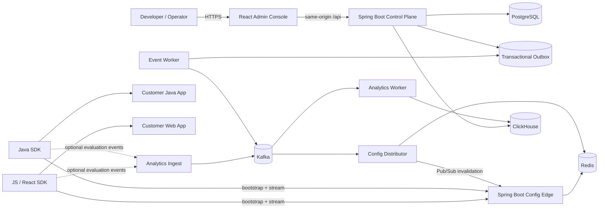

# LaunchForge — Feature Flag & Remote Configuration Platform

> **Working project name.** Perform trademark/domain clearance before using `LaunchForge` commercially.

## What this package is

This repository contains the implementation and source-of-truth specification for a production-style **feature flag, remote configuration, gradual rollout, kill-switch, and SDK delivery platform** built primarily with **Java / Spring Boot** and **React / TypeScript**.

The project is designed for two goals:

1. **Employment/portfolio:** prove modern Java, Spring Boot, React, distributed systems, caching, Kafka, low-latency SDK design, security, testing, observability, Docker, and Kubernetes/Helm.
2. **Commercial validation:** become a real developer tool that can be self-hosted first and later offered as a hosted service if outside teams validate the need.

The central engineering problem is not CRUD. It is **safe, deterministic, low-latency delivery of changing configuration to many applications without making customer request paths synchronously depend on LaunchForge**.

## Core product

A software team can:

- create organizations, projects, and Development/Staging/Production environments;
- create typed flags and remote configuration values;
- define ordered targeting rules;
- roll a feature out deterministically to a percentage of subjects;
- disable a feature globally with a kill switch;
- publish immutable configuration revisions;
- roll back by publishing a new revision containing prior known-good content;
- integrate through Java, JavaScript, and React SDKs;
- evaluate flags locally from SDK-cached configuration;
- receive near-real-time configuration revision updates;
- rotate SDK keys;
- audit who changed what and why;
- optionally collect privacy-minimized evaluation analytics.

## Final target architecture



### Key design principle

The **control plane** is where humans manage configuration. The **data plane** is where SDKs retrieve published snapshots and stay updated. Runtime flag evaluation happens **inside the SDK**, not by calling LaunchForge on every application request.

## Implementation strategy

Do not begin with every distributed component.

1. Build a correct modular control plane and deterministic evaluator.
2. Prove Java SDK local evaluation and outage behavior.
3. Add a dedicated Config Edge and real-time streaming.
4. Build the JavaScript/React SDKs against the same golden vectors.
5. Add the polished React admin console.
6. Introduce Kafka and Redis only when multi-node runtime distribution requires them.
7. Add analytics only after configuration delivery is correct.
8. Add observability, performance evidence, Docker, Helm, and CI/CD.
9. Finish with recruiter demo and pilot package.

## Technology baseline — dated 2026-08-10

Prompt 0 verification is recorded in `docs/19_TECHNOLOGY_BASELINE.md`. Deferred service versions are re-verified again when their owning milestone begins.

- Java 25 LTS; no preview/incubator APIs in production code
- Spring Boot 4.1.x
- Maven multi-module
- React 19.2.x + TypeScript + Vite + pnpm
- PostgreSQL 18.x + Flyway
- Apache Kafka 4.3.x in KRaft mode
- Redis 8.2.x
- ClickHouse 26.7.1.1315 in the optional M8 analytics profile
- Keycloak 26.7.0 as the digest-pinned local/reference OIDC provider
- Docker Compose
- Kubernetes + Helm
- OpenTelemetry + Prometheus + Grafana
- JUnit 5, ArchUnit, Testcontainers, Playwright, JMH, k6

## Repository shape

```text
LaunchForge/
  pom.xml
  package.json
  pnpm-workspace.yaml
  AGENTS.md
  README.md
  CODEX_START_HERE.md
  CODEX_PROMPT_SEQUENCE.md
  CODEX_MASTER_IMPLEMENTATION_SPEC.md
  PROJECT_STATUS.md
  backend/
    launchforge-domain/
    launchforge-application/
    launchforge-infrastructure/
    launchforge-contracts/
    launchforge-control-api/
    launchforge-config-edge/
    launchforge-event-worker/
  frontend/
    admin-web/
  sdks/
    java/
      launchforge-java-sdk/
    javascript/
      packages/
        core/
        browser/
        react/
  demos/
    spring-demo/
    react-demo/
  tests/
    architecture-tests/
    integration-tests/
    e2e/
    performance/
  contracts/
    openapi/
    events/
    snapshots/
    golden-vectors/
  deploy/
    docker/
    helm/
  docs/
  templates/
  eng/
```

## How to use this package

1. Extract the folder into a new Git repository.
2. Read `CODEX_START_HERE.md`.
3. Give Codex **Prompt 0 only**.
4. Review the assessment and exact technology pins.
5. Continue one numbered prompt at a time.
6. Never ask Codex to build all milestones in one task.
7. `CODEX_MASTER_IMPLEMENTATION_SPEC.md` is generated from the modular docs; edit source files, not the generated master.

## Development foundation

M0 requires Eclipse Temurin Java `25.0.4+7`, the committed Maven `3.9.16` wrapper, Node.js `24.19.0`, pnpm `11.21.0`, and Docker/Compose. Exact dependency and deferred-service pins are recorded in `docs/19_TECHNOLOGY_BASELINE.md`.

### Toolchain check

```powershell
java -version
.\mvnw.cmd -version
node --version
corepack --version
pnpm --version
docker version
docker compose version
```

Activate the pinned JavaScript package manager once per Node installation:

```powershell
corepack enable
corepack prepare pnpm@11.21.0 --activate
```

### Java quality and tests

```powershell
.\mvnw.cmd spotless:apply
.\mvnw.cmd verify
.\mvnw.cmd -pl tests/integration-tests -am verify -Pintegration
```

`verify` runs formatter checks, focused Checkstyle, compiler `-Xlint:all` with warnings treated as failures, unit tests, and ArchUnit rules. The integration profile requires a running Docker engine and starts PostgreSQL `18.4` through Testcontainers.

### Frontend quality and development

```powershell
pnpm install --frozen-lockfile
pnpm format:check
pnpm lint
pnpm typecheck
pnpm test
pnpm build
pnpm --filter @launchforge/admin-web dev
pnpm --filter @launchforge/admin-web test:e2e
pnpm --filter @launchforge/react-storefront-demo test:e2e
```

### Local PostgreSQL

```powershell
Copy-Item .env.example .env
docker compose config --quiet
docker compose up -d --wait postgres
docker compose ps
docker compose exec postgres pg_isready -U launchforge -d launchforge
docker compose down
```

The local template binds PostgreSQL to `127.0.0.1:55432` to avoid colliding with an existing system PostgreSQL. Change `LAUNCHFORGE_POSTGRES_PORT` and the matching JDBC URL together if another host port is preferred.

To run the minimal Control API shell, export `LAUNCHFORGE_DB_URL`, `LAUNCHFORGE_DB_USER`, and `LAUNCHFORGE_DB_PASSWORD` using the same local-only values as `.env`, then run:

```powershell
.\mvnw.cmd -pl backend/launchforge-control-api -am package
java -jar backend/launchforge-control-api/target/launchforge-control-api-0.1.0-SNAPSHOT-exec.jar
```

### Local identity and authenticated shell

M1 adds an optional Keycloak profile, four fictional operator identities, a fictional organization/project seed, and the authenticated React shell. Set every password placeholder in `.env`, then start PostgreSQL and the imported realm. Keycloak resolves the local-only demo password from the environment while importing the realm; the password is not stored in the JSON file:

```powershell
docker compose --profile identity up -d --wait postgres keycloak
```

Export the database and OIDC variables shown in `.env.example` into the shell that starts Java. Enable the fictional SQL seed only in the `local` profile:

```powershell
.\mvnw.cmd -pl backend/launchforge-control-api -am package
java -jar backend/launchforge-control-api/target/launchforge-control-api-0.1.0-SNAPSHOT-exec.jar --spring.profiles.active=local
```

Start the UI at `http://localhost:5173` and sign in as `owner`, `admin`, `developer`, or `viewer` with `LAUNCHFORGE_DEMO_USER_PASSWORD`:

```powershell
pnpm --filter @launchforge/admin-web dev
```

The browser receives only an HttpOnly same-origin application-session cookie; OIDC tokens remain server-side. The local profile uses the non-secure `launchforge_session` cookie for HTTP development, while the default non-local configuration uses the secure `__Host-launchforge_session` cookie.

With PostgreSQL, Keycloak, and the seeded Control API running, execute the real login/access/logout smoke test with:

```powershell
$env:LAUNCHFORGE_E2E_PASSWORD = $env:LAUNCHFORGE_DEMO_USER_PASSWORD
pnpm test:e2e
```

The Playwright configuration starts and stops Vite automatically. Stop the local services without deleting PostgreSQL data with:

```powershell
docker compose --profile identity down
```

The reset command below permanently deletes only the local Compose PostgreSQL volume:

```powershell
docker compose down -v
```

### Flag control plane

M2 implements the authenticated management API for projects, environments, typed flags/variations, environment drafts, ordered targeting rules, 100,000-bucket percentage allocations, publication history/diff, and rollback. Mutable routes use ETag/`If-Match`; browser mutations retain the M1 CSRF requirement. Rollout salt is server-owned and can change only through the explicit reason-required reseed route.

Flyway applies `V2__flag_control_plane.sql` when the Control API starts. Publication validates the full draft and commits the RFC 8785 canonical revision, current pointer, audit event, and pending outbox intent atomically. PostgreSQL rejects update/delete of revision rows. Kafka publication was deliberately deferred until the M7 distribution implementation described below.

### Java evaluator and SDK

M3 implements the pure Java algorithm-version-1 evaluator, strict immutable snapshot compiler, typed local APIs, SDK bootstrap authentication, conditional jittered polling, atomic revision activation, and in-memory last-known-good behavior. The SDK has no Spring or LaunchForge server-module dependency. Its frozen language-neutral corpus is `contracts/golden-vectors/evaluator-v1.json`; the generator and exact verification commands are documented in `sdks/java/launchforge-java-sdk/README.md`.

### Config Edge and live updates

M4 implements LF-0401 through LF-0406. The Control API manages one-environment server SDK keys
using one-time `lf_srv_...` secrets and hash-only PostgreSQL storage. The separate Spring Boot
WebFlux Config Edge validates those keys, serves the authoritative immutable PostgreSQL snapshot
with ETag/304/revision/checksum headers, and exposes a bounded authenticated SSE stream containing
revision hints only. The Java SDK can opt into the stream, fetches the authoritative snapshot after
a newer hint, reconnects with exponential jitter, and retains conditional polling plus in-memory
last-known-good behavior. M7 keeps these HTTP/SSE semantics and adds Redis-first snapshot reads plus
durable Kafka-backed fan-out.

Control API and Config Edge must receive the same uncommitted HMAC pepper. Start the Control API
first so Flyway applies V3, then start the edge in a second terminal:

```powershell
$env:LAUNCHFORGE_SDK_KEY_PEPPER = '<at-least-32-random-bytes>'
.\mvnw.cmd -pl backend/launchforge-control-api,backend/launchforge-config-edge -am package
java -jar backend/launchforge-config-edge/target/launchforge-config-edge-0.1.0-SNAPSHOT-exec.jar
```

The fictional Spring storefront in `demos/spring-demo` enables streaming by default, includes the
active snapshot revision in `/demo/{subject}`, and keeps evaluating after Config Edge becomes
unavailable. Its README contains the interactive flow and the reproducible PostgreSQL/WebFlux/SDK
E2E command.

### Durable Kafka and Redis distribution

M7 implements LF-0701 through LF-0706 in `launchforge-event-worker` and Config Edge. Multiple
workers safely lease the PostgreSQL outbox, require a Kafka acknowledgement before marking a row
published, and retry transient broker failures with bounded exponential backoff. Versioned
revision events are keyed by environment. The idempotent projector validates immutable PostgreSQL
content before atomically advancing a rebuildable Redis hash and publishing a bounded hint on one
global channel. Config Edge reads Redis first and uses a semaphore-bounded PostgreSQL fallback;
Redis is never authoritative.

Start the digest-pinned local KRaft broker and Redis cache with PostgreSQL:

```powershell
docker compose --profile distribution up -d --wait
.\mvnw.cmd -pl backend/launchforge-event-worker,backend/launchforge-config-edge -am package
```

Then run these in separate terminals after exporting the database, Redis, Kafka, and shared SDK-key
pepper values from `.env.example`:

```powershell
java -jar backend/launchforge-event-worker/target/launchforge-event-worker-0.1.0-SNAPSHOT-exec.jar
java -jar backend/launchforge-config-edge/target/launchforge-config-edge-0.1.0-SNAPSHOT-exec.jar
```

`contracts/events/` contains the versioned event schema/example. The repeatable two-edge,
broker/cache outage, rebuild, and Java SDK last-known-good drill is recorded in
`docs/18_FAILURE_MODES_RUNBOOKS.md`.

### Optional evaluation analytics

M8 implements LF-0801 through LF-0805 as an isolated, disabled-by-default pipeline. Java and
browser SDKs emit only after an explicit analytics opt-in, use bounded in-memory queues and batch
requests, and never send subject identifiers or arbitrary evaluation context. Config Edge derives
organization/project/environment scope from the authenticated server or browser key and publishes
validated batches to a dedicated Kafka topic. Event Worker performs bounded batched inserts into
ClickHouse; insert failure drops optional telemetry and cannot affect snapshot delivery, publish,
rollback, or local SDK evaluation.

Start the digest-pinned analytics dependencies, then enable analytics in the three backend
processes using the local-only values in `.env.example`:

```powershell
docker compose --profile distribution --profile analytics up -d --wait
$env:LAUNCHFORGE_ANALYTICS_ENABLED='true'
$env:LAUNCHFORGE_CLICKHOUSE_PASSWORD='<local-only password from .env>'
```

The admin console's Analytics page queries tenant-authorized, hour/day aggregate counts with
bounded time, row, concurrency, and ClickHouse execution limits. Counts are operational telemetry,
not experiment-significance or causal results. ClickHouse retains events for 90 days; its table has
no subject or raw-context columns. SDK opt-in examples and local counters are documented in the SDK
READMEs.

### JavaScript, browser, and React SDKs

M5 implements LF-0501 through LF-0505. `@launchforge/js-core` is the strict algorithm-version-1
TypeScript evaluator and consumes the same frozen corpus as Java. `@launchforge/js-browser` adds a
public-client-key bootstrap path, conditional polling, streaming-fetch SSE, atomic activation, and
in-memory last-known-good behavior. `@launchforge/react-sdk` owns one client through a provider and
exposes typed value/detail hooks without duplicating evaluator logic.

Config Edge serves browser-safe projections at
`/sdk/v1/client/{clientKey}/{snapshot|stream}`. The Control API manages separate browser client keys
and exact origin allowlists through `/api/v1/.../client-keys`; server and browser key classes cannot
substitute for one another. Browser configuration is intentionally inspectable, contains no
server-only flags, and must never be used as an authorization boundary.

The fictional Northstar Commerce app is in `demos/react-storefront`. Supply its public key at
runtime—never a server SDK key—and start it with:

```powershell
$env:VITE_LAUNCHFORGE_EDGE_URL='http://localhost:8081'
$env:VITE_LAUNCHFORGE_CLIENT_KEY='<public lf_client_ value>'
corepack pnpm --filter @launchforge/react-storefront-demo dev --host 127.0.0.1 --port 5174
```

Its Playwright flow proves two deterministic fictional users plus an SSE-triggered kill switch
without redeploy. The exact setup, security notes, and real-edge workflow are in the demo README.

### React admin console

M6 implements LF-0601 through LF-0606 in `frontend/admin-web`. The same-origin OIDC/BFF console
provides project/environment navigation, typed flags and stable variations, ordered rules, exact
rollout allocation, Java-backed draft simulation, production publish review, immutable revision
diff/rollback, separate server/browser SDK key lifecycle, and tenant-scoped audit filtering.

The selected environment remains visible throughout the console and production has an explicit
warning and confirmation gate. ETag conflicts preserve local form state for reconciliation;
ambiguous publish/rollback errors refresh server state before retry. Server SDK secrets are held
only in transient one-time dialog state. Run its isolated browser acceptance flow with:

```powershell
pnpm --filter @launchforge/admin-web test:e2e
```

The opt-in local SQL seed includes a fictional Development environment so a successful OIDC login
lands directly in the console. The Analytics page handles disabled or unavailable telemetry
without implying that configuration delivery is degraded.

On Unix-like systems, use `./mvnw` in place of `.\mvnw.cmd`. After initializing Git on Windows, record the executable bit with `git update-index --chmod=+x mvnw`.

## Commercial approach

Treat the product name, pricing, and market positioning as hypotheses.

1. Build a reproducible self-hosted demo.
2. Interview 10–15 small SaaS/agency engineering teams.
3. Offer 2–3 controlled pilots.
4. Measure integration time, recurring usage, reliability, and willingness to pay.
5. Prefer paid onboarding/managed hosting before building a complicated subscription system.

Never claim customers, revenue, availability, or benchmark numbers until they are real and measured.
