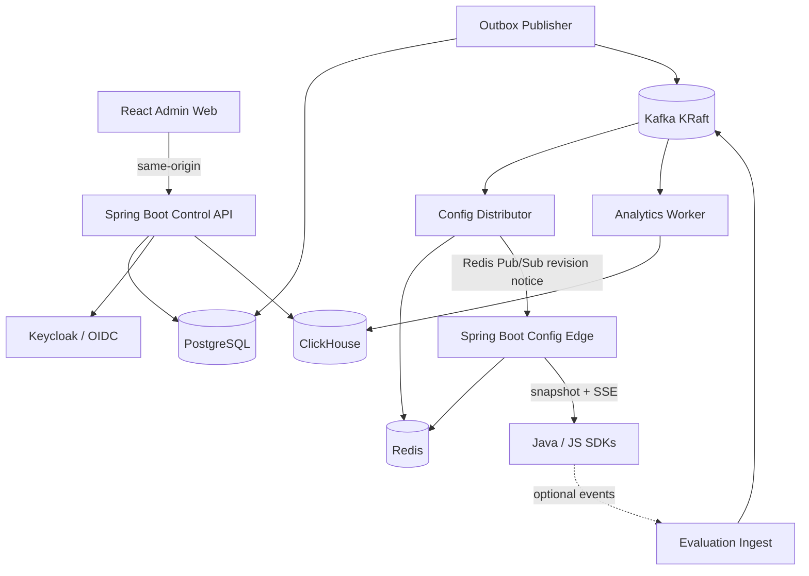
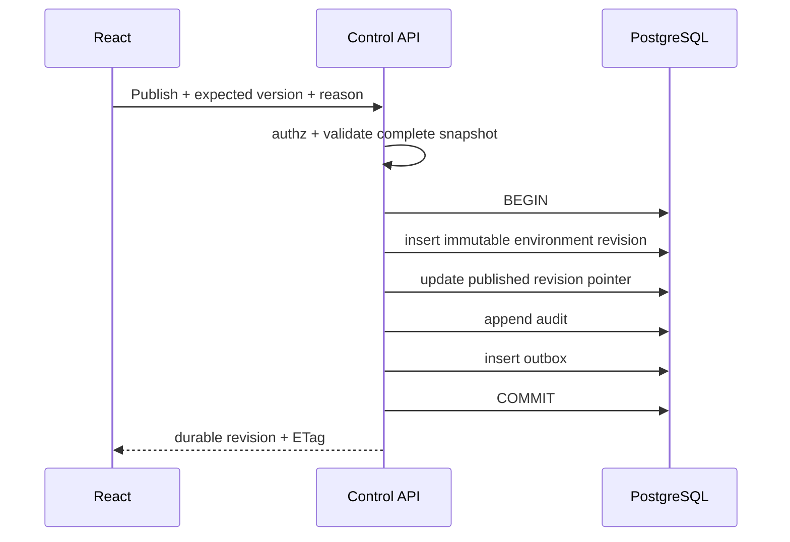
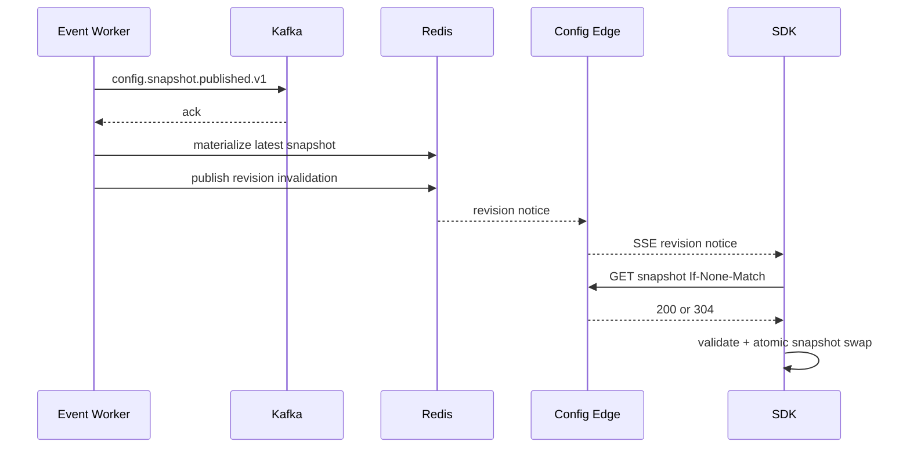

# 02 — System Architecture

## 1. Strategy

LaunchForge uses a **control-plane / data-plane architecture**, while the control-plane business model starts as a modular monolith.

Do not begin with many microservices. Separate runtime delivery only when its traffic/availability requirements justify a distinct deployable.

## 2. Final logical architecture



## 3. Deployable units

### Control API — Spring MVC

Responsibilities:

- OIDC BFF/session
- organization membership/authorization
- projects/environments
- flag/variation/rule management
- publish and rollback
- SDK key lifecycle
- audit queries
- analytics query API
- health/readiness
- transactional outbox writes

It must not own long-lived SDK streaming connections.

### Config Edge — Spring WebFlux

Responsibilities:

- SDK-key authentication
- snapshot serving
- ETag/304
- local hot cache
- Redis materialization lookup/fallback
- long-lived revision stream
- SDK data-plane rate limits
- data-plane health/metrics

It exposes no management mutation capability.

### Event Worker

Responsibilities after later milestones:

- lease/publish outbox events
- Kafka publication
- config event consumption/materialization
- Redis Pub/Sub invalidation
- analytics consumption/ClickHouse inserts
- bounded retries
- lag/failure metrics

Separate logical workers may share one deployable initially.

### React Admin Web

Responsibilities:

- authenticated navigation
- project/environment context
- flag/rule/rollout editor
- publish/revision/rollback
- SDK keys
- audit
- analytics/operations
- accessible errors/loading/concurrency

### Java SDK

Pure Java, no Spring dependency:

- bootstrap snapshot
- immutable in-memory config
- deterministic local evaluation
- streaming/poll refresh
- last-known-good hooks
- caller defaults
- evaluation details
- optional bounded analytics

### JS and React SDKs

A TypeScript core SDK and thin React binding. React never reimplements evaluator semantics.

## 4. Module structure

```text
backend/
  launchforge-domain/
  launchforge-application/
  launchforge-infrastructure/
  launchforge-contracts/
  launchforge-control-api/
  launchforge-config-edge/
  launchforge-event-worker/
sdks/
  java/
    launchforge-java-sdk/
  javascript/
    packages/
      core/
      browser/
      react/
frontend/
  admin-web/
demos/
  spring-demo/
  react-demo/
```

## 5. Dependency rules

- Domain references no Spring/JPA/transport/infrastructure.
- Application references Domain.
- Contracts references neither Domain nor Infrastructure.
- Infrastructure references Domain/Application.
- Control API references Application/Infrastructure/Contracts. The M6
  `dev.launchforge.controlapi.simulation` adapter has one narrow additional dependency on the Java
  SDK's public snapshot parser/evaluator so the console does not introduce a third evaluator;
  ArchUnit rejects SDK access from every other Control API package and server module.
- Config Edge references only runtime contracts/data-plane infrastructure, not management controllers.
- Event Worker references narrow Application/Infrastructure/Contracts as needed.
- Java SDK is independent of backend modules and does not reference Spring or server code.
- JS SDK shares JSON schemas/golden vectors only, not Java code.
- JavaScript Browser SDK depends on JavaScript Core.
- React SDK depends on JavaScript Browser/Core and never reimplements evaluation.

ArchUnit enforces backend constraints.

## 6. Publish path



No Kafka network call occurs inside the database transaction.

## 7. Final runtime distribution path



## 8. Availability philosophy

Customer applications must not fail just because LaunchForge is temporarily unavailable.

SDK evaluation priority:

1. current in-memory snapshot
2. persisted last-known-good if configured
3. caller-provided default

Remote failure impacts freshness, not every application request.

## 9. Multi-tenancy

Organization is the management security boundary.

Organization scope is derived server-side through authenticated membership and resource parentage. Never trust a client-supplied organization ID as the authority.

Integration tests must attempt direct-ID cross-organization access for every resource family.

## 10. Data ownership

- PostgreSQL: authoritative management state, revisions, keys metadata, audit, outbox
- Kafka: durable propagation transport; not source of truth
- Redis: rebuildable current data-plane materialization/cache
- ClickHouse: analytics only
- SDK local cache: runtime last-known-good copy

## 11. Consistency

A successful publish means the revision is durable in PostgreSQL. It does not mean every SDK has already observed it.

Runtime distribution is eventually consistent with **monotonic environment revision numbers**. Edge and SDK ignore stale revisions. Rollback publishes a newer revision.

## 12. Scaling

Scale independently:

- Control API by management load
- Config Edge by SDK bootstrap/stream load
- Event Worker by outbox/Kafka lag
- PostgreSQL by management/revision workload
- Redis by active snapshot footprint
- ClickHouse by analytics volume

Do not introduce sharding or multi-region active-active until measured requirements exist.
